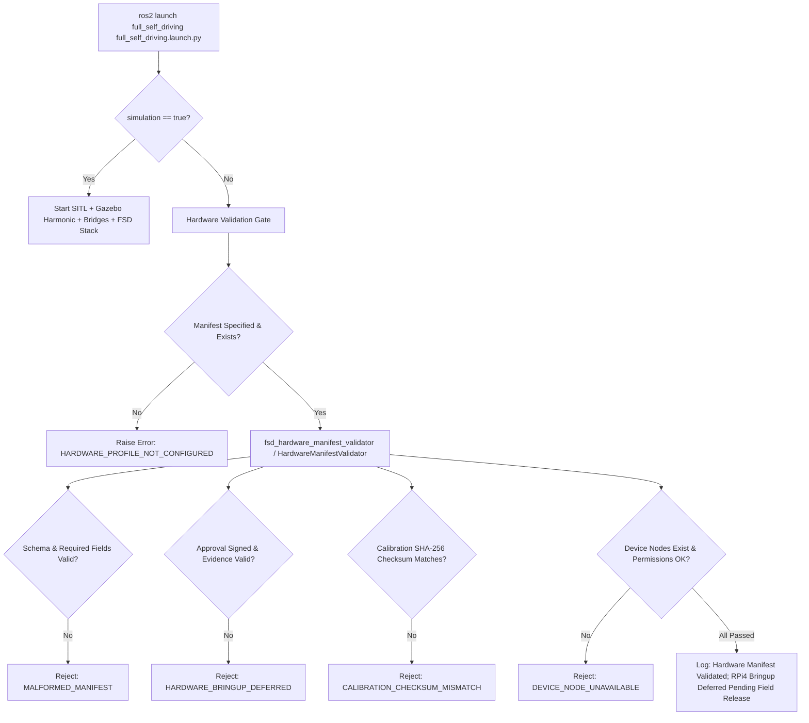

# Design Document: Task 16 — Defer Raspberry Pi 4 Hardware Bringup Behind an Explicit Manifest Gate

**Author:** Antigravity (Google DeepMind Pair Programming Assistant)  
**Date:** 2026-08-18  
**Status:** PROPOSED (Ready for User Review)  
**Task Reference:** Task 16.1 (`spec/tasks.md`)  
**Requirements Traceability:** Requirements 1.6, 1.7, 1.8, 7.6, 7.7  

---

## 1. Executive Summary

Having achieved **Checkpoint G (Task 15)** with 100% test pass across all 44 test suites (309 tests), **Task 16.1** establishes the formal boundary for physical hardware deployment. Physical bringup on the Raspberry Pi 4 companion computer and Pixhawk flight management unit (FMU) is **explicitly deferred** pending an approved, validated hardware profile and field verification package.

To enforce this boundary cleanly without introducing runtime mocks, fake simulation fallbacks, or prototype leaks, Task 16.1 implements:
1. **Formal Hardware Manifest Schema (`simulation/manifests/hardware_schema.yaml`)**:
   A declarative schema defining physical FMU UART serial transport paths, V4L2/libcamera sensor endpoints, GPIO/PWM payload actuator pins, sensor calibration extrinsics/intrinsics SHA-256 hashes, SROS2 security keystores, resource limits, and cryptographic approval records.
2. **C++ Hardware Manifest Validator (`src/launch/hardware_manifest_validator.hpp` / `.cpp` & `fsd_hardware_manifest_validator`)**:
   A rigorous C++ validation library and CLI tool verifying manifest syntax, field bounds, device node paths/permissions (`/dev/tty*`, `/dev/video*`), OpenSSL SHA-256 calibration checksums, security materials, and signed approval gates.
3. **Clean Hardware HAL Interface Stubs**:
   Explicit C++ hardware adapter stubs (`HardwareFmuAdapter`, `HardwareCameraAdapter`, `HardwarePayloadAdapter`) that cleanly implement base adapter interfaces without fake runtime implementations or Gazebo fallbacks, reporting deferred health if instantiated.
4. **Single Public Launch Entry Point Integration (`full_self_driving.launch.py`)**:
   Enforces fail-closed termination with `HARDWARE_PROFILE_NOT_CONFIGURED` when `simulation:=false` is selected without a complete, approved manifest.
5. **Comprehensive Hardware Installation & Provisioning Manual (`MANUAL.md` Section 17)**:
   A complete operational and hardware bringup guide covering Bill of Materials (BOM), Raspberry Pi 4 & Pixhawk 6C wiring, Ubuntu 22.04 LTS OS setup, deterministic `udev` rules, camera calibration, SROS2 keystores, and manifest approval sign-off.
6. **Testing & Verification Suite**:
   Unit tests (`test/launch/hardware_manifest_validator_test.cpp`), launch boundary tests (`test/launch/launch_boundary_test.py`), and test manifest fixtures exercising valid, malformed, tampered, missing-field, and unapproved manifests.

---

## 2. System Architecture & Gate Enforcement



---

## 3. Hardware Manifest Schema Specification

**File Path:** `full_self_driving/simulation/manifests/hardware_schema.yaml`

The schema defines all mandatory configuration blocks for physical hardware execution:

```yaml
profile: "hardware_rpi4_pixhawk6c"
manifest_version: "1.0.0"
description: "Authoritative Hardware Profile for Raspberry Pi 4 Companion Computer & Pixhawk FMU"

approval:
  approved: false # Explicitly false until physical field sign-off
  approval_authority: "safety-board@fsd.roscon25.org"
  approval_evidence_sha256: ""
  approval_timestamp_utc: ""

fmu_transport:
  adapter_id: "px4_hardware_uart_serial"
  device_path: "/dev/ttyAMA0" # Or /dev/ttyUSB0 / /dev/fsd_fmu_serial
  baud_rate: 921600
  flow_control: "none" # "none" | "rts_cts"
  dds_agent_protocol: "serial"

camera:
  adapter_id: "v4l2_hardware_camera"
  device_path: "/dev/video0" # Or /dev/fsd_camera
  driver: "v4l2" # "v4l2" | "libcamera"
  width: 1280
  height: 720
  framerate_hz: 30
  pixel_format: "YUYV"
  calibration_file: "config/camera_calibrations/imx219_720p.yaml"
  calibration_sha256: "e3b0c44298fc1c149afbf4c8996fb92427ae41e4649b934ca495991b7852b855"
  tf_camera_to_base_link:
    translation: [0.0, 0.0, -0.05]
    rotation_xyzw: [-0.7071068, 0.7071068, 0.0, 0.0]

payload:
  adapter_id: "gpio_pwm_payload_actuator"
  device_path: "/dev/gpiochip0"
  pwm_pin: 18
  pwm_frequency_hz: 50
  disarmed_pwm_us: 1000
  armed_pwm_us: 1500
  release_pwm_us: 2000
  feedback_sense_pin: 24
  max_pulse_duration_ms: 2500

security:
  sros2_keystore_path: "/home/ubuntu/fsd_keystore"
  require_encryption: true
  require_access_control: true

system_resources:
  max_cpu_percent: 75.0
  max_memory_mb: 2048
  storage_reserve_mb: 1024
  power_loss_recovery_enabled: true
```

---

## 4. Hardware Manifest Validator Component

### 4.1 Header: `src/launch/hardware_manifest_validator.hpp`
Defines data structures and the validator engine:
* `HardwareManifest`: Typed C++ representation of the parsed YAML.
* `ValidationResult`: Boolean `is_valid`, list of `violations`, and status code enum:
  - `VALID`
  - `FILE_NOT_FOUND`
  - `SYNTAX_ERROR`
  - `SCHEMA_MISSING_REQUIRED_FIELD`
  - `APPROVAL_DEFERRED_OR_MISSING`
  - `CALIBRATION_CHECKSUM_MISMATCH`
  - `DEVICE_NODE_UNAVAILABLE`
  - `SECURITY_KEYSTORE_INVALID`
  - `ADAPTER_ID_MISMATCH`
* `HardwareManifestValidator`:
  - `static ValidationResult validate_file(const std::string & manifest_path, bool check_physical_devices = false, const std::string & base_dir = "")`
  - `static ValidationResult validate_yaml(const YAML::Node & root, bool check_physical_devices = false, const std::string & base_dir = "")`
  - `static std::string compute_file_sha256(const std::string & file_path)`

### 4.2 Implementation: `src/launch/hardware_manifest_validator.cpp`
1. Parses YAML safely using `yaml-cpp`.
2. Validates existence and typing of `profile`, `manifest_version`, `approval`, `fmu_transport`, `camera`, `payload`, `security`, and `system_resources`.
3. Verifies adapter identifiers strictly match expected HAL IDs:
   - `fmu_transport.adapter_id == "px4_hardware_uart_serial"`
   - `camera.adapter_id == "v4l2_hardware_camera"`
   - `payload.adapter_id == "gpio_pwm_payload_actuator"`
4. Verifies `approval.approved == true` and `approval.approval_evidence_sha256` is non-empty for production clearance; otherwise marks `APPROVAL_DEFERRED_OR_MISSING`.
5. Computes SHA-256 of `calibration_file` using OpenSSL EVP API (`EVP_sha256()`) and compares against `calibration_sha256`.
6. If `check_physical_devices == true`, tests device nodes via `access(path.c_str(), R_OK | W_OK)`.
7. Verifies directory existence and permissions for `security.sros2_keystore_path`.

### 4.3 CLI Executable: `fsd_hardware_manifest_validator`
A standalone binary installed in `${PROJECT_NAME}` runtime destination:
```bash
fsd_hardware_manifest_validator --manifest <path> [--check-devices] [--json]
```
Returns `0` on valid manifest, non-zero on validation failure with explicit error output.

---

## 5. Clean Hardware HAL Interface Stubs

To ensure strict separation of concerns without introducing fake mocks or simulation fallback paths, Task 16 provides explicit C++ HAL stubs:

1. **FMU UART Transport Stub (`src/adapters/hardware_fmu_adapter.hpp` / `.cpp`)**:
   - Class `HardwareFmuAdapter`
   - Encapsulates physical UART serial transport attributes (`device_path`, `baud_rate`, `flow_control`).
   - Explicitly returns `is_connected() == false` / `is_healthy() == false` when driver is uninitialized.
2. **Camera Sensor Stub (`src/adapters/hardware_camera_adapter.hpp` / `.cpp`)**:
   - Class `HardwareCameraAdapter`
   - Encapsulates V4L2 / libcamera device endpoints, format configuration, and calibration matrix.
   - Explicitly returns `is_capturing() == false` when driver is uninitialized.
3. **Payload Actuator Stub (`src/payload/hardware_payload_adapter.hpp` / `.cpp`)**:
   - Class `HardwarePayloadAdapter` implementing `PayloadAdapter`.
   - Returns `get_adapter_id() == "gpio_pwm_payload_actuator"`.
   - `is_healthy()` returns `false`.
   - `execute_command(...)` returns `false` and sets `status.result = RESULT_REJECTED` to guarantee zero actuator side effects.

---

## 6. Single Public Launch Entry Point Integration

In `full_self_driving/launch/full_self_driving.launch.py`:
* Add launch argument:
  ```python
  DeclareLaunchArgument(
      "hardware_manifest",
      default_value="",
      description="Path to approved hardware profile manifest (required when simulation:=false)",
  )
  ```
* In `launch_setup(context)`:
  * When `simulation == False`:
    * If `hardware_manifest` is empty or does not exist:
      * Log clear diagnostic error.
      * Raise `RuntimeError("HARDWARE_PROFILE_NOT_CONFIGURED")`.
    * If `hardware_manifest` is provided:
      * Validate manifest via validator logic. If `approved == False` or validation fails:
        * Log validation errors.
        * Raise `RuntimeError("HARDWARE_PROFILE_NOT_CONFIGURED: Manifest validation failed or bringup deferred.")`.

---

## 7. Hardware Installation & Provisioning Manual (`MANUAL.md` Section 17)

Section 17 will be added to `full_self_driving/MANUAL.md` containing:
1. **Physical Hardware Bill of Materials (BOM)**:
   - Companion Computer: Raspberry Pi 4 Model B (4GB / 8GB)
   - Autopilot FMU: Pixhawk 6C / FMUv6X running PX4 Autopilot v1.14+
   - Sensor: Downward-facing Raspberry Pi Camera v2 (IMX219) or Global Shutter V4L2 USB camera
   - Actuator: Digital PWM Cargo Release Actuator on GPIO Pin 18 (BCM)
   - Telemetry Cable: 6-pin JST-GH to 4-pin DuPont connecting Pixhawk `TELEM2` (TX/RX/GND) to RPi4 `GPIO 14 (TXD) / GPIO 15 (RXD) / GND`
2. **Operating System & Companion Environment**:
   - Ubuntu 22.04 LTS Server (arm64)
   - ROS 2 Humble Hawksbill, `px4_ros2_cpp`, `MicroXRCEAgent`
   - Linux User Group Permissions: `sudo usermod -a -G dialout,video,gpio ubuntu`
3. **Deterministic `udev` Rules**:
   - `/etc/udev/rules.d/99-fsd-hardware.rules` mapping device serial numbers to `/dev/fsd_fmu_serial` and `/dev/fsd_camera`.
4. **Camera Sensor Calibration Procedure**:
   - Step-by-step camera intrinsics calibration using OpenCV 8x6 checkerboard pattern.
   - Generation of YAML calibration artifact and SHA-256 checksum generation (`sha256sum config/camera_calibrations/imx219_720p.yaml`).
5. **SROS2 Keystore & Security Configuration**:
   - Keystore provisioning on the companion computer and environment exports (`ROS_SECURITY_ENABLE=true`, `ROS_SECURITY_KEYSTORE=/home/ubuntu/fsd_keystore`).
6. **Hardware Manifest Approval Process**:
   - Safety board review, SHA-256 evidence generation, and signing workflow before live flight trials.

---

## 8. Testing & Verification Suite

1. **`test/launch/hardware_manifest_validator_test.cpp`** (GoogleTest):
   - `ValidateSampleValidManifest`: Verifies schema parsing and hash calculation on well-formed manifest.
   - `RejectMissingFields`: Verifies rejection when mandatory keys (e.g. `fmu_transport`, `camera`, `payload`) are omitted.
   - `RejectTamperedCalibration`: Verifies SHA-256 mismatch detection on modified calibration file.
   - `RejectUnapprovedManifest`: Verifies that `approved: false` is flagged as deferred bringup.
   - `RejectInvalidAdapterId`: Verifies detection of incorrect HAL adapter IDs.
2. **`test/launch/launch_boundary_test.py`** (Pytest):
   - Verifies `ros2 launch full_self_driving full_self_driving.launch.py simulation:=false` fails closed with `HARDWARE_PROFILE_NOT_CONFIGURED`.
   - Verifies that passing an unapproved manifest fails closed before node initialization.
3. **Regression Suite**:
   - Re-run all 44 existing test suites to ensure 100% test pass rate is preserved.

---

## 9. Next Steps

Upon user approval of this design document:
1. Invoke the `writing-plans` skill to generate the detailed step-by-step implementation plan.
2. Implement schema, C++ validator, CLI probe, HAL stubs, launch integration, tests, and `MANUAL.md` Section 17.
3. Execute clean build and verify 100% test suite pass rate.
