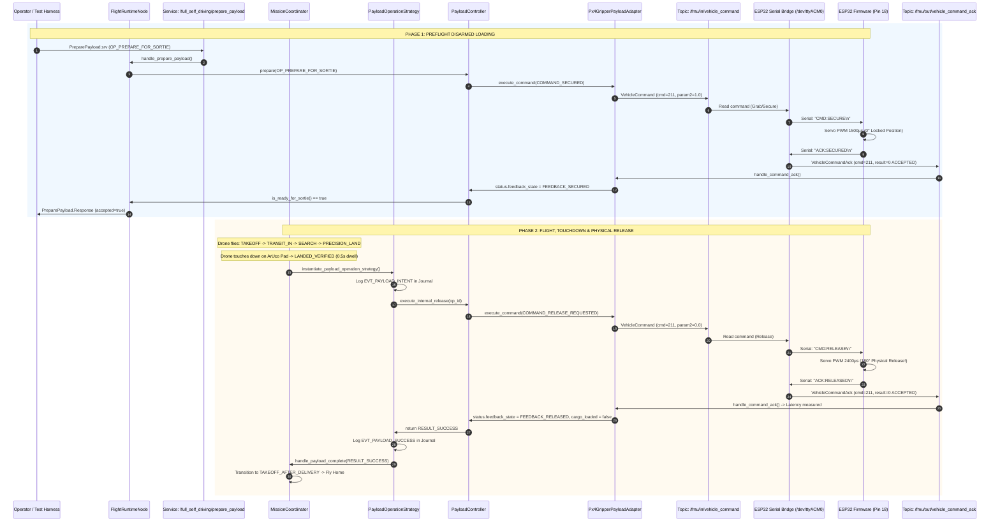

# ESP32 + Servo Hardware-in-the-Loop (HITL) Actuator Testbed Design

## 1. Executive Summary & Objective

This specification details the design for a **Hardware-in-the-Loop (HITL) Actuator Testbed** that integrates a physical **ESP32 microcontroller + PWM Servo Motor** with the simulated **Full Self-Driving (FSD) Autonomous Delivery Drone** stack running in Gazebo Simulation (Docker).

The goal is to validate that the entire mission pipeline—from preflight preparation via ROS 2 Services, to simulated waypoint navigation, precision landing on an ArUco pad, and touchdown verification (`LANDED_VERIFIED`)—triggers **real, physical mechanical actuation on the user's desk** via `/dev/ttyACM0`, without requiring a physical flight controller (Pixhawk/FCU).

---

## 2. End-to-End Codebase Flow & Traceability

---

## 3. Component Architecture

### 3.1 ESP32 Microcontroller Firmware (`esp32_gripper_actuator.ino`)
- **Hardware setup**:
  - Microcontroller: ESP32 Dev Module
  - PWM Actuation Pin: **GPIO 18** (Standard 50Hz PWM, 500µs to 2400µs)
  - Serial Interface: USB UART (`/dev/ttyACM0` or `/dev/ttyUSB0`) @ 115200 baud
- **State Behavior**:
  - `CMD:SECURE\n`: Drives Servo to 0° (Locked). Waits 300ms for mechanical transit. Emits `ACK:SECURED\n`.
  - `CMD:RELEASE\n`: Drives Servo to 180° (Open/Released). Waits 300ms. Emits `ACK:RELEASED\n`.
  - `CMD:PING\n`: Emits `ACK:PONG\n` for latency & link heartbeat.

### 3.2 ROS 2 Hardware Actuator Bridge (`scripts/esp32_gripper_bridge.py`)
- Python ROS 2 Node that interfaces between ROS 2 uORB topics and the physical serial device.
- **Subscriptions**:
  - `/fmu/in/vehicle_command` (`px4_msgs/msg/VehicleCommand`): Intercepts Command 211 (`VEHICLE_CMD_DO_GRIPPER`).
- **Publishers**:
  - `/fmu/out/vehicle_command_ack` (`px4_msgs/msg/VehicleCommandAck`): Emits command acknowledgments with precise nanosecond timestamps when physical confirmation arrives from the ESP32.
- **Serial Connection**:
  - Non-blocking I/O with automatic reconnect and port detection on `/dev/ttyACM0` (fallback `/dev/ttyUSB0`).

### 3.3 Docker Integration & Hardware Passthrough
- Running with container device mapping:
  `--device=/dev/ttyACM0:/dev/ttyACM0`
- Granting read/write dialout permissions for seamless USB communication.

---

## 4. Verification & Testing Strategy

1. **Step 1: Loopback & Serial Ping Test**:
   - Verify ESP32 replies `ACK:PONG` and correctly sweeps servo 0° $\leftrightarrow$ 180° on raw serial commands.
2. **Step 2: ROS 2 Service Preflight Test**:
   - Invoke `/full_self_driving/prepare_payload` with `op=2` (`OP_PREPARE_FOR_SORTIE`).
   - Verify that the physical servo locks to 0° and `/full_self_driving/payload/status` reports `secured: true`, `feedback_state: 1` (`FEEDBACK_SECURED`).
3. **Step 3: End-to-End Sortie Delivery Test**:
   - Launch Gazebo simulation + Full Self-Driving runtime with `payload_adapter:="px4_uorb_gripper_actuator"`.
   - Watch simulated drone navigate to the ArUco pad in Gazebo.
   - Verify that upon touchdown, the physical servo motor on the desk immediately rotates to 180°, releasing the physical cargo mechanism in synchronization with the simulated mission.
