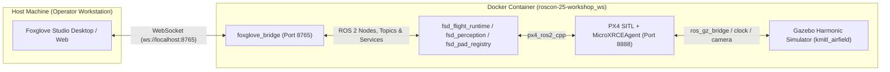
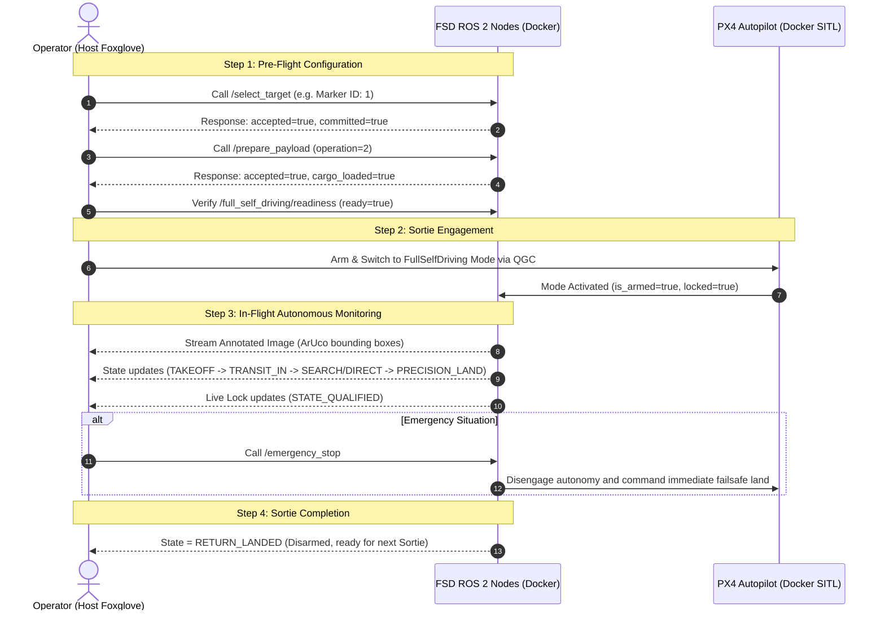

# Design Document: Full Self-Driving Mission Control Native Foxglove Layout

**Author:** Antigravity (Google DeepMind Pair Programming Assistant)  
**Date:** 2026-08-20  
**Status:** PROPOSED (Ready for User Review)  
**Target File:** `foxglove/roscon-25-workshop.json`  

---

## 1. Executive Summary

This design document specifies the architecture and layout configuration for the **Full Self-Driving (FSD) Mission Control Dashboard** in **Foxglove Studio**. 

The solution uses a **Native Foxglove Layout (`.json`)** requiring zero additional frontend build steps or dependencies. The dashboard interfaces with the ROS 2 software stack running inside the Docker container via `foxglove_bridge` WebSocket transport (`ws://localhost:8765`).

### Key Design Goals:
1. **Direct Service Integration**: Native `CallService` panels with pre-populated, typed JSON requests for `/full_self_driving/select_target`, `/full_self_driving/prepare_payload`, and `/full_self_driving/emergency_stop`.
2. **Real-time Perception & 3D Tracking**: Direct visual feedback of the ArUco detector stream (`/full_self_driving/perception/annotated_image`) and 3D drone trajectory.
3. **Flight State & Safety Visibility**: Instant monitoring of the operational state machine (`/full_self_driving/state`), pre-flight readiness gate (`/full_self_driving/readiness`), and visual lock qualification (`/full_self_driving/perception/live_target_lock`).
4. **Clean & Focused Single-Screen Layout**: Three-column responsive grid avoiding unnecessary elements (e.g., GPS tile maps deferred for basic operations).

---

## 2. Deployment Architecture & Network Boundaries



### Environmental Notes:
* **Simulation Runtime**: Runs strictly inside the Docker container (`/home/ubuntu/roscon-25-workshop_ws`).
* **Foxglove Studio**: Runs on the Host machine, connecting to `ws://localhost:8765` (port forwarded via Docker).

---

## 3. Dashboard Layout & Panel Specifications

The layout is organized into a **3-column single-screen mission dashboard**:

```
┌─────────────────────────┬───────────────────────────────┬───────────────────────────────┐
│ 🎮 1. COMMAND & SAFETY   │ 👁️ 2. VISION & 3D SPATIAL     │ 📊 3. FLIGHT TELEMETRY & PADS │
├─────────────────────────┼───────────────────────────────┼───────────────────────────────┤
│ [Service] Select Target │ [Image] ArUco Annotated Feed  │ [State] FSD Flight State      │
│   (Target ID, Dict)     │   (/perception/annotated_img) │   (TAKEOFF -> SEARCH -> LAND) │
│                         │                               │                               │
│ [Service] Prepare Cargo │ [3D Scene] Drone Model & TF   │ [Status] Live Target Lock     │
│   (Attach/Secure)       │   (URDF, Odom, Trajectory)    │   (QUALIFIED / CANDIDATE)     │
│                         │                               │                               │
│ [Service] EMERGENCY     │                               │ [Plot] Altitude (Z) vs Time   │
│   STOP (Red Trigger)    │                               │ [Plot] Battery % & Speed      │
│                         │                               │                               │
│ [Status] Readiness Gate │                               │ [Table] Discovered Pad List   │
└─────────────────────────┴───────────────────────────────┴───────────────────────────────┘
```

---

### 3.1 Column 1: Command & Safety Center (Left Column)

| Panel Title | Panel Type | Topic / Service Interface | Configuration & Pre-filled Payload |
| :--- | :--- | :--- | :--- |
| **Select Target** | `CallService` | `/full_self_driving/select_target`<br/>(`SelectTargetIdentity.srv`) | `{"target": {"marker_id": 1, "dictionary": "DICT_4X4_50", "target_namespace": "aavc2026"}, "expected_selection_revision": 0}` |
| **Prepare Payload** | `CallService` | `/full_self_driving/prepare_payload`<br/>(`PreparePayload.srv`) | `{"request_id": "sortie_prep", "operation": 2, "expected_selection_revision": 0}` |
| **EMERGENCY STOP** | `CallService` | `/full_self_driving/emergency_stop`<br/>(`EmergencyStop.srv`) | `{"reason": "Operator manual emergency stop trigger"}` |
| **Pre-Flight Readiness** | `RawMessages` | `/full_self_driving/readiness`<br/>(`ReadinessReport.msg`) | Displays `ready` (boolean), `readiness_revision`, and `failures` list. |

---

### 3.2 Column 2: Perception & Spatial 3D (Center Column)

| Panel Title | Panel Type | Topic Interface | Configuration |
| :--- | :--- | :--- | :--- |
| **ArUco Annotated Camera** | `ImageView` | `/full_self_driving/perception/annotated_image`<br/>(`sensor_msgs/Image`) | `mode: "fit"`, camera info linked to `/camera_info` |
| **3D World & Vehicle Scene** | `ThreeDee` | `/robot_description`<br/>`/fmu/out/vehicle_odometry`<br/>TF (`map` $\rightarrow$ `odom` $\rightarrow$ `base_link`) | Follow drone base link, coordinate axes enabled, ground grid enabled. |

---

### 3.3 Column 3: Flight Telemetry & Pad Database (Right Column)

| Panel Title | Panel Type | Topic Interface | Configuration |
| :--- | :--- | :--- | :--- |
| **FSD Flight State** | `RawMessages` | `/full_self_driving/state`<br/>(`FullSelfDrivingState.msg`) | Key fields: `flight_phase`, `active_strategy`, `armed`, `locked`, `ready_for_mode`. |
| **Live Visual Lock** | `RawMessages` | `/full_self_driving/perception/live_target_lock`<br/>(`LiveTargetLock.msg`) | Key fields: `lock_state` (QUALIFIED / CANDIDATE / LOST), `quality`, `pose.position`. |
| **Altitude Profile** | `Plot` | `/full_self_driving/telemetry.altitude_m`<br/>(`/fmu/out/vehicle_odometry.position[2]`) | Value vs Time, locked scales, auto-scrolling. |
| **Battery & Velocity** | `Plot` | `/full_self_driving/telemetry.battery_percentage`<br/>`/full_self_driving/telemetry.ground_speed_m_s` | Multi-line plot tracking energy and transit velocity. |
| **Discovered Pad Registry** | `RawMessages` | `/full_self_driving/pad_registry`<br/>(`PadRegistrySnapshot.msg`) | Shows array of discovered landing pads with their latitude, longitude, and marker IDs. |

---

## 4. Operational Workflow for the Operator



---

## 5. Verification & Acceptance Plan

### 5.1 Verification Checklist:
1. **Layout File Integrity**: Ensure `foxglove/roscon-25-workshop.json` conforms to Foxglove Studio Layout Schema v1.
2. **Host-to-Docker Connection**: Open Foxglove Studio on Host, connect to `ws://localhost:8765`, verify all panels subscribe and render without errors.
3. **Service Call Execution**:
   - Trigger `/full_self_driving/select_target` with marker ID 1 $\rightarrow$ Verify `accepted: true` and `/full_self_driving/target_selection` broadcast.
   - Trigger `/full_self_driving/prepare_payload` with operation 2 $\rightarrow$ Verify `cargo_loaded: true`.
   - Trigger `/full_self_driving/emergency_stop` $\rightarrow$ Verify `success: true`.
4. **Visual Stream Verification**: Verify `/full_self_driving/perception/annotated_image` renders at ~10 Hz with marker bounding box annotations.
5. **State Progression Verification**: Execute a flight sortie and confirm State transitions smoothly from `TAKEOFF` $\rightarrow$ `TRANSIT_IN` $\rightarrow$ `SEARCH` / `DIRECT` $\rightarrow$ `PRECISION_LAND` $\rightarrow$ `TRANSIT_OUT` $\rightarrow$ `RETURN_LANDED`.
