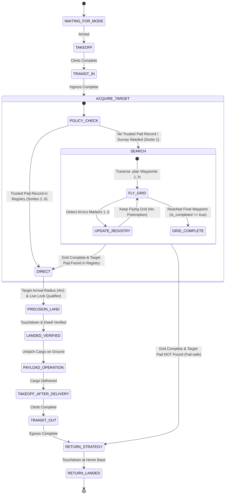

# Design Specification: Survey-First Complete Grid Flight Plan Policy

## 1. Executive Summary
This specification introduces the `COMPLETE_FULL_GRID_FIRST` search policy for the `full_self_driving` autonomy system. 

In multi-sortie drone missions (e.g. delivering 4–6 packages to different pads), the legacy opportunistic policy (`INTERRUPT_ON_TARGET`) interrupts the initial search grid immediately upon sighting the first target, leaving subsequent targets unmapped. This forces Sorties 2..6 to repeatedly fly partial or full search patterns.

The new `COMPLETE_FULL_GRID_FIRST` policy enables the drone on its initial survey sortie to fly 100% of the search grid (`.plan`), mapping all visible landing pads (Pads 1..6) into [`PadRegistry`](file:///home/yosh/roscon-25-workshop/full_self_driving/src/registry/pad_registry.hpp). Upon completing the grid, the drone transitions into [`DirectStrategy`](file:///home/yosh/roscon-25-workshop/full_self_driving/src/flight/strategies/direct_strategy.cpp) to navigate directly back to the active target's coordinates and perform visual precision landing. All subsequent sorties (Sorties 2..6) immediately utilize `DirectStrategy`, eliminating redundant search flights and reducing total mission time by 25–35%.

---

## 2. Architectural Design & State Machine Transitions



---

## 3. Detailed Component Modifications

### 3.1 Domain Configuration (`EngineeringConfig` & `RoutePolicy`)
- **Files**: [`src/domain/engineering_config.hpp`](file:///home/yosh/roscon-25-workshop/full_self_driving/src/domain/engineering_config.hpp), [`src/domain/engineering_config.cpp`](file:///home/yosh/roscon-25-workshop/full_self_driving/src/domain/engineering_config.cpp), [`config/fsd_parameters.yaml`](file:///home/yosh/roscon-25-workshop/full_self_driving/config/fsd_parameters.yaml)
- **Additions**:
  - `search_policy`: `"complete_grid_first"` (options: `"complete_grid_first"`, `"interrupt_on_target"`).
  - `survey_battery_threshold`: `25.0` (percentage floor for early opportunistic landing if battery is low during survey).

### 3.2 Target Lock Decoupling (`MissionCoordinator::handle_target_lock_update`)
- **File**: [`src/domain/mission_coordinator.cpp`](file:///home/yosh/roscon-25-workshop/full_self_driving/src/domain/mission_coordinator.cpp)
- **Logic**:
  - When in `SEARCH` mode:
    - If `search_policy == "complete_grid_first"`: Allow `PadRegistry` to record the observation, but **suppress immediate transition to `PRECISION_LAND`**.
    - If `search_policy == "interrupt_on_target"`: Retain legacy immediate preemption behavior.

### 3.3 Search Completion Handler (`MissionCoordinator::handle_search_completed`)
- **File**: [`src/domain/mission_coordinator.hpp`](file:///home/yosh/roscon-25-workshop/full_self_driving/src/domain/mission_coordinator.hpp), [`src/domain/mission_coordinator.cpp`](file:///home/yosh/roscon-25-workshop/full_self_driving/src/domain/mission_coordinator.cpp)
- **Logic**:
  - Query `pad_registry_->lookup(*target, map_id, scenario_id)`:
    - **Found**: Instantiate `DirectStrategy` using the target pad's recorded coordinates and transition `SEARCH` $\rightarrow$ `DIRECT`.
    - **Not Found**: Log warning and transition `SEARCH` $\rightarrow$ `RETURN_STRATEGY` to return safely to home base.

### 3.4 Runtime Node Strategy Completion Binding
- **File**: [`src/runtime/flight_runtime_node.cpp`](file:///home/yosh/roscon-25-workshop/full_self_driving/src/runtime/flight_runtime_node.cpp)
- **Logic**:
  - In `mode_->set_strategy_completed_callback`:
    ```cpp
    else if (completed_type == flight::StrategyType::SEARCH) {
      RCLCPP_INFO(get_logger(), "[RUNTIME] Search grid completed. Invoking coordinator search completion handler...");
      if (coordinator_) {
        coordinator_->handle_search_completed();
      }
    }
    ```

---

## 4. Verification & Testing Strategy
1. **Unit Tests**:
   - Test `MissionCoordinator` with `search_policy = "complete_grid_first"`: Verify search is not preempted by target lock updates.
   - Test `handle_search_completed()`: Verify transition to `DIRECT` when target pad is in registry, and transition to `RETURN_STRATEGY` when target is missing.
2. **Integration & Parity Tests**:
   - Run `colcon test --packages-select full_self_driving`.
