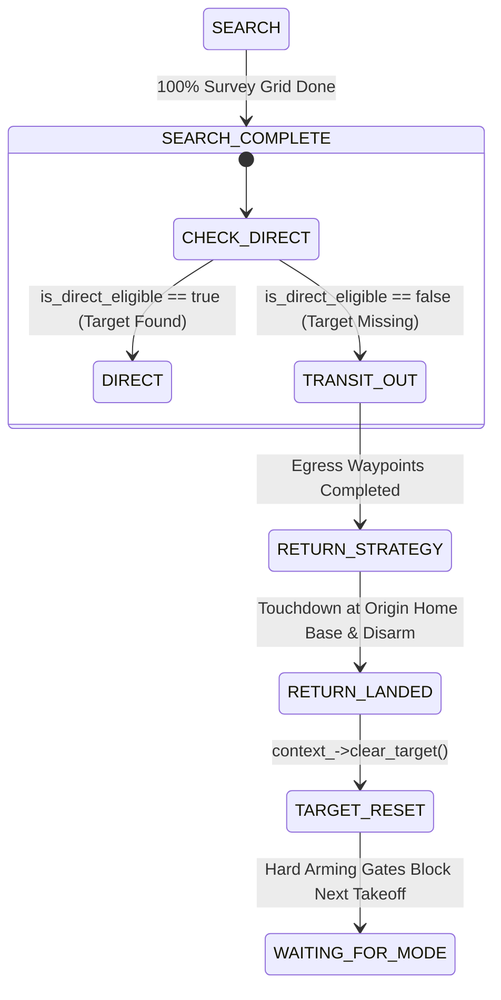

# Design Document: Search Missing Target Egress Transit-Out & Sortie Target Reset

## 1. Overview & Objectives

In the `full_self_driving` autonomy stack, two safety-critical flight behaviors require enhancement:
1. **Flight Corridor Enforcement on Missing Target**: When the Boustrophedon survey search grid completes 100% and the target landing pad is not found in the `PadRegistry`, the drone must NOT fly a direct path back to home base. Instead, it must follow the configured egress transit corridor waypoints (`TRANSIT_OUT`) at cruise transit altitude before transitioning to `RETURN_STRATEGY` to return to home base and land.
2. **Sortie Completion Target Reset**: Upon completing a sortie (touchdown at home base, disarmed in `RETURN_LANDED`), the target selection in `MissionContext` must be automatically cleared (`target = std::nullopt` / marker_id = 0). This prevents infinite autonomous re-flight loops and prevents ground operators from inadvertently launching subsequent sorties with stale target identities.

---

## 2. Architectural Analysis & Component Interfaces

### 2.1 State Machine Transition Flow

### 2.2 Detailed Subsystem Interactions

#### A. `MissionCoordinator::handle_search_completed()`
- **Current Behavior**:
  - When `is_direct_eligible(...)` is false, it logs `SURVEY_COMPLETE_TARGET_MISSING` and sets `current_strategy_ = flight::StrategyType::RETURN_STRATEGY`, directly instantiating `ReturnStrategy`.
- **Target Behavior**:
  - When `is_direct_eligible(...)` is false, it logs `SURVEY_COMPLETE_TARGET_MISSING`, sets `current_strategy_ = flight::StrategyType::TRANSIT_OUT`, and instantiates `TransitOutStrategy` using the configured `transit_out` route (at `routes.transit_altitude_m`, default 20.0m).
  - When `TransitOutStrategy` finishes all egress waypoints, `FlightRuntimeNode` catches `completed_type == flight::StrategyType::TRANSIT_OUT` and calls `coordinator_->request_transition(flight::StrategyType::RETURN_STRATEGY)`.
  - `MissionCoordinator` transitions `TRANSIT_OUT -> RETURN_STRATEGY`, instantiating `ReturnStrategy` to fly from the end of egress back to the locked origin home base.

#### B. `MissionContext::clear_target()`
- **Implementation**:
  - Adds `void clear_target()` to `MissionContext`.
  - Resets `selection_.target = std::nullopt`.
  - Increments `selection_.selection_revision++`.
  - Resets state to `ConfigState::CONFIGURING` if previously committed.
  - Clears `validation_token_`.
- **Safety Gate Effect**:
  - In `MissionContext::check_readiness(...)`, when `selection_.target` has no value, it appends `"MISSING_TARGET_IDENTITY"` to `out_missing_gates` and returns `false`.
  - In `FullSelfDrivingMode::checkArmingAndRunConditions`, PX4 arming check receives readiness failure, preventing automatic re-arm or operator takeoff until an explicit `select_target` service call is made.

#### C. `FlightRuntimeNode` Sortie Completion Hook
- In `FlightRuntimeNode`:
  - When `completed_type == flight::StrategyType::RETURN_STRATEGY` triggers transition to `RETURN_LANDED`:
    - Disarms PX4 via `executor_->disarm()`.
    - Invokes `context_->clear_target()`.
    - Logs `[RUNTIME] Sortie completed at Home Base. Target identity cleared to prevent loop.`.

---

## 3. Files Touched

1. [`src/domain/mission_context.hpp`](file:///home/yosh/roscon-25-workshop/full_self_driving/src/domain/mission_context.hpp):
   - Declare `void clear_target()`.
2. [`src/domain/mission_context.cpp`](file:///home/yosh/roscon-25-workshop/full_self_driving/src/domain/mission_context.cpp):
   - Implement `void clear_target()`.
3. [`src/domain/mission_coordinator.cpp`](file:///home/yosh/roscon-25-workshop/full_self_driving/src/domain/mission_coordinator.cpp):
   - In `handle_search_completed()`: if `!direct_ok`, transition to `TRANSIT_OUT` and instantiate `TransitOutStrategy`.
4. [`src/runtime/flight_runtime_node.cpp`](file:///home/yosh/roscon-25-workshop/full_self_driving/src/runtime/flight_runtime_node.cpp):
   - In `RETURN_STRATEGY` completion callback / `RETURN_LANDED` transition, call `context_->clear_target()`.
5. [`test/flight/acquisition_branch_test.cpp`](file:///home/yosh/roscon-25-workshop/full_self_driving/test/flight/acquisition_branch_test.cpp):
   - Update Test 14 to verify `handle_search_completed()` transitions to `TRANSIT_OUT` when target is missing.
   - Add unit test verifying `clear_target()` resets target and causes `check_readiness` to fail with `MISSING_TARGET_IDENTITY`.

---

## 4. Verification & Testing Strategy

1. **Unit Tests**:
   - `colcon test --packages-select full_self_driving --ctest-args -R acquisition_branch_test`
   - All tests in `full_self_driving` pass 100%.
2. **Integration Verification**:
   - Verify that upon missing target, transition sequence is: `SEARCH -> TRANSIT_OUT -> RETURN_STRATEGY -> RETURN_LANDED`.
   - Verify that when in `RETURN_LANDED`, `target` is null and arming readiness is false.
