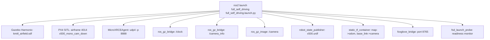
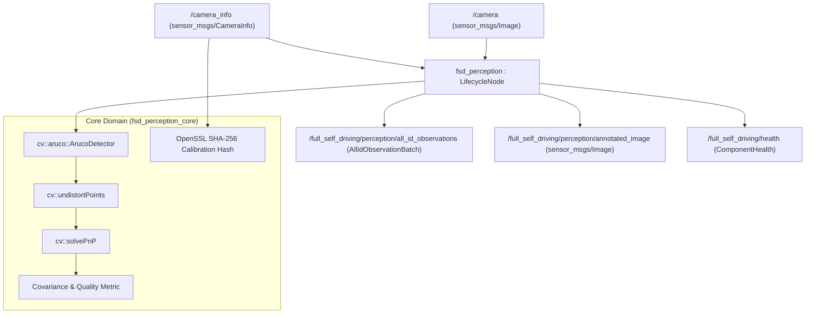
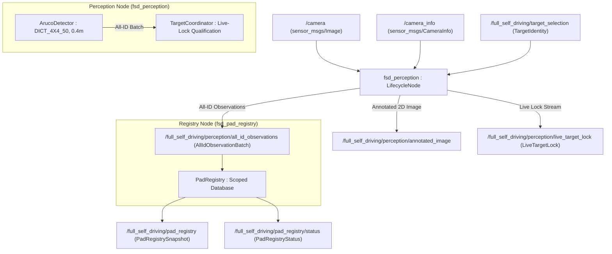
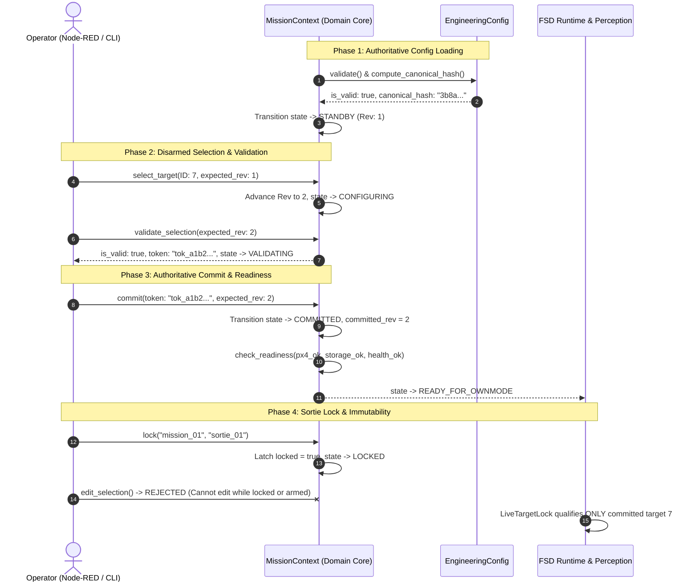
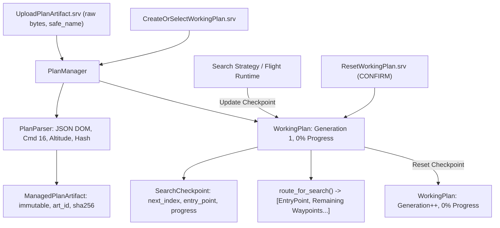

# Full Self-Driving (`full_self_driving`) Package Manual

This document is the **single authoritative operational and developer manual** for the `full_self_driving` ROS 2 package. All developers and AI agents working on any task must follow the guidelines, execution conventions, and single-command workflows described in this document.

---

## 0. Golden Rules & Architectural Invariants

1. **One Public Launch Entry Point**: 
   * Always use `ros2 launch full_self_driving full_self_driving.launch.py`.
   * **NEVER** use old prototype launch files or scripts (`gazebo_models/run_world.sh`, `px4_roscon_25/common.launch.py`, manual `simulation-gazebo`, or opening multiple terminal tabs manually for `MicroXRCEAgent` / `px4`).
2. **Zero Prototype Dependencies**:
   * Do **NOT** import, link, launch, or depend on prototype packages: `aruco_tracker`, `aruco_database`, `aruco_database_bridge`, `transit_in`, `transit_out`, `search`, `precision_land`, `px4_roscon_25`, or `gazebo_models`.
3. **Flight Control Exclusivity (`px4_ros2_cpp`, No Offboard)**:
   * Companion flight control uses **only** the registered `FullSelfDrivingMode` and `FullSelfDrivingModeExecutor` via `px4_ros2_cpp`.
   * Do **NOT** use `OffboardControlMode` or publish directly to `/fmu/in/offboard_control_mode` or `/fmu/in/trajectory_setpoint`.
4. **Container Execution**:
   * All builds, tests, and launches must be executed inside the Docker container (`/home/ubuntu/roscon-25-workshop_ws`).

---

## 1. Environment Sourcing

Inside the container terminal, source the environment overlays in the following order:

```bash
source /opt/ros/humble/setup.bash
source /home/ubuntu/px4_ros_ws/install/setup.bash
source /home/ubuntu/roscon-25-workshop_ws/install/setup.bash
```

---

## 2. Section 1: Foundation & Integrated Simulation (Task 1)

### 2.1 The Single Simulation Launch Command

To start the complete environment (Gazebo world, PX4 SITL, MicroXRCE-DDS Agent, `/clock`, `/camera`, `/camera_info`, TF, and all FSD nodes):

```bash
# Standard launch with Gazebo GUI
ros2 launch full_self_driving full_self_driving.launch.py \
  simulation:=true \
  world:=kmitl_airfield \
  headless:=false

# Headless launch (for CI / background testing)
ros2 launch full_self_driving full_self_driving.launch.py \
  simulation:=true \
  world:=kmitl_airfield \
  headless:=true
```

### 2.2 What the Launch Entry Point Orchestrates Automatically

The single launch file (`launch/full_self_driving.launch.py`) manages the following graph:



* **Gazebo Harmonic**: Loads the production world `simulation/worlds/kmitl_airfield.sdf` and landing pad textures.
* **PX4 SITL (`SYS_AUTOSTART=4014`)**: Starts the PX4 autopilot binary (`/home/ubuntu/px4_sitl/bin/px4`) configured for `4014_gz_x500_mono_cam_down` (x500 drone with downward-facing camera).
* **MicroXRCE-DDS Agent**: Starts `MicroXRCEAgent udp4 -p 8888`, exposing PX4 uORB topics to ROS 2 (`/fmu/in/*` and `/fmu/out/*`).
* **Clock Bridge**: Unidirectionally bridges Gazebo `/clock` to ROS 2 `/clock`.
* **Camera & Image Bridges**: Bridges `/camera_info` and `/camera` image stream from the drone's downward imager.
* **Robot State Publisher & TF**: Publishes `x500.urdf` and static coordinate frames (`map` $\rightarrow$ `odom`, `base_link` $\rightarrow$ camera optical frame).
* **Foxglove Bridge**: Exposes WebSocket server on port `8765` for 3D visualization.
* **Launch Probe (`fsd_launch_probe`)**: Verifies all simulation dependencies and prints readiness.
* **Supervised Reverse Shutdown**: Automatically cleans up all child processes on exit.

### 2.3 Hardware Deferral Gate
```bash
ros2 launch full_self_driving full_self_driving.launch.py simulation:=false
```
* Fails closed immediately with `HARDWARE_PROFILE_NOT_CONFIGURED` because physical Raspberry Pi 4 hardware bringup is explicitly deferred pending validation evidence.

### 2.4 Verification Commands (Task 1)

1. **Build the package:**
   ```bash
   cd /home/ubuntu/roscon-25-workshop_ws
   colcon build --packages-select full_self_driving --symlink-install --cmake-args -DCMAKE_BUILD_TYPE=RelWithDebInfo -DBUILD_TESTING=ON
   ```
2. **Run the automated test suite:**
   ```bash
   source install/setup.bash
   colcon test --packages-select full_self_driving --event-handlers console_direct+
   colcon test-result --verbose
   ```
3. **Verify active topics during launch:**
   ```bash
   ros2 topic echo /clock --once
   ros2 topic echo /camera_info --once
   ros2 topic echo /fmu/out/vehicle_status_v1 --once
   ```

---

---

## 3. Section 2: Production ArUco Perception Slice (Task 2)

### 3.1 Overview & Architecture

Task 2 ports the prototype ArUco tracker into a production-grade, managed ROS 2 Lifecycle Node (`fsd_perception`). It operates on the incoming camera feed and camera intrinsics to perform marker detection, OpenCV `solvePnP` 6-DoF pose estimation, corner undistortion, covariance estimation, canonical calibration hashing, and annotated image generation.



### 3.2 Created Production Components & Artifacts

1. **Production Messages (`msg/`)**:
   * [`MessageHeader.msg`](file:///home/yosh/roscon-25-workshop/full_self_driving/msg/MessageHeader.msg): Standard bounded header (`stamp`, `frame_id <= 64`, `sequence`).
   * [`TargetIdentity.msg`](file:///home/yosh/roscon-25-workshop/full_self_driving/msg/TargetIdentity.msg): Marker ID and dictionary metadata (`marker_id`, `dictionary <= 32`, `target_namespace <= 64`).
   * [`AllIdObservation.msg`](file:///home/yosh/roscon-25-workshop/full_self_driving/msg/AllIdObservation.msg): Complete 6-DoF observation record with `pose`, `covariance` (float64[36] row-major diagonal variances), `quality` (float32 [0.0, 1.0]), monotonic and camera timestamps, canonical `calibration_sha256`, and `observation_state`.
   * [`AllIdObservationBatch.msg`](file:///home/yosh/roscon-25-workshop/full_self_driving/msg/AllIdObservationBatch.msg): Bounded array of observations (`AllIdObservation[<=256]`) with `map_id`, `scenario_id`, and drop counter.
   * [`ComponentHealth.msg`](file:///home/yosh/roscon-25-workshop/full_self_driving/msg/ComponentHealth.msg): Node lifecycle state, ready boolean, monotonic timestamp, and diagnostics.

2. **Core Domain Library (`src/perception/`)**:
   * [`aruco_detector.hpp`](file:///home/yosh/roscon-25-workshop/full_self_driving/src/perception/aruco_detector.hpp) / [`aruco_detector.cpp`](file:///home/yosh/roscon-25-workshop/full_self_driving/src/perception/aruco_detector.cpp): Pure C++ domain logic without node dependencies. Encapsulates dictionary resolution (`DICT_4X4_50`, `DICT_4X4_250`, etc.), pose estimation via `solvePnP`, normalized quaternion conversion, covariance generation, and image annotation.
   * Built as target `fsd_perception_core`.

3. **Lifecycle Perception Node (`src/perception/`)**:
   * [`perception_node.hpp`](file:///home/yosh/roscon-25-workshop/full_self_driving/src/perception/perception_node.hpp) / [`perception_node.cpp`](file:///home/yosh/roscon-25-workshop/full_self_driving/src/perception/perception_node.cpp): `rclcpp_lifecycle::LifecycleNode` named `fsd_perception`.
   * Manages lifecycle transitions (`on_configure`, `on_activate`, `on_deactivate`, `on_cleanup`, `on_shutdown`).
   * Fails closed if camera calibration is missing or degenerate (e.g., zero focal length).

4. **Replay Fixture Publisher & Test Fixtures (`test/fixtures/prototype_behavior/aruco/`)**:
   * [`fsd_replay_fixture_publisher`](file:///home/yosh/roscon-25-workshop/full_self_driving/src/runtime/replay_fixture_publisher.cpp): Offline test node publishing camera stream and camera info from static fixture datasets.
   * Fixtures: `single_marker_id1.png`, `multi_marker_id1_id2.png`, `blank.png`, `camera_info.yaml`, `golden_observations.yaml`.

### 3.3 Node Parameters & Configuration

| Parameter | Type | Default Value | Description |
| :--- | :--- | :--- | :--- |
| `dictionary` | string | `"DICT_4X4_50"` | ArUco dictionary name (e.g. `DICT_4X4_50`, `DICT_4X4_250`) |
| `marker_size` | double | `0.4` | Physical marker side length in meters |
| `camera_topic` | string | `"/camera"` | Input RGB/grayscale image topic |
| `camera_info_topic` | string | `"/camera_info"` | Input camera intrinsics topic |
| `camera_frame` | string | `"camera_frame"` | TF frame ID for camera optical center |
| `map_id` | string | `"kmitl_airfield"` | Allowlisted world / map identifier |
| `scenario_id` | string | `"default_scenario"` | Active scenario identifier |
| `target_namespace` | string | `"aavc2026"` | Target namespace classification |
| `autostart` | bool | `false` | When `true`, automatically configures and activates on launch |

### 3.4 Topic Interfaces & QoS

* **Subscribed Topics**:
  * `/camera` (`sensor_msgs/msg/Image`, SensorData QoS / best effort, depth=5)
  * `/camera_info` (`sensor_msgs/msg/CameraInfo`, SensorData QoS / best effort, depth=5)
* **Published Topics**:
  * `/full_self_driving/perception/all_id_observations` ([`AllIdObservationBatch`](file:///home/yosh/roscon-25-workshop/full_self_driving/msg/AllIdObservationBatch.msg), SensorData QoS, depth=10)
  * `/full_self_driving/perception/annotated_image` (`sensor_msgs/msg/Image`, SensorData QoS, depth=5)
  * `/full_self_driving/health` ([`ComponentHealth`](file:///home/yosh/roscon-25-workshop/full_self_driving/msg/ComponentHealth.msg), Transient Local / Reliable QoS, depth=10)

### 3.5 How to Run and Verify (Task 2)

#### A. Standard Live Launch (Simulation + Perception)
```bash
ros2 launch full_self_driving full_self_driving.launch.py \
  simulation:=true \
  world:=kmitl_airfield \
  dictionary:=DICT_4X4_50 \
  marker_size:=0.4
```

#### B. Offline Fixture Replay Mode (Deterministic Verification)
```bash
ros2 launch full_self_driving full_self_driving.launch.py \
  simulation:=true \
  world:=kmitl_airfield \
  headless:=true \
  replay_fixture:=aruco
```

#### C. Inspect Perception Topics
```bash
# Check perception health status
ros2 topic echo /full_self_driving/health --once

# Stream detected ArUco observations and 6-DoF poses
ros2 topic echo /full_self_driving/perception/all_id_observations

# Verify annotated image feed rate (target: 10 Hz)
ros2 topic hz /full_self_driving/perception/annotated_image
```

#### D. Manual Lifecycle Management (When `autostart:=false`)
```bash
# Check current lifecycle state
ros2 lifecycle get /fsd_perception

# Configure node
ros2 lifecycle set /fsd_perception configure

# Activate node (starts publishing observations and annotated feed)
ros2 lifecycle set /fsd_perception activate

# Deactivate node
ros2 lifecycle set /fsd_perception deactivate
```

#### E. Run Automated Tests
```bash
# Run all package unit and regression tests inside container
colcon test --packages-select full_self_driving --event-handlers console_direct+

# Run only ArUco replay and parity tests
colcon test --packages-select full_self_driving --ctest-args -R aruco_replay --event-handlers console_direct+

# Check results
colcon test-result --verbose
```

---

## 4. Section 3: Selected-Target Live-Lock Qualification & Scoped Pad Registry (Task 3)

### 4.1 Overview & Architecture

Task 3 introduces two major architectural capabilities:
1. **Live-Lock Qualification (`LiveTargetLock`)**: Consumes the all-ID observation stream, filters for the commanded target identity (marker ID, dictionary, namespace), and evaluates quality, covariance, freshness, and spatial consistency gates to transition through `ACQUIRING` $\rightarrow$ `CANDIDATE` $\rightarrow$ `QUALIFIED` $\rightarrow$ `TARGET_LOST` states.
2. **Map/Scenario-Scoped Pad Registry (`fsd_pad_registry`)**: A dedicated lifecycle node that ingests all accepted marker observations, maintains a scoped spatial database of landing pads, and isolates records strictly by `map_id`, `scenario_id`, and `target_namespace`.



### 4.2 Production Components & Messages Added

1. **Production Messages (`msg/`)**:
   * [`LiveTargetLock.msg`](file:///home/yosh/roscon-25-workshop/full_self_driving/msg/LiveTargetLock.msg): Target qualification state (`STATE_NO_TARGET`, `STATE_ACQUIRING`, `STATE_CANDIDATE`, `STATE_QUALIFIED`, `STATE_TARGET_LOST`), selected identity, filtered 6-DoF pose, quality, covariance, and age.
   * [`PadRecord.msg`](file:///home/yosh/roscon-25-workshop/full_self_driving/msg/PadRecord.msg): Database record for an individual landing pad (`identity`, `map_id`, `scenario_id`, latitude/longitude/altitude, uncertainty, observation count, first/last seen timestamps, calibration SHA-256).
   * [`PadRegistrySnapshot.msg`](file:///home/yosh/roscon-25-workshop/full_self_driving/msg/PadRegistrySnapshot.msg): Scoped snapshot containing all registered pads (`records[]`), map/scenario metadata, and revision.
   * [`PadRegistryStatus.msg`](file:///home/yosh/roscon-25-workshop/full_self_driving/msg/PadRegistryStatus.msg): Registry lifecycle health, record count, active revision, and durability state.

2. **Core Domain & Target Coordinator (`src/domain/`, `src/perception/`)**:
   * [`target_identity.hpp/.cpp`](file:///home/yosh/roscon-25-workshop/full_self_driving/src/domain/target_identity.hpp): Type-safe target identity abstraction with dictionary/namespace validation and canonical hashing.
   * [`live_target_lock.hpp/.cpp`](file:///home/yosh/roscon-25-workshop/full_self_driving/src/domain/live_target_lock.hpp): Domain model and state transition logic for live lock qualification.
   * [`target_coordinator.hpp/.cpp`](file:///home/yosh/roscon-25-workshop/full_self_driving/src/perception/target_coordinator.hpp): Coordinates all-ID observation filtering, consecutive-observation gating, spatial consistency checks, and lock loss timeout transitions. Built into `fsd_perception_core`.

3. **Pad Registry Lifecycle Node (`src/registry/`)**:
   * [`pad_registry.hpp/.cpp`](file:///home/yosh/roscon-25-workshop/full_self_driving/src/registry/pad_registry.hpp): Pure C++ thread-safe scoped spatial database. Enforces scope isolation (`map_id`, `scenario_id`), covariance gating, and observation averaging. Built into `fsd_registry_core`.
   * [`pad_registry_node.hpp/.cpp`](file:///home/yosh/roscon-25-workshop/full_self_driving/src/registry/pad_registry_node.hpp): `rclcpp_lifecycle::LifecycleNode` named `fsd_pad_registry`. Subscribes to `/full_self_driving/perception/all_id_observations` and publishes registry snapshots and status.

4. **Test Selection Provider Fixture (`test/fixtures/`)**:
   * [`target_selection_provider.hpp/.cpp`](file:///home/yosh/roscon-25-workshop/full_self_driving/test/fixtures/target_selection_provider.hpp): Node named `fsd_target_selection_provider` providing periodic or one-shot target selection commands on `/full_self_driving/target_selection`.

### 4.3 Node Parameters & Configuration

#### `fsd_perception` (Added Task 3 Parameters):
| Parameter | Type | Default Value | Description |
| :--- | :--- | :--- | :--- |
| `selected_marker_id` | int | `-1` | Initial target marker ID (`-1` = none) |
| `selected_dictionary` | string | `"DICT_4X4_50"` | Initial target dictionary |
| `selected_namespace` | string | `"aavc2026"` | Initial target namespace |
| `lock_min_quality` | double | `0.1` | Minimum quality threshold to qualify a lock |
| `lock_max_pose_age_s` | double | `0.5` | Maximum observation age before lock becomes stale |
| `lock_min_consecutive_observations` | int | `2` | Number of consecutive frames needed for `STATE_QUALIFIED` |
| `lock_target_loss_timeout_s` | double | `2.0` | Timeout after which lost target transitions to `STATE_TARGET_LOST` |

#### `fsd_pad_registry`:
| Parameter | Type | Default Value | Description |
| :--- | :--- | :--- | :--- |
| `map_id` | string | `"kmitl_airfield"` | Active map scope |
| `scenario_id` | string | `"default_scenario"` | Active scenario scope |
| `autostart` | bool | `true` | Automatically configure and activate on launch |

### 4.4 Topic Interfaces

* **Subscribed Topics**:
  * `/full_self_driving/target_selection` ([`TargetIdentity`](file:///home/yosh/roscon-25-workshop/full_self_driving/msg/TargetIdentity.msg), Reliable QoS) — Dynamic target command.
  * `/full_self_driving/perception/all_id_observations` ([`AllIdObservationBatch`](file:///home/yosh/roscon-25-workshop/full_self_driving/msg/AllIdObservationBatch.msg), SensorData QoS) — Input to `fsd_pad_registry`.
* **Published Topics**:
  * `/full_self_driving/perception/live_target_lock` ([`LiveTargetLock`](file:///home/yosh/roscon-25-workshop/full_self_driving/msg/LiveTargetLock.msg), Reliable QoS) — Live target lock stream.
  * `/full_self_driving/pad_registry` ([`PadRegistrySnapshot`](file:///home/yosh/roscon-25-workshop/full_self_driving/msg/PadRegistrySnapshot.msg), Transient Local / Reliable QoS) — Active scoped pad database snapshot.
  * `/full_self_driving/pad_registry/status` ([`PadRegistryStatus`](file:///home/yosh/roscon-25-workshop/full_self_driving/msg/PadRegistryStatus.msg), Reliable QoS) — Registry status and durability.

---

### 4.5 How to Run and Verify (Task 3)

#### A. Launching Simulation with Target Selection (Terminal 1)
```bash
ros2 launch full_self_driving full_self_driving.launch.py \
  simulation:=true \
  world:=kmitl_airfield \
  headless:=false \
  test_selection:=5
```

#### B. Flying in Simulation via QGroundControl (Terminal 2)
```bash
/home/ubuntu/QGroundControl/qgroundcontrol
```
1. Arm and Takeoff to 5–10m.
2. Fly the drone over different landing pads across the KMITL Airfield:
   * **Home Pad (Takeoff)**: $(0, 0)$ $\rightarrow$ **Marker ID 5**
   * **Search Area 1**: $(90, 85)$ $\rightarrow$ **Marker ID 1**
   * **Search Area 2**: $(210, 85)$ $\rightarrow$ **Marker ID 2**
   * **Search Area 3**: $(90, 55)$ $\rightarrow$ **Marker ID 3**
   * **Search Area 4**: $(210, 55)$ $\rightarrow$ **Marker ID 4**

#### C. Inspecting Topics & Verifying Data (Terminal 3)
```bash
# 1. Verify Live Target Lock (lock_state: 2 = STATE_QUALIFIED when over ID 5)
ros2 topic echo /full_self_driving/perception/live_target_lock

# 2. Inspect Scoped Pad Registry Snapshot (shows all discovered pads and observation counts)
ros2 topic echo /full_self_driving/pad_registry --once

# 3. Test Dynamic Target Switching in Real Time (Switch commanded target to ID 1)
ros2 topic pub /full_self_driving/target_selection full_self_driving/msg/TargetIdentity \
  "{marker_id: 1, dictionary: 'DICT_4X4_50', target_namespace: 'aavc2026'}" --once
```

#### D. Visualizing in Foxglove Studio
1. Connect Foxglove Studio to `ws://localhost:8765`.
2. Add an **Image Panel** and select topic: `/full_self_driving/perception/annotated_image`.
3. Set **Image fit** to `Contain` (or double-click the image).
4. Verify 2D video is clear, green bounding boxes track markers, marker IDs are shown, and coordinate text `X: ... Y: ... Z: ...` is rendered in yellow.

#### E. Running Automated Unit & Property Tests
```bash
# Run all package unit, replay, and property tests (28 tests total)
colcon test --packages-select full_self_driving --event-handlers console_direct+

# Run Property 6 (Registry Scope Isolation)
colcon test --packages-select full_self_driving --ctest-args -R fsd_property_6_registry_isolation --event-handlers console_direct+

# Run Property 7 (All-ID / Live-Lock Separation)
colcon test --packages-select full_self_driving --ctest-args -R fsd_property_7_all_id_live_lock --event-handlers console_direct+

# Check results
colcon test-result --verbose
```

---

## 5. Section 4: Authoritative Configuration, Mission Context & Interface Contracts (Task 4)

### 5.1 Overview & Architecture

Task 4 establishes the authoritative flight policy, operational lifecycle state machine, and concrete ROS 2 contract boundary for the entire `full_self_driving` software stack:

1. **Authoritative Engineering Configuration (`EngineeringConfig`)**:
   * All flight, safety, route, simulation, adapter, and target constraint parameters are owned by a single, validated YAML configuration file (`config/engineering_config_simulation.yaml`).
   * Evaluates bounds, positive limits, and logical relationships (e.g. `search_altitude >= approach_altitude`).
   * Generates a deterministic, lowercase 64-character **SHA-256 canonical hash** using OpenSSL (`EVP_Q_digest`). Any perturbation to any field alters the hash.
   * Operator UI (Node-RED) and ROS parameters are strictly forbidden from modifying resolved engineering policy.

2. **Authoritative Mission Context (`MissionContext`)**:
   * Owns the configuration and operational lifecycle state machine:
     `STARTUP` $\rightarrow$ `STANDBY` $\rightarrow$ `CONFIGURING` $\rightarrow$ `VALIDATING` $\rightarrow$ `COMMITTED` $\rightarrow$ `READY_FOR_OWNMODE` $\rightarrow$ `LOCKED` $\rightarrow$ `COMPLETE`.
   * **Monotonic Revision Guards**: Every valid mutation advances `selection_revision` by 1. Stale or future revision inputs are rejected without state alteration.
   * **Validation & Commit Token Gate**: Validating an operator selection generates a short-lived cryptographic validation token (`tok_...`). A commit is accepted only if the provided token matches the active validation token and revision.
   * **Readiness Gatekeeper (`check_readiness`)**: Evaluates that context is committed, target is valid, config hash is active, PX4 transport is ready, durable storage is healthy, and component health checks pass.
   * **Armed-State & Runtime Immutability (`lock`)**: When a sortie is locked / armed (`is_locked() == true`), all mutation attempts (`edit_selection`, `select_target`, `select_map_scenario`, `commit`, `set_engineering_config`) are strictly rejected.



### 5.2 Production Components & Interfaces Added

1. **Production Messages (`msg/`)**:
   * [`FullSelfDrivingState.msg`](file:///home/yosh/roscon-25-workshop/full_self_driving/msg/FullSelfDrivingState.msg): Bounded state broadcast containing `config_state` (`CONFIG_STATE_*`), `flight_phase` (`FLIGHT_PHASE_*`), `armed`, `locked`, `ready_for_mode`, `active_strategy`, `mission_id`, `sortie_id`, `config_hash`, and monotonic sequence.
   * [`VehicleTelemetry.msg`](file:///home/yosh/roscon-25-workshop/full_self_driving/msg/VehicleTelemetry.msg): Bounded vehicle flight telemetry with armed/airborne/landed flags, battery percentage/voltage/current, WGS-84 coordinates, heading, and velocities.
   * [`LandingTargetSetpoint.msg`](file:///home/yosh/roscon-25-workshop/full_self_driving/msg/LandingTargetSetpoint.msg): Commanded landing target setpoint with target identity, pose, frame ID, quality, and live-lock qualification flag.
   * [`FlightSafetyStatus.msg`](file:///home/yosh/roscon-25-workshop/full_self_driving/msg/FlightSafetyStatus.msg): Bounded flight safety indicators (`SAFETY_STATUS_*`), emergency stop, geofence, battery critical, and link loss status.

2. **Production Services (`srv/`)**:
   * [`FullSelfDrivingCommand.srv`](file:///home/yosh/roscon-25-workshop/full_self_driving/srv/FullSelfDrivingCommand.srv): Typed preparation and state transition service (`CMD_CONFIGURE`, `CMD_VALIDATE`, `CMD_COMMIT`, `CMD_RESET`, `CMD_HOLD`, `CMD_RESUME`, `CMD_ABORT`) requiring request ID, target identity, and `expected_revision`.
   * [`EmergencyStop.srv`](file:///home/yosh/roscon-25-workshop/full_self_driving/srv/EmergencyStop.srv): Emergency stop trigger requiring `reason` and `confirmation_token`.
   * [`ClearPadRegistry.srv`](file:///home/yosh/roscon-25-workshop/full_self_driving/srv/ClearPadRegistry.srv): Scoped pad registry clear requiring `expected_registry_revision`, `confirmation: "CONFIRM"`, returning backup reference.
   * [`BackupPadRegistry.srv`](file:///home/yosh/roscon-25-workshop/full_self_driving/srv/BackupPadRegistry.srv): Scoped pad registry backup returning managed `backup_reference` and record count.

3. **Core Domain Library (`src/domain/`)**:
   * [`engineering_config.hpp/.cpp`](file:///home/yosh/roscon-25-workshop/full_self_driving/src/domain/engineering_config.hpp): Pure C++ configuration domain model. Handles parsing from YAML, schema validation, relationship bounds checking, and canonical OpenSSL SHA-256 hash generation.
   * [`mission_context.hpp/.cpp`](file:///home/yosh/roscon-25-workshop/full_self_driving/src/domain/mission_context.hpp): Pure C++ mission context domain model. Manages `OperatorSelection`, `ValidationReport`, monotonic revision tracking, commit gates, readiness evaluation, and armed/locked immutability.
   * Built into target `fsd_domain_core`.

### 5.3 Engineering Configuration Parameters

The configuration file ([`config/engineering_config_simulation.yaml`](file:///home/yosh/roscon-25-workshop/full_self_driving/config/engineering_config_simulation.yaml)) provides authoritative values:

| Parameter Category | Field | Type | Default | Bounds / Constraints |
| :--- | :--- | :--- | :--- | :--- |
| **Meta** | `schema_version` | string | `"1.0.0"` | Must match `"1.0.0"` |
| **Meta** | `deployment_id` | string | `"kmitl_airfield_sim"` | $1 \le \text{length} \le 64$ |
| **Meta** | `profile` | string | `"simulation"` | Must be `"simulation"` or `"hardware"` |
| **Safety** | `max_altitude_m` | double | `30.0` | $> 0.0\text{ m}$ |
| **Safety** | `min_battery_percentage` | double | `20.0` | $0.0 \le \text{val} \le 100.0\%$ |
| **Safety** | `target_loss_timeout_s` | double | `3.0` | $> 0.0\text{ s}$ |
| **Routes** | `transit_in_speed_m_s` | double | `5.0` | $> 0.0\text{ m/s}$ |
| **Routes** | `transit_out_speed_m_s` | double | `5.0` | $> 0.0\text{ m/s}$ |
| **Routes** | `search_altitude_m` | double | `10.0` | $\ge \text{approach\_altitude\_m}$ |
| **Routes** | `approach_altitude_m` | double | `4.0` | $> 0.0\text{ m}$ |
| **Routes** | `landing_descent_rate_m_s`| double | `0.5` | $> 0.0\text{ m/s}$ |
| **Adapters** | `px4_transport` | string | `"px4_sitl_uxrce_dds"` | Non-empty |
| **Target Constraints**| `marker_id_min / max` | uint32 | `0` / `500` | $\text{min} \le \text{max}$ |
| **Target Constraints**| `allowed_dictionaries` | string[] | `["DICT_4X4_50", ...]` | Must contain target dictionary |
| **Target Constraints**| `allowed_namespaces` | string[] | `["aavc2026"]` | Must contain target namespace |

### 5.4 How to Run and Verify (Task 4)

#### A. Run the Complete Automated Property Test Suite (71 Tests Total)
```bash
cd /home/ubuntu/roscon-25-workshop_ws
source /opt/ros/humble/setup.bash
source /home/ubuntu/px4_ros_ws/install/setup.bash

# Build package with test targets enabled
colcon build --packages-select full_self_driving --symlink-install \
  --cmake-args -DCMAKE_BUILD_TYPE=RelWithDebInfo -DBUILD_TESTING=ON

# Source workspace
source install/setup.bash

# Run all 11 test suites
colcon test --packages-select full_self_driving --event-handlers console_direct+
colcon test-result --verbose
```

#### B. Run Individual Task 4 Property-Based Tests
```bash
# 1. Property 1: Authoritative Configuration & Hash Determinism (5 tests)
ctest --test-dir build/full_self_driving -R fsd_property_1_authoritative_config --output-on-failure

# 2. Property 2: Armed-State Immutability & Mutation Lockout (4 tests)
ctest --test-dir build/full_self_driving -R fsd_property_2_armed_immutability --output-on-failure

# 3. Property 3: Disarmed Selection & Revision Isolation (5 tests)
ctest --test-dir build/full_self_driving -R fsd_property_3_scope_isolation --output-on-failure

# 4. Property 9: Complete Ownmode Readiness Gatekeeper (5 tests)
ctest --test-dir build/full_self_driving -R fsd_property_9_readiness --output-on-failure

# 5. Property 21: Concrete Bounded ROS Interface Boundary (19 tests)
ctest --test-dir build/full_self_driving -R fsd_property_21_ros_interface_boundary --output-on-failure
```

#### C. Inspect Generated ROS 2 Interfaces
```bash
ros2 interface show full_self_driving/msg/FullSelfDrivingState
ros2 interface show full_self_driving/msg/VehicleTelemetry
ros2 interface show full_self_driving/msg/LandingTargetSetpoint
ros2 interface show full_self_driving/msg/FlightSafetyStatus
ros2 interface show full_self_driving/srv/FullSelfDrivingCommand
ros2 interface show full_self_driving/srv/EmergencyStop
ros2 interface show full_self_driving/srv/ClearPadRegistry
ros2 interface show full_self_driving/srv/BackupPadRegistry
```

---

## 6. Section 5: Managed Plan Artifacts & Working-Plan State (Task 5)

### 6.1 Overview & Architecture

Task 5 delivers production plan artifact ingestion, immutable managed storage, canonical route extraction, working-plan generation, and resume/checkpoint tracking:

1. **Immutable Managed Plan Artifacts (`PlanManager`, `PlanParser`)**:
   - Ingests raw QGroundControl `.plan` JSON bytes with size and nesting depth bounds.
   - Rejects unsafe filenames and path traversal attempts (no `/`, `\`, `..`, leading dot).
   - Walks nested mission items (supporting surveys, transect complex items, and simple items) and extracts command-16 waypoints with source indexes.
   - Extracts altitude (`CameraCalc.DistanceToSurface` or waypoint altitude parameters) and cruise speed.
   - Computes deterministic **Canonical Route SHA-256** and **Artifact SHA-256**.
   - Stores accepted artifacts under managed immutable IDs (`art_<sha256_prefix>`).
   - Strictly rejects hash-changing replacements for existing artifact IDs (Requirement 2.11 / Property 4).

2. **Working-Plan Generation & Checkpoint Tracking (`WorkingPlan`, `WorkingPlanStore`)**:
   - Creates a separate working plan record with generation counters and scope (`map_id`, `scenario_id`).
   - Tracks live search progress via `SearchCheckpoint` (`next_source_index`, `completed_waypoints`, `progress_percent`, `checkpoint_position`, `sequence`).
   - Provides safe resume semantics: `route_for_search()` starts from the interrupted entry point position (if present) followed by remaining unsearched waypoints (never silently restarts at index 0).
   - Holds at the final waypoint when all waypoints are completed.
   - Disarmed and confirmation-guarded reset: `reset("CONFIRM")` increments generation, clears checkpoint position, sets `next_source_index = 0`, `progress = 0%`, while strictly preserving the source artifact hash.



### 6.2 Created Production Components & Artifacts

1. **Production Messages & Services (`msg/`, `srv/`)**:
   - [`msg/PlanArtifactReference.msg`](file:///home/yosh/roscon-25-workshop/full_self_driving/msg/PlanArtifactReference.msg): Managed artifact ID, safe name, SHA-256, byte length, immutable flag.
   - [`msg/SearchCheckpoint.msg`](file:///home/yosh/roscon-25-workshop/full_self_driving/msg/SearchCheckpoint.msg): Working plan ID, generation, next source index, optional checkpoint position, completed count, total count, progress percent, reason, sequence.
   - [`msg/WorkingPlanStatus.msg`](file:///home/yosh/roscon-25-workshop/full_self_driving/msg/WorkingPlanStatus.msg): Working plan state (`STATE_*`), IDs, hashes, generation, checkpoint, durability, update reason.
   - [`msg/ErrorReport.msg`](file:///home/yosh/roscon-25-workshop/full_self_driving/msg/ErrorReport.msg): Bounded error diagnostics report.
   - [`srv/UploadPlanArtifact.srv`](file:///home/yosh/roscon-25-workshop/full_self_driving/srv/UploadPlanArtifact.srv): Ingest raw plan bytes, returns artifact reference and error report.
   - [`srv/SelectPlanArtifact.srv`](file:///home/yosh/roscon-25-workshop/full_self_driving/srv/SelectPlanArtifact.srv): Selects managed artifact into mission context.
   - [`srv/CreateOrSelectWorkingPlan.srv`](file:///home/yosh/roscon-25-workshop/full_self_driving/srv/CreateOrSelectWorkingPlan.srv): Generates scoped working plan from artifact.
   - [`srv/ResetWorkingPlan.srv`](file:///home/yosh/roscon-25-workshop/full_self_driving/srv/ResetWorkingPlan.srv): Confirmation-guarded working plan reset.

2. **Core Domain & Runtime Libraries (`src/domain/`, `src/runtime/`)**:
   - [`src/domain/plan_parser.hpp/.cpp`](file:///home/yosh/roscon-25-workshop/full_self_driving/src/domain/plan_parser.hpp): Bounded JSON parsing, command-16 waypoint extraction, finite coordinate checks, canonical route hashing.
   - [`src/domain/plan_printer.hpp/.cpp`](file:///home/yosh/roscon-25-workshop/full_self_driving/src/domain/plan_printer.hpp): Canonical QGC plan serializer with round-trip idempotency.
   - [`src/domain/working_plan.hpp/.cpp`](file:///home/yosh/roscon-25-workshop/full_self_driving/src/domain/working_plan.hpp): Working-plan domain model, checkpoint progression, resume route generation, and reset logic.
   - [`src/runtime/plan_manager.hpp/.cpp`](file:///home/yosh/roscon-25-workshop/full_self_driving/src/runtime/plan_manager.hpp): Thread-safe runtime manager for artifacts and working plans with atomic storage.
   - [`src/runtime/working_plan_store.hpp/.cpp`](file:///home/yosh/roscon-25-workshop/full_self_driving/src/runtime/working_plan_store.hpp): Disk persistence adapter for working plans.

3. **Test Suites & Fixtures**:
   - [`test/fixtures/plans/aavc2026_mission.plan`](file:///home/yosh/roscon-25-workshop/full_self_driving/test/fixtures/plans/aavc2026_mission.plan): Production fixture copied for parity testing.
   - [`test/property/property_4_plan_immutability.cpp`](file:///home/yosh/roscon-25-workshop/full_self_driving/test/property/property_4_plan_immutability.cpp): Property 4 test suite (Plan immutability and safe paths).
   - [`test/property/property_5_working_plan.cpp`](file:///home/yosh/roscon-25-workshop/full_self_driving/test/property/property_5_working_plan.cpp): Property 5 test suite (Working-plan generation correctness).
   - [`test/plan/plan_round_trip_test.cpp`](file:///home/yosh/roscon-25-workshop/full_self_driving/test/plan/plan_round_trip_test.cpp): Round-trip serialization idempotency test.
   - [`test/plan/working_plan_parity_test.cpp`](file:///home/yosh/roscon-25-workshop/full_self_driving/test/plan/working_plan_parity_test.cpp): Algorithm parity test against prototype SearchPlanner.

### 6.3 Verification Commands (Task 5)

#### A. Run All Automated Test Suites (99 Tests Total)
```bash
cd /home/ubuntu/roscon-25-workshop_ws
source /opt/ros/humble/setup.bash
source /home/ubuntu/px4_ros_ws/install/setup.bash

# Build package
colcon build --packages-select full_self_driving --symlink-install \
  --cmake-args -DCMAKE_BUILD_TYPE=RelWithDebInfo -DBUILD_TESTING=ON

# Source workspace
source install/setup.bash

# Run all 15 test suites
colcon test --packages-select full_self_driving --event-handlers console_direct+
colcon test-result --verbose
```

#### B. Run Individual Task 5 Tests
```bash
# 1. Property 4: Plan Immutability & Safe Paths (5 tests)
ctest --test-dir build/full_self_driving -R fsd_property_4_plan_immutability --output-on-failure

# 2. Property 5: Working Plan Generation Correctness (4 tests)
ctest --test-dir build/full_self_driving -R fsd_property_5_working_plan --output-on-failure

# 3. Plan Parser / Printer Round-Trip Test (2 tests)
ctest --test-dir build/full_self_driving -R plan_round_trip_test --output-on-failure

# 4. Working Plan Parity Test (2 tests)
ctest --test-dir build/full_self_driving -R working_plan_parity_test --output-on-failure
```

#### C. Inspect Generated ROS 2 Interfaces
```bash
ros2 interface show full_self_driving/msg/PlanArtifactReference
ros2 interface show full_self_driving/msg/SearchCheckpoint
ros2 interface show full_self_driving/msg/WorkingPlanStatus
ros2 interface show full_self_driving/srv/UploadPlanArtifact
ros2 interface show full_self_driving/srv/SelectPlanArtifact
ros2 interface show full_self_driving/srv/CreateOrSelectWorkingPlan
ros2 interface show full_self_driving/srv/ResetWorkingPlan
```

---

---

## 7. Section 6: Durable State, Lifecycle Supervision, Recovery Gates & Gateway (Task 6)

### 7.1 Overview & Architecture

Task 6 delivers production-grade state durability, reverse lifecycle process supervision, recovery safety gates, and the typed preparation gateway:

1. **Atomic Durability Pipeline (`PersistenceManager`)**:
   - Implements a 7-stage write pipeline: `VALIDATE` $\rightarrow$ `TEMP_WRITE` (sibling `.tmp`) $\rightarrow$ `FLUSH_FSYNC` (`fsync`) $\rightarrow$ `RENAME` (atomic `rename`) $\rightarrow$ `DIRECTORY_SYNC` (`fsync` directory) $\rightarrow$ `JOURNAL` (append to `mission_journal.jsonl`) $\rightarrow$ `BACKUP`.
   - Any fault during the write pipeline retains the previous valid state and prevents durable sequence advancement.
   - Computes canonical SHA-256 checksums over snapshot data.

2. **Ordered Lifecycle Supervision (`LifecycleSupervisor`, `EvidenceNode`)**:
   - Supervised configure and activation order: `fsd_pad_registry` $\rightarrow$ `fsd_perception` $\rightarrow$ `fsd_evidence` $\rightarrow$ `fsd_gateway`.
   - Supervised reverse deactivation and shutdown order: `fsd_gateway` $\rightarrow$ `fsd_evidence` $\rightarrow$ `fsd_perception` $\rightarrow$ `fsd_pad_registry`.
   - Immediate rollback: if any node fails during activation, already-activated nodes are deactivated in reverse order and runtime readiness is withheld.

3. **Recovery Safety Gates (`RecoveryStatus`, `ResolveRecovery`)**:
   - Detects ambiguity upon restart across snapshots, journals, working plans, executor checkpoints, payload states, registry scopes, and configuration hashes.
   - Any ambiguity enters `STATE_REQUIRED` (`safe_decision_required = true`), blocking auto-arm and auto-resume.
   - Explicit `ResolveRecovery` service requires disarmed vehicle, expected recovery revision, confirmation token, and valid decision code to transition to `STATE_RESOLVED`.

4. **Typed Preparation & Inspection Gateway (`FsdGateway`, `GatewayNode`)**:
   - Strictly enforces command envelope schema `"full_self_driving.command.v1"`.
   - Allows only allowlisted preparation and inspection commands (`select_map_scenario`, `select_target_identity`, `upload_plan_artifact`, `list_plan_artifacts`, `inspect_pad_registry`, `get_status`, etc.).
   - Explicitly rejects all flight/arm/setpoint/raw-control commands with `ERROR_FORBIDDEN_COMMAND`.
   - Rejects retained MQTT commands (`ERROR_RETAINED_COMMAND_FORBIDDEN`) and stale requests (`ERROR_STALE_REQUEST`).
   - Idempotency cache ensures duplicate request IDs return cached responses without re-triggering side effects.

### 7.2 Production Components Added

1. **Production Messages & Services (`msg/`, `srv/`)**:
   - [`msg/RecoveryStatus.msg`](file:///home/yosh/roscon-25-workshop/full_self_driving/msg/RecoveryStatus.msg): Recovery state (`STATE_*`), ambiguity codes (`AMBIGUOUS_*`), decision codes (`DECISION_*`), and durability sequences.
   - [`srv/SelectMapScenario.srv`](file:///home/yosh/roscon-25-workshop/full_self_driving/srv/SelectMapScenario.srv): Scoped map/scenario selection.
   - [`srv/SelectTargetIdentity.srv`](file:///home/yosh/roscon-25-workshop/full_self_driving/srv/SelectTargetIdentity.srv): Target identity selection.
   - [`srv/PreparePayload.srv`](file:///home/yosh/roscon-25-workshop/full_self_driving/srv/PreparePayload.srv): Disarmed payload preparation.
   - [`srv/ValidateMissionContext.srv`](file:///home/yosh/roscon-25-workshop/full_self_driving/srv/ValidateMissionContext.srv): Mission context validation.
   - [`srv/CommitMissionContext.srv`](file:///home/yosh/roscon-25-workshop/full_self_driving/srv/CommitMissionContext.srv): Mission context commit.
   - [`srv/ResolveRecovery.srv`](file:///home/yosh/roscon-25-workshop/full_self_driving/srv/ResolveRecovery.srv): Disarmed recovery resolution.

2. **JSON Schemas (`config/schemas/`)**:
   - `snapshot.schema.json`: Schema for mission snapshot records.
   - `journal.schema.json`: Schema for journal entries.
   - `backup.schema.json`: Schema for backup records.
   - `command_envelope.schema.json`: Schema for gateway command envelope.

3. **Core Libraries & Lifecycle Nodes (`src/persistence/`, `src/runtime/`, `src/gateway/`)**:
   - [`src/persistence/persistence_manager.hpp/.cpp`](file:///home/yosh/roscon-25-workshop/full_self_driving/src/persistence/persistence_manager.hpp): Persistence manager engine. Built into `fsd_persistence_core`.
   - [`src/runtime/lifecycle_supervisor.hpp/.cpp`](file:///home/yosh/roscon-25-workshop/full_self_driving/src/runtime/lifecycle_supervisor.hpp): Lifecycle supervisor. Built into `fsd_runtime_core`.
   - [`src/runtime/evidence_node.hpp/.cpp`](file:///home/yosh/roscon-25-workshop/full_self_driving/src/runtime/evidence_node.hpp): `fsd_evidence` lifecycle node executable.
   - [`src/gateway/fsd_gateway.hpp/.cpp`](file:///home/yosh/roscon-25-workshop/full_self_driving/src/gateway/fsd_gateway.hpp): Gateway security core. Built into `fsd_gateway_core`.
   - [`src/gateway/fsd_gateway_node.hpp/.cpp`](file:///home/yosh/roscon-25-workshop/full_self_driving/src/gateway/fsd_gateway_node.hpp): `fsd_gateway` lifecycle node executable.

4. **Property Test Suites (`test/property/`)**:
   - [`test/property/property_10_gateway_boundary.cpp`](file:///home/yosh/roscon-25-workshop/full_self_driving/test/property/property_10_gateway_boundary.cpp): Property 10 test suite (`fsd_property_10_gateway_boundary`).
   - [`test/property/property_16_durable_boundary.cpp`](file:///home/yosh/roscon-25-workshop/full_self_driving/test/property/property_16_durable_boundary.cpp): Property 16 test suite (`fsd_property_16_durable_boundary`).
   - [`test/property/property_17_recovery_safety.cpp`](file:///home/yosh/roscon-25-workshop/full_self_driving/test/property/property_17_recovery_safety.cpp): Property 17 test suite (`fsd_property_17_recovery_safety`).
   - [`test/property/property_18_snapshot_commit.cpp`](file:///home/yosh/roscon-25-workshop/full_self_driving/test/property/property_18_snapshot_commit.cpp): Property 18 test suite (`fsd_property_18_snapshot_commit`).

### 7.3 How to Run and Verify (Task 6)

```bash
cd /home/ubuntu/roscon-25-workshop_ws
source /opt/ros/humble/setup.bash
source /home/ubuntu/px4_ros_ws/install/setup.bash

# 1. Build package
colcon build --packages-select full_self_driving --symlink-install \
  --cmake-args -DCMAKE_BUILD_TYPE=RelWithDebInfo -DBUILD_TESTING=ON

# 2. Source workspace
source install/setup.bash

# 3. Run all 19 test suites (138 tests total)
colcon test --packages-select full_self_driving --event-handlers console_direct+
colcon test-result --verbose

# 4. Run individual Task 6 property test suites
ctest --test-dir build/full_self_driving -R fsd_property_10_gateway_boundary --output-on-failure
ctest --test-dir build/full_self_driving -R fsd_property_16_durable_boundary --output-on-failure
ctest --test-dir build/full_self_driving -R fsd_property_17_recovery_safety --output-on-failure
ctest --test-dir build/full_self_driving -R fsd_property_18_snapshot_commit --output-on-failure
```

---

---

## 8. Section 7: PX4 API Probe, Single Mode Authority & Flight Runtime (Task 7)

### 8.1 Overview & Architecture

Task 7 establishes the single registered-mode authority path with PX4 Autopilot via `px4_ros2_cpp`:

1. **Pinned API Manifest & Capabilities Probe (`Px4ApiCapabilities`, `pinned_api_manifest.yaml`)**:
   - Compares compile-time traits, method signatures, and message definitions against `config/pinned_api_manifest.yaml`.
   - Explicitly checks `px4_ros2_cpp` version (0.0.1) and `px4_msgs` version (2.0.1).
   - Validates that `FullSelfDrivingMode` and `FullSelfDrivingModeExecutor` strictly follow library-managed setpoints without fallback controllers or raw topic publishers.

2. **Single Registered Mode & Executor (`FullSelfDrivingMode`, `FullSelfDrivingModeExecutor`)**:
   - Exactly **one** mode named `"Full Self-Driving"` derived from `px4_ros2::ModeBase`.
   - Exactly **one** mode executor derived from `px4_ros2::ModeExecutorBase` (`Activation::ActivateAlways`).
   - Arming check reporter evaluates comprehensive preflight readiness (lifecycle, recovery, config, transport).
   - Instant RC / QGC takeover handling: when PX4 or QGroundControl switches away from the mode, `onDeactivate` triggers immediate yield and sets takeover hold without fighting the operator.

3. **Coordinator-Owned Transitions (`MissionCoordinator`, `InternalStrategy`)**:
   - Enforces **Property 12**: all flight phase transitions are strictly owned and decided by `MissionCoordinator`.
   - Perception callbacks publish data/decisions only; they are strictly forbidden from directly commanding mode changes or setpoints.

4. **Safety Authority & Lifecycle Registration Precedence (`FlightRuntimeNode`)**:
   - Enforces **Property 20**: stronger safety authority always supersedes autonomous requests; RC/QGC takeover locks out autonomous setpoint overrides.
   - Enforces **Property 22**: all required lifecycle nodes (`fsd_pad_registry`, `fsd_perception`, `fsd_evidence`, `fsd_gateway`), storage recovery, configuration hash, and PX4 transport must be fully active and healthy *before* mode registration is permitted.

### 8.2 Production Components Added

1. **API Manifest & Adapters (`config/`, `src/adapters/`)**:
   - [`config/pinned_api_manifest.yaml`](file:///home/yosh/roscon-25-workshop/full_self_driving/config/pinned_api_manifest.yaml): Versioned PX4 ROS 2 C++ API manifest.
   - [`src/adapters/px4_api_capabilities.hpp/.cpp`](file:///home/yosh/roscon-25-workshop/full_self_driving/src/adapters/px4_api_capabilities.hpp): Compile-time trait validation and manifest verification. Built into `fsd_adapters_core`.
   - [`src/adapters/px4_state_cache.hpp/.cpp`](file:///home/yosh/roscon-25-workshop/full_self_driving/src/adapters/px4_state_cache.hpp): Thread-safe PX4 vehicle state, odometry, home, land detection, and freshness timeouts. Built into `fsd_adapters_core`.

2. **Flight Core & Domain (`src/flight/`, `src/domain/`)**:
   - [`src/flight/internal_strategy.hpp`](file:///home/yosh/roscon-25-workshop/full_self_driving/src/flight/internal_strategy.hpp): Internal strategy interface for internal flight behaviors.
   - [`src/flight/full_self_driving_mode.hpp/.cpp`](file:///home/yosh/roscon-25-workshop/full_self_driving/src/flight/full_self_driving_mode.hpp): `FullSelfDrivingMode` implementation with goto setpoints and arming check reporters. Built into `fsd_flight_core`.
   - [`src/flight/full_self_driving_mode_executor.hpp/.cpp`](file:///home/yosh/roscon-25-workshop/full_self_driving/src/flight/full_self_driving_mode_executor.hpp): `FullSelfDrivingModeExecutor` implementation with takeover callbacks. Built into `fsd_flight_core`.
   - [`src/domain/mission_coordinator.hpp/.cpp`](file:///home/yosh/roscon-25-workshop/full_self_driving/src/domain/mission_coordinator.hpp): Coordinator state machine for internal strategies and takeover management. Built into `fsd_flight_core`.

3. **Runtime Executable (`src/runtime/`)**:
   - [`src/runtime/flight_runtime_node.hpp/.cpp`](file:///home/yosh/roscon-25-workshop/full_self_driving/src/runtime/flight_runtime_node.hpp): `fsd_flight_runtime` executable orchestrating readiness evaluation, single mode registration, and telemetry publishing.

4. **Integration & Property Test Suites (`test/`)**:
   - [`test/px4_api_probe/px4_api_probe_test.cpp`](file:///home/yosh/roscon-25-workshop/full_self_driving/test/px4_api_probe/px4_api_probe_test.cpp): GTest suite validating compile-time traits, method signatures, and manifest loading (`px4_api_probe_test`).
   - [`test/integration/registered_mode_authority_smoke.cpp`](file:///home/yosh/roscon-25-workshop/full_self_driving/test/integration/registered_mode_authority_smoke.cpp): Integration test verifying registration, arming checks, takeover, and deactivation (`registered_mode_authority_smoke`).
   - [`test/property/property_12_coordinator_transitions.cpp`](file:///home/yosh/roscon-25-workshop/full_self_driving/test/property/property_12_coordinator_transitions.cpp): Property 12 test suite (`fsd_property_12_coordinator_transitions`).
   - [`test/property/property_20_authority.cpp`](file:///home/yosh/roscon-25-workshop/full_self_driving/test/property/property_20_authority.cpp): Property 20 test suite (`fsd_property_20_authority`).
   - [`test/property/property_22_lifecycle_registration.cpp`](file:///home/yosh/roscon-25-workshop/full_self_driving/test/property/property_22_lifecycle_registration.cpp): Property 22 test suite (`fsd_property_22_lifecycle_registration`).

### 8.3 How to Run and Verify (Task 7)

```bash
cd /home/ubuntu/roscon-25-workshop_ws
source /opt/ros/humble/setup.bash
source /home/ubuntu/px4_ros_ws/install/setup.bash

# 1. Build package
colcon build --packages-select full_self_driving --symlink-install \
  --cmake-args -DCMAKE_BUILD_TYPE=RelWithDebInfo -DBUILD_TESTING=ON

# 2. Source workspace
source install/setup.bash

# 3. Run all 24 test suites (163 tests total)
colcon test --packages-select full_self_driving --event-handlers console_direct+
colcon test-result --verbose

# 4. Run individual Task 7 test suites
ctest --test-dir build/full_self_driving -R px4_api_probe_test --output-on-failure
ctest --test-dir build/full_self_driving -R registered_mode_authority_smoke --output-on-failure
ctest --test-dir build/full_self_driving -R fsd_property_12_coordinator_transitions --output-on-failure
ctest --test-dir build/full_self_driving -R fsd_property_20_authority --output-on-failure
ctest --test-dir build/full_self_driving -R fsd_property_22_lifecycle_registration --output-on-failure
```

---

## 9. Subsequent Task Sections (To Be Extended by Other Tasks)

* **Section 8: Internal Flight Strategies (Tasks 8, 9, 10, 11, 12)** — Takeoff, TransitIn, Search, Direct, PrecisionLand, Payload, TransitOut, Land.
* **Section 9: Security & End-to-End Verification (Tasks 13, 14, 15)** — Multi-machine security, full mission rehearsal, documentation.


