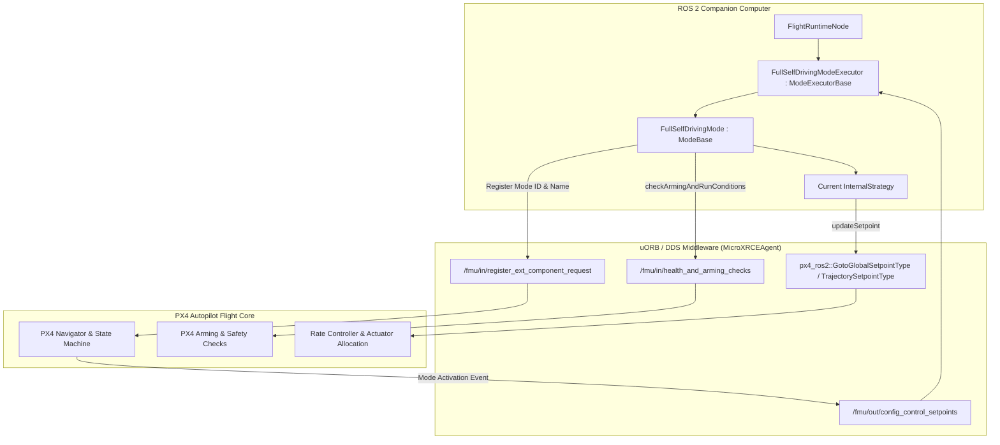

# Module 01: Architecture & Design Principles

The `full_self_driving` package is architected according to strict modern robotics software principles, defensive engineering patterns, and hard real-time safety invariants. This module details the foundational system layers, design rules, and integration paradigms governing the software stack.

---

## 1. The 7-Layer Robotics Architecture

Information flows **upward** through perception and estimation; control decisions and setpoints flow **downward** through flight strategies to the autopilot. Application and user layers never directly command hardware actuators.

```
┌─────────────────────────────────────────────────────────────┐
│ 1. APPLICATION & OPERATOR LAYER                             │
│    Foxglove Studio UI, Mission Control HUD, Plan Manager,  │
│    External Node-RED / REST API, FSD TUI                   │
├─────────────────────────────────────────────────────────────┤
│ 2. GATEWAY & BOUNDARY SECURITY LAYER                         │
│    FsdGateway, Command Envelope Validator, Rate Limiter     │
│    (120 req/min), Negative Security Boundary Gates         │
├─────────────────────────────────────────────────────────────┤
│ 3. DOMAIN & MISSION COORDINATION LAYER                      │
│    MissionCoordinator (FSM), MissionContext (Multi-tenant), │
│    EngineeringConfig (Authoritative Config), PlanManager    │
├─────────────────────────────────────────────────────────────┤
│ 4. FLIGHT RUNTIME & STRATEGY ENGINE                         │
│    FullSelfDrivingMode, FullSelfDrivingModeExecutor,        │
│    InternalStrategy Pattern (Takeoff, Transit, Land, etc.)  │
├─────────────────────────────────────────────────────────────┤
│ 5. FUNCTIONAL PERCEPTION & REGISTRY LAYER                   │
│    fsd_perception (LifecycleNode), OpenCV ArucoDetector,   │
│    TargetCoordinator, Scoped PadRegistry, TF2 Geodesy       │
├─────────────────────────────────────────────────────────────┤
│ 6. HARDWARE ABSTRACTION LAYER (HAL)                         │
│    PayloadController, PayloadAdapter (Sim, PX4, ESP32),     │
│    Px4StateCache (Odometry, Home, LandDetected)             │
├─────────────────────────────────────────────────────────────┤
│ 7. PLATFORM & COMMUNICATION MIDDLEWARE                      │
│    PX4 Autopilot (px4_ros2_cpp), MicroXRCEAgent,            │
│    Gazebo Harmonic / Physical Hardware, SROS2 DDS Security  │
└─────────────────────────────────────────────────────────────┘
```

---

## 2. SOLID Design Principles Applied to ROS 2

### 2.1 Single Responsibility Principle (SRP)
Every ROS 2 node and class has exactly **one reason to change**:
- **[`PerceptionNode`](file:///home/yosh/roscon-25-workshop/full_self_driving/src/perception/perception_node.hpp)**: Exclusively responsible for image ingestion, ArUco corner detection, `solvePnP` pose estimation, and publishing [`AllIdObservationBatch`](file:///home/yosh/roscon-25-workshop/full_self_driving/msg/AllIdObservationBatch.msg). It does *not* filter targets or decide flight transitions.
- **[`TargetCoordinator`](file:///home/yosh/roscon-25-workshop/full_self_driving/src/perception/target_coordinator.hpp)**: Exclusively responsible for multi-observation qualification, spatial consistency gating, and publishing [`LiveTargetLock`](file:///home/yosh/roscon-25-workshop/full_self_driving/msg/LiveTargetLock.msg).
- **[`PadRegistry`](file:///home/yosh/roscon-25-workshop/full_self_driving/src/registry/pad_registry.hpp)**: Exclusively maintains durable, scoped landmark records across space and time.
- **[`MissionCoordinator`](file:///home/yosh/roscon-25-workshop/full_self_driving/src/domain/mission_coordinator.hpp)**: Pure state machine evaluating mission rules and orchestrating transitions between autonomous flight strategies.

### 2.2 Open-Closed Principle (OCP)
The flight autonomy engine is open for extension but closed for modification via the **Strategy Pattern**:
- All autonomous flight behaviors implement the pure abstract interface [`InternalStrategy`](file:///home/yosh/roscon-25-workshop/full_self_driving/src/flight/internal_strategy.hpp) (`on_enter()`, `on_update(dt_s)`, `on_exit()`, `is_completed()`).
- New behaviors (e.g., LiDAR obstacle avoidance, thermal landing) can be added as new strategy classes without modifying the core `FullSelfDrivingMode` executor.

### 2.3 Liskov Substitution Principle (LSP)
Any implementation of an abstract interface can be substituted seamlessly:
- The [`PayloadAdapter`](file:///home/yosh/roscon-25-workshop/full_self_driving/src/payload/payload_adapter.hpp) interface defines contracts for payload mechanisms. The system operates identically whether using [`SimulationPayloadAdapter`](file:///home/yosh/roscon-25-workshop/full_self_driving/src/payload/simulation_payload_adapter.hpp), [`Px4GripperPayloadAdapter`](file:///home/yosh/roscon-25-workshop/full_self_driving/src/payload/px4_gripper_payload_adapter.hpp), or [`HardwarePayloadAdapter`](file:///home/yosh/roscon-25-workshop/full_self_driving/src/payload/hardware_payload_adapter.hpp).

### 2.4 Interface Segregation Principle (ISP)
Interfaces are narrowly scoped to avoid forcing modules to depend on unused capabilities:
- Perception publishes separate, dedicated topics for raw observations ([`AllIdObservationBatch`](file:///home/yosh/roscon-25-workshop/full_self_driving/msg/AllIdObservationBatch.msg)) vs qualified locks ([`LiveTargetLock`](file:///home/yosh/roscon-25-workshop/full_self_driving/msg/LiveTargetLock.msg)) vs health status ([`ComponentHealth`](file:///home/yosh/roscon-25-workshop/full_self_driving/msg/ComponentHealth.msg)).

### 2.5 Dependency Inversion Principle (DIP)
High-level mission logic depends on abstractions, never on low-level hardware or drivers:
- `MissionCoordinator` interacts with the payload through [`PayloadController`](file:///home/yosh/roscon-25-workshop/full_self_driving/src/payload/payload_controller.hpp), which depends on `PayloadAdapter` (interface).
- Application code never directly opens serial ports, calls ioctl, or manipulates GPIOs.

---

## 3. Flight Authority: `px4_ros2_cpp` Registered Mode vs Legacy Offboard

### Why Legacy Offboard Control Was Completely Discarded
In legacy ROS/ROS 2 drone stacks, companion computers commonly rely on **Offboard Control Mode**:
- Stacks publish to `/fmu/in/offboard_control_mode` and stream setpoints to `/fmu/in/trajectory_setpoint` at >2 Hz.
- **Critical Flaws of Legacy Offboard**:
  1. *Fragile Heartbeat Requirement*: If the companion computer misses setpoints for >500ms due to CPU load, PX4 triggers an emergency failsafe.
  2. *No Mode Registration*: PX4 does not know what companion algorithm is executing; QGroundControl/Autopilot reports generic "Offboard".
  3. *Unsafe Pilot Interlock*: Manual pilot override requires fighting setpoint streams or manually flipping RC switches back and forth.
  4. *No Pre-Flight Arming Integration*: Offboard cannot inject custom pre-arm readiness checks into PX4's internal health check system.

### The Production Standard: `px4_ros2_cpp` Registered Modes
`full_self_driving` enforces **Single Mode Authority** using the official PX4 ROS 2 C++ interface library:



#### Key Advantages of Registered Mode:
1. **First-Class Mode in Autopilot**: `FullSelfDrivingMode` registers with PX4 at startup. The mode name appears natively in telemetry and QGroundControl.
2. **Automated Arming & Takeoff Sequencing**: `FullSelfDrivingModeExecutor` executes automated pre-flight checks, arms the vehicle via internal service calls, climbs to the designated altitude, and transitions control to the registered mode.
3. **Hard Arming Interlocks**: `checkArmingAndRunConditions(reporter)` actively prevents arming if required prerequisites (valid target identity, approved plan, secured cargo) are not met.
4. **Deterministic Pilot Takeover**: If the pilot commands RC stick deflection or PX4 switches flight mode, `onDeactivate(DeactivateReason)` is invoked immediately. The companion executor yields authority cleanly and latches into `HOLD` state without competing setpoints.

---

## 4. Single Public Launch Invariant & Supervised Lifecycle

To guarantee deterministic bringup and prevent orphaned background processes:
- **Only One Entry Point**:
  ```bash
  ros2 launch full_self_driving full_self_driving.launch.py [arguments...]
  ```
- **Prohibited**: Never run standalone background scripts, manual `MicroXRCEAgent` invocations, or legacy prototype launch files (`px4_roscon_25/common.launch.py`, `run_world.sh`).

### Supervised Process Graph & Auto-Shutdown
The launch file implements event handlers monitoring all sub-processes:
- If Gazebo exits $\rightarrow$ Entire ROS 2 graph initiates clean shutdown.
- If PX4 SITL exits $\rightarrow$ Entire ROS 2 graph initiates clean shutdown.
- On SIGINT $\rightarrow$ Supervised reverse-order teardown stops nodes, bridges, and simulation engines cleanly without leaving background port locks (e.g., port 8888 or 8765).

---

## 5. Hardware Deferral Gate (`HARDWARE_PROFILE_NOT_CONFIGURED`)

In accordance with safety-critical robotics deployment standards, physical hardware execution is strictly gated:

```bash
ros2 launch full_self_driving full_self_driving.launch.py simulation:=false
```

When `simulation:=false`, the launch file evaluates the `--hardware_manifest` argument:
1. **Manifest Existence Check**: The manifest YAML path must exist.
2. **Schema & Field Validation**: Must conform to [`config/schemas/engineering_config.schema.json`](file:///home/yosh/roscon-25-workshop/full_self_driving/config/schemas/engineering_config.schema.json).
3. **Cryptographic Approval Gate**: `approval.approved` must be `true` and contain a valid `approval_evidence_sha256` digest signed by the safety team.
4. **Fail-Closed Default**: If the manifest is missing, tampered, or unapproved, the launch file aborts immediately with `HARDWARE_PROFILE_NOT_CONFIGURED: Bringup deferred`.
