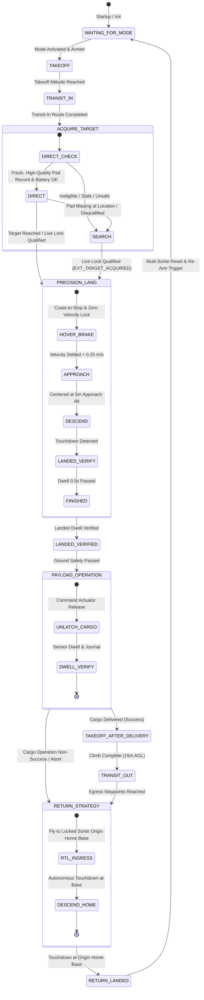
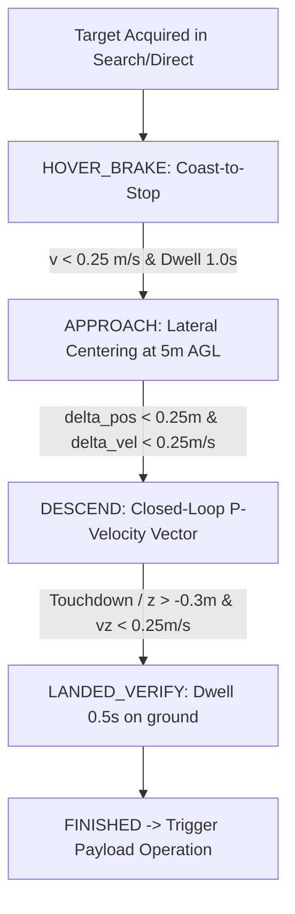

# Module 02: Flight Runtime & Strategy Engine

The flight autonomy stack in `full_self_driving` is built around a deterministic **Finite State Machine (FSM)** managed by the [`MissionCoordinator`](file:///home/yosh/roscon-25-workshop/full_self_driving/src/domain/mission_coordinator.hpp) and executed through modular [`InternalStrategy`](file:///home/yosh/roscon-25-workshop/full_self_driving/src/flight/internal_strategy.hpp) behaviors registered with `px4_ros2_cpp`.

---

## 1. Mission Coordinator State Machine (FSM)

The flight lifecycle follows a deterministic transition sequence:

---

## 2. Exhaustive Strategy Breakdown

### 2.1 `TakeoffStrategy`
- **Source File**: [`src/flight/strategies/takeoff_strategy.cpp`](file:///home/yosh/roscon-25-workshop/full_self_driving/src/flight/strategies/takeoff_strategy.cpp)
- **Role**: Coordinates initial ascent from ground level to cruise altitude.
- **Key Parameters**:
  - `takeoff_altitude_m`: Target altitude above ground/home (default: 10.0m for initial takeoff, 15.0m for post-delivery takeoff).
  - `climb_rate_m_s`: Vertical speed limit (default: 1.0 m/s).
  - `acceptance_radius_m`: Vertical arrival threshold (default: 0.5m).
- **Completion Criteria**: Drone altitude within `acceptance_radius_m` of target and vertical velocity settled.

---

### 2.2 `TransitInStrategy`
- **Source File**: [`src/flight/strategies/transit_in_strategy.cpp`](file:///home/yosh/roscon-25-workshop/full_self_driving/src/flight/strategies/transit_in_strategy.cpp)
- **Role**: Navigates ingress waypoints from the home base to the target operational zone.
- **Control Law**: Streams global waypoint coordinates via `px4_ros2::GotoGlobalSetpointType` with strict yaw rate and speed clamping:
  $$\text{speed} = \min(v_{\text{cruise}}, v_{\text{max\_horizontal}})$$
  $$\dot{\psi} = \text{clamp}(\Delta\psi, -\dot{\psi}_{\text{max}}, +\dot{\psi}_{\text{max}})$$
- **Completion Criteria**: Final ingress waypoint reached within `acceptance_radius_m` (default: 4.0m).

---

### 2.3 `DirectStrategy` (Direct Target Acquisition)
- **Source File**: [`src/flight/strategies/direct_strategy.cpp`](file:///home/yosh/roscon-25-workshop/full_self_driving/src/flight/strategies/direct_strategy.cpp)
- **Role**: Directly routes the drone to a known, trusted landing pad stored in the [`PadRegistry`](file:///home/yosh/roscon-25-workshop/full_self_driving/src/registry/pad_registry.hpp), bypassing the time-consuming search pattern.
- **Direct Eligibility Rules (`is_direct_eligible`)**:
  1. *Battery Budget*: Battery remaining $\ge \text{min\_battery\_percentage}$ (default: 20.0%).
  2. *Scope Matching*: Pad record matches active `map_id` and `scenario_id`.
  3. *Quality Threshold*: Record quality $\ge \text{minimum\_record\_quality}$ (default: 0.20).
  4. *Uncertainty Bound*: Position uncertainty $\le \text{max\_record\_uncertainty\_m}$ (default: 10.0m).
  5. *Freshness Window*: Record age $\le \text{trusted\_record\_max\_age\_s}$ (default: 600.0s).
- **Fallback Trigger**: If the direct target location is reached but the ArUco marker is not acquired within timeout, the strategy automatically falls back to `SearchStrategy`.

---

### 2.4 `SearchStrategy` (Checkpointed Boustrophedon Search)
- **Source File**: [`src/flight/strategies/search_strategy.cpp`](file:///home/yosh/roscon-25-workshop/full_self_driving/src/flight/strategies/search_strategy.cpp)
- **Role**: Executes a systematic lawnmower/boustrophedon search pattern across the search sector when direct coordinates are unavailable.
- **Checkpointing**: Every completed waypoint updates the [`WorkingPlan`](file:///home/yosh/roscon-25-workshop/full_self_driving/src/domain/working_plan.hpp) state. If search is interrupted and resumed, the drone continues from the last uncompleted checkpoint.
- **Preemption**: When `TargetCoordinator` issues a qualified `LiveTargetLock`, `SearchStrategy` immediately yields and triggers `PrecisionLandStrategy`.

---

### 2.5 `PrecisionLandStrategy` (Vision-Guided Touchdown)
- **Source File**: [`src/flight/strategies/precision_land_strategy.cpp`](file:///home/yosh/roscon-25-workshop/full_self_driving/src/flight/strategies/precision_land_strategy.cpp)
- **Role**: High-precision, closed-loop visual touchdown onto the ArUco landing pad.
- **Sub-Phase Execution**:

1. `HOVER_BRAKE` (Coast-to-Stop): Continuously advances the brake hold target to the drone's instantaneous position until forward momentum is neutralized. **Prevents PX4 from generating backwards position error and reversing**.
2. `APPROACH`: Drives lateral error to zero at 5m approach altitude.
3. `DESCEND`: Closed-loop proportional velocity control:
   $$\vec{V}_{xy} = K_p \cdot (\vec{P}_{\text{target\_xy}} - \vec{P}_{\text{drone\_xy}}) + K_i \int \vec{e}_{xy} \, dt$$
   $$V_z = v_{\text{descent}} \quad (0.5 - 1.0 \text{ m/s})$$
   Velocity vector $(V_x, V_y, V_z)$ is streamed directly to `px4_ros2::TrajectorySetpointType`.
4. `LANDED_VERIFY`: Detects ground contact via `LandDetected` uORB topic and altitude radar, maintaining 0.5s dwell before disarming.

---

### 2.6 `PayloadOperationStrategy`
- **Source File**: [`src/flight/strategies/payload_operation_strategy.cpp`](file:///home/yosh/roscon-25-workshop/full_self_driving/src/flight/strategies/payload_operation_strategy.cpp)
- **Role**: Manages cargo release on the ground.
- **Safety Interlock**: Releasing cargo is strictly forbidden while the drone is in flight (`is_landed == false`).
- **Execution Flow**:
  1. Issues release command via [`PayloadController`](file:///home/yosh/roscon-25-workshop/full_self_driving/src/payload/payload_controller.hpp).
  2. Waits for actuator completion feedback (ESP32 pulse verification or PX4 servo acknowledge).
  3. Appends an immutable record to the mission journal via [`PersistenceManager`](file:///home/yosh/roscon-25-workshop/full_self_driving/src/persistence/persistence_manager.hpp).

---

### 2.7 `TakeoffAfterDelivery` & `TransitOutStrategy`
- **Role**: Post-drop vertical climb to 15m departure altitude, followed by egress route navigation through clearance corridor waypoints to clear the delivery zone.

---

### 2.8 `ReturnStrategy` (Return to Launch / Return Landed)
- **Source File**: [`src/flight/strategies/return_strategy.cpp`](file:///home/yosh/roscon-25-workshop/full_self_driving/src/flight/strategies/return_strategy.cpp)
- **Role**: Returns the vehicle to the **locked sortie origin home base**.
- **Home Base Origin Invariant**: The home coordinates are locked during the initial takeoff at the beginning of the sortie. This guarantees that `ReturnStrategy` always flies back to the true origin base rather than the intermediate delivery pad.
- **Multi-Sortie Reset**: Upon touchdown at home base, the vehicle disarms and transitions to `RETURN_LANDED`. The operator can load a new payload, assign a new target pad, and trigger a new sortie without restarting nodes.

---

## 3. Pilot Takeover, Failsafe & Emergency Stop

### Manual Takeover Callback Interlock
When a safety pilot moves the RC sticks or flips the flight mode switch:
1. PX4 revokes active mode status $\rightarrow$ `FullSelfDrivingModeExecutor::onDeactivate(DeactivateReason)` is called.
2. `MissionCoordinator::handle_takeover()` latches the state to `HOLD`.
3. The companion stops sending setpoints immediately, giving the pilot unhindered manual authority.
4. **Ground Disarm Differentiation**: Normal landing disarms on the ground during `LANDED_VERIFY` or `RETURN_LANDED` are explicitly ignored by the takeover latch, preventing false takeover alarms.

### Emergency Stop Service (`/full_self_driving/flight/emergency_stop`)
- Service Type: [`full_self_driving/srv/EmergencyStop.srv`](file:///home/yosh/roscon-25-workshop/full_self_driving/srv/EmergencyStop.srv)
- Action: Immediately commands zero velocity hold, transitions FSM to `FAILSAFE`, disables further strategy transitions, and alerts ground telemetry.
