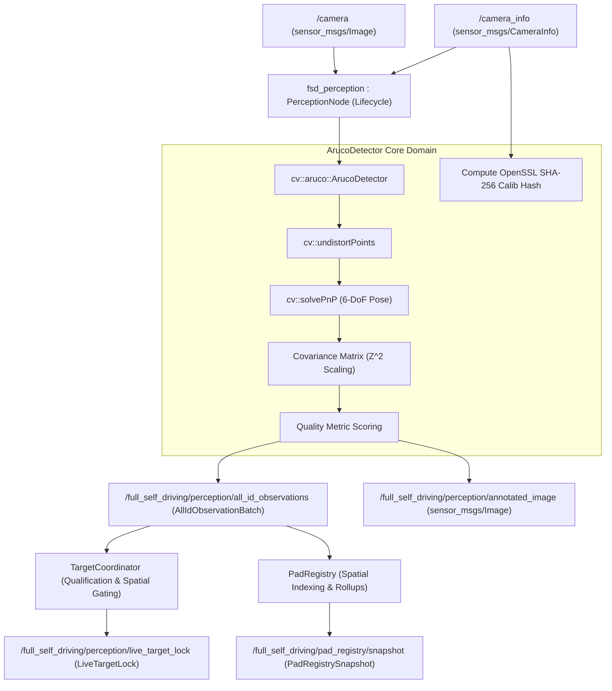

# Module 03: Perception & Scoped Pad Registry

The perception subsystem in `full_self_driving` transforms raw downward camera frames into mathematically validated 6-DoF target poses, qualifies live tracking locks, and maintains a durable, multi-tenant landmark database via the Scoped Pad Registry.

---

## 1. Perception Pipeline Overview



---

## 2. `ArucoDetector` Core Domain

The core detector library ([`src/perception/aruco_detector.cpp`](file:///home/yosh/roscon-25-workshop/full_self_driving/src/perception/aruco_detector.cpp)) is implemented as pure C++ logic with zero ROS node dependencies, ensuring deterministic execution and unit testability.

### 2.1 Supported Dictionaries & Resolution
Supported OpenCV ArUco dictionaries:
- `DICT_4X4_50` (Default, optimized for low marker confusion at high altitudes)
- `DICT_4X4_100`, `DICT_4X4_250`, `DICT_4X4_1000`
- `DICT_5X5_50`, `DICT_5X5_250`

### 2.2 Canonical SHA-256 Camera Calibration Hashing
To prevent dangerous pose estimation errors caused by stale or uncalibrated camera parameters, every incoming `sensor_msgs/msg/CameraInfo` is hashed using OpenSSL SHA-256:
$$\text{Digest} = \text{SHA256}\left( K[0..8] \,\|\, D[0..4] \,\|\, \text{width} \,\|\, \text{height} \,\|\, \text{distortion\_model} \right)$$
The resulting 64-character hexadecimal digest is attached to every [`AllIdObservation.msg`](file:///home/yosh/roscon-25-workshop/full_self_driving/msg/AllIdObservation.msg). Downstream consumers verify that `calibration_sha256` matches the approved camera profile.

### 2.3 6-DoF Pose Estimation via `solvePnP`
1. Marker corners are extracted in 2D image coordinates $(u_i, v_i)$.
2. Corners are undistorted using `cv::undistortPoints` against camera matrix $K$ and distortion coefficients $D$.
3. 3D object points in the marker reference frame (defined with marker width $L$ centered at origin):
   $$P_{\text{obj}} = \left\{ \left(-\frac{L}{2}, \frac{L}{2}, 0\right), \left(\frac{L}{2}, \frac{L}{2}, 0\right), \left(\frac{L}{2}, -\frac{L}{2}, 0\right), \left(-\frac{L}{2}, -\frac{L}{2}, 0\right) \right\}$$
4. `cv::solvePnP` solves for rotation vector $\vec{r}$ and translation vector $\vec{t}$.
5. Rodrigues rotation vector $\vec{r}$ is converted to a normalized Hamiltonian quaternion $(q_w, q_x, q_y, q_z)$.

### 2.4 Covariance Matrix Estimation ($6 \times 6$)
The $6 \times 6$ covariance matrix (position and orientation uncertainty) scales quadratically with depth distance $Z$:
$$\sigma_{\text{pos\_xy}}^2 = c_{\text{base}} \cdot \left(\frac{Z}{L}\right)^2, \quad \sigma_{\text{pos\_z}}^2 = 2.0 \cdot \sigma_{\text{pos\_xy}}^2$$
$$\sigma_{\text{rot}}^2 = c_{\text{rot\_base}} \cdot \left(\frac{Z}{L}\right)^2$$
The diagonal elements are packed into `float64[36] covariance` in row-major order.

### 2.5 Quality Metric Calculation
A composite quality metric $Q \in [0.0, 1.0]$ evaluates the reliability of the observation:
$$Q = \text{clamp}\left( \frac{\text{Area}_{\text{pixels}}}{A_{\text{ref}}} \cdot \cos(\theta_{\text{view}}) \cdot \exp\left(-\frac{Z}{Z_{\text{max}}}\right), 0.0, 1.0 \right)$$
Observations below `min_quality` (default: 0.10) are filtered out before reaching flight control.

### 2.6 High-Altitude Detection Tuning & EMA Smoothing
For 15m high-altitude cruise on compute-constrained platforms (e.g. Raspberry Pi 4):
- Adaptive thresholding parameters: `adaptiveThreshWinSizeMin=3`, `adaptiveThreshWinSizeMax=23`, `adaptiveThreshWinSizeStep=10`.
- Exponential Moving Average (EMA) filter on estimated marker coordinates:
  $$P_{k} = \alpha P_{\text{meas}} + (1 - \alpha) P_{k-1}, \quad (\alpha = 0.75)$$
  $$q_k = \text{slerp}(q_{k-1}, q_{\text{meas}}, \alpha)$$

---

## 3. Target Qualification: `TargetCoordinator`

The [`TargetCoordinator`](file:///home/yosh/roscon-25-workshop/full_self_driving/src/perception/target_coordinator.hpp) enforces qualification gates before emitting a `QUALIFIED` live lock:
1. **Target Identity Filtering**: Rejects any observation whose `marker_id`, `dictionary`, or `target_namespace` does not match the active mission selection.
2. **Consecutive Observation Threshold**: Requires $N \ge \text{lock\_min\_consecutive\_observations}$ consecutive valid detections.
3. **Spatial Consistency Gating**: Validates that new detections lie within $\text{lock\_spatial\_consistency\_radius\_m}$ (default: 25.0m) of the previous detection.
4. **Freshness Watchdog**: If no valid detection is received within `lock_freshness_timeout_s` (default: 2.0s), the target state transitions to `LOST`.

---

## 4. Scoped Pad Registry & Dynamic Geodesy

The [`PadRegistry`](file:///home/yosh/roscon-25-workshop/full_self_driving/src/registry/pad_registry.hpp) acts as the persistent, scoped repository of known landing sites.

```
PadKey = { map_id, scenario_id, target_namespace, dictionary, marker_id }
```

### 4.1 Multi-Tenant Isolation
- Observations from `kmitl_airfield` / `scenario_A` never bleed into `scenario_B` or other airfields.
- Lookups require exact matching of the active 5-tuple key.

### 4.2 Dynamic TF2 Geodetic Projection (Zero Hardcoding)
Rather than hardcoding GPS origin reference coordinates:
1. `PadRegistryNode` subscribes to live PX4 GPS coordinates (`/fmu/out/vehicle_global_position` or `/fmu/out/vehicle_gps_position`).
2. When an ArUco marker is observed in camera frame, `tf2_ros` transforms the pose:
   $$\text{camera\_frame} \xrightarrow{\text{static TF}} \text{base\_link} \xrightarrow{\text{px4\_tf}} \text{odom} \xrightarrow{\text{geodesic}} (\text{Latitude}, \text{Longitude}, \text{Altitude})$$
3. **Fail-Safe Gating & Frame Invariant**: If GPS datum is not locked or TF is unavailable, `PadRegistryNode` drops untransformed observations to prevent raw camera metric offsets from entering the geodetic database. `PadRegistry` enforces defense-in-depth rejection of any observation bearing an optical/camera frame name.
4. WGS84 geodesic conversions compute true global coordinates automatically regardless of simulation world origin or real-world physical airfield.

### 4.3 Pad Record Structure ([`PadRecord.msg`](file:///home/yosh/roscon-25-workshop/full_self_driving/msg/PadRecord.msg))
- `latitude_deg`, `longitude_deg`, `altitude_amsl_m`
- `observation_count`: Total valid observations integrated into rolling average.
- `quality`: Running average observation quality score.
- `uncertainty_m`: 1-sigma positional uncertainty radius in meters.
- `last_observed_monotonic_ns`: Timestamp of most recent detection.
