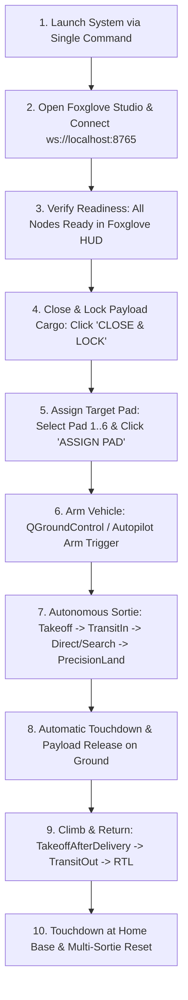

# Module 08: Operations & Troubleshooting Runbook

This runbook provides step-by-step Standard Operating Procedures (SOP), command references, pre-flight checklists, and a comprehensive field troubleshooting matrix for the `full_self_driving` system.

---

## 1. Standard Operating Procedures (SOP)

### 1.1 Environment Setup (Container)
Inside the development Docker container:
```bash
# Source underlay and overlay workspaces
source /opt/ros/humble/setup.bash
source /home/ubuntu/px4_ros_ws/install/setup.bash
source /home/ubuntu/roscon-25-workshop_ws/install/setup.bash
```

---

### 1.2 Launch Modes Catalog

#### Mode A: Full Simulation with Gazebo GUI
Starts Gazebo Harmonic, PX4 SITL, MicroXRCEAgent, Foxglove WebSocket bridge, and all autonomy nodes:
```bash
ros2 launch full_self_driving full_self_driving.launch.py \
  simulation:=true \
  world:=kmitl_airfield \
  headless:=false
```

#### Mode B: Headless Simulation (CI / Automated Testing)
Runs without rendering Gazebo GUI, consuming minimal CPU and RAM:
```bash
ros2 launch full_self_driving full_self_driving.launch.py \
  simulation:=true \
  world:=kmitl_airfield \
  headless:=true
```

#### Mode C: Hardware-in-the-Loop (HITL) with ESP32 Gripper & GPU Acceleration
Launches physical ESP32 serial bridge, GPU-accelerated Gazebo, and Foxglove on host machine:
```bash
# From workspace root on host:
./scripts/run_hitl_delivery.sh /dev/ttyUSB0
```

#### Mode D: Custom Port Launch (Avoiding Port Conflicts)
```bash
ros2 launch full_self_driving full_self_driving.launch.py \
  simulation:=true \
  foxglove_port:=8766
```

---

## 2. Step-by-Step Mission Execution Workflow



### Phase 1: Pre-Flight Verification
1. Verify ROS 2 topic activity:
   ```bash
   ros2 topic echo /clock --once
   ros2 topic echo /full_self_driving/health --once
   ros2 topic echo /full_self_driving/readiness --once
   ```
2. Confirm readiness report returns `is_ready: true`:
   - `failure_codes` must be empty.

### Phase 2: Ground Mission Preparation
1. **Secure Cargo**: On the Foxglove HUD left panel, click **`CLOSE & LOCK`** (or call `/full_self_driving/payload/prepare` with `state: 1`).
2. **Assign Target**: Click **`Pad 1`** (Marker ID 1) $\rightarrow$ Click **`ASSIGN PAD 1`** (or call `/full_self_driving/target/select` with `marker_id: 1`).

### Phase 3: Autonomous Sortie Execution
1. Trigger Arming in QGroundControl or via PX4 Arm command.
2. The `FullSelfDrivingModeExecutor` automatically takes over, climbs to 10m AGL, navigates ingress waypoints, acquires Pad 1, executes precision touchdown, and unlatches the payload.
3. The drone climbs to 15m, navigates egress waypoints, and returns to the locked home base origin.

---

## 3. Automated Verification & Acceptance Tests

### 3.1 Run Full Automated Test Suite (All Unit & Property Tests)
```bash
colcon test --packages-select full_self_driving --event-handlers console_direct+
colcon test-result --verbose
```

### 3.2 Run Full Autonomous Sortie Acceptance Test
```bash
python3 /home/yosh/roscon-25-workshop/full_self_driving/test/acceptance/full_sortie_acceptance.py
```
- Validates the end-to-end mission lifecycle without manual GUI interaction.

---

## 4. Field Troubleshooting Matrix

| Symptom | Probable Root Cause | Diagnostic Command | Remediation Step |
| :--- | :--- | :--- | :--- |
| **Drone refuses to arm; takeoff aborted** | Target identity uncommitted or payload unsecured | `ros2 topic echo /full_self_driving/readiness --once` | Select a target pad and click `CLOSE & LOCK` in Foxglove before arming. |
| **Camera topic empty (`/camera`)** | Image bridge disconnected or Gazebo model name mismatch | `ros2 topic list \| grep camera` | Verify Gazebo camera sensor is active: `gz topic -l \| grep image`. |
| **Foxglove Studio cannot connect (`ws://localhost:8765`)** | Port 8765 in use or stale foxglove bridge running | `lsof -i :8765` or `netstat -tuln \| grep 8765` | Kill stale process `kill -9 $(lsof -t -i:8765)` or specify `foxglove_port:=8766`. |
| **ESP32 Servo not moving during HITL** | USB port permissions or baud rate mismatch | `ls -l /dev/ttyUSB*` and check user in `dialout` | Add user to dialout: `sudo usermod -a -G dialout $USER`. Run interactive test: `python3 scripts/test_esp32_gripper.py`. |
| **Drone stuck in `HOLD` mode** | Manual takeover was triggered by RC stick jitter | `ros2 topic echo /full_self_driving/safety --once` | Reset takeover state via `/full_self_driving/flight/reset_takeover` service or Foxglove HUD. |
| **`HARDWARE_PROFILE_NOT_CONFIGURED` error** | Launched with `simulation:=false` without approved manifest | Check launch arguments | Pass `--hardware_manifest /path/to/approved_manifest.yaml` or use `simulation:=true`. |
| **ArUco markers not detected at 15m altitude** | Camera out of focus or marker size mismatch | `ros2 param get /fsd_perception marker_size` | Verify `marker_size_m` in `fsd_parameters.yaml` matches physical pad size (0.4m or 0.5m). |
| **RTL returns to delivery pad instead of home base** | Sortie origin coordinate not locked upon initial takeoff | Check `flight_runtime_node` log for `[ORIGIN]` | Ensure you are on latest firmware commit with `lock sortie origin` fix (`f15551e`). |
