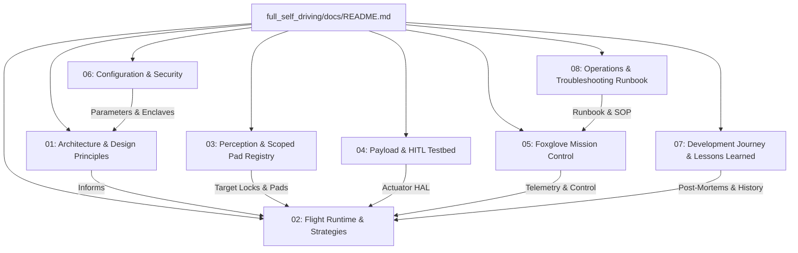

# Full Self-Driving (`full_self_driving`) Documentation Suite

Welcome to the authoritative documentation suite for the `full_self_driving` ROS 2 package. This package delivers a production-grade, fully autonomous flight runtime, vision-guided precision landing system, multi-sortie payload delivery engine, and hardware-in-the-loop (HITL) testbed for PX4-based aerial robotic systems.

---

## 🗺️ Documentation Map & Navigation

The documentation is organized into 8 modular technical guides:



---

## 📚 Documentation Index

| Module | Title | Primary Topics | Target Audience |
| :--- | :--- | :--- | :--- |
| **[01](file:///home/yosh/roscon-25-workshop/full_self_driving/docs/01_architecture_and_design_principles.md)** | [Architecture & Design Principles](file:///home/yosh/roscon-25-workshop/full_self_driving/docs/01_architecture_and_design_principles.md) | Layered architecture, SOLID in ROS 2, `px4_ros2_cpp` Registered Mode authority (vs legacy offboard), Single launch invariant, Hardware Deferral Gate | System Architects, Lead Engineers |
| **[02](file:///home/yosh/roscon-25-workshop/full_self_driving/docs/02_flight_runtime_and_strategies.md)** | [Flight Runtime & Strategy Engine](file:///home/yosh/roscon-25-workshop/full_self_driving/docs/02_flight_runtime_and_strategies.md) | Mission Coordinator FSM, 8 Flight Strategies (Takeoff, TransitIn, Direct, Search, PrecisionLand, Payload, TransitOut, Return), Trajectory control, Takeover & Failsafe | Flight Control Engineers, Autonomy Developers |
| **[03](file:///home/yosh/roscon-25-workshop/full_self_driving/docs/03_perception_and_pad_registry.md)** | [Perception & Scoped Pad Registry](file:///home/yosh/roscon-25-workshop/full_self_driving/docs/03_perception_and_pad_registry.md) | `fsd_perception` Lifecycle Node, OpenCV `solvePnP`, SHA-256 Calibration Hashing, Covariance ($Z^2$), Target Coordinator, Scoped Pad Registry & Dynamic TF2 Geodesy | Perception Engineers, Computer Vision Developers |
| **[04](file:///home/yosh/roscon-25-workshop/full_self_driving/docs/04_payload_and_hitl_testbed.md)** | [Payload Subsystems & HITL Testbed](file:///home/yosh/roscon-25-workshop/full_self_driving/docs/04_payload_and_hitl_testbed.md) | Payload HAL, Native PX4 Gripper, ESP32 Servo Actuator Testbed, Arduino Firmware, Serial JSON Protocol, DTR/RTS auto-reset draining, Wiring | Embedded Engineers, Hardware Integrators |
| **[05](file:///home/yosh/roscon-25-workshop/full_self_driving/docs/05_foxglove_mission_control.md)** | [Foxglove Mission Control & UI](file:///home/yosh/roscon-25-workshop/full_self_driving/docs/05_foxglove_mission_control.md) | Aerospace HUD 3-column layout, Custom Panel Extension (`.foxe`), Pad Chips, Cargo controls, Plan Manager UI, Configurable WebSocket bridge | Flight Operators, Ground Station Integrators |
| **[06](file:///home/yosh/roscon-25-workshop/full_self_driving/docs/06_configuration_and_security.md)** | [Configuration & Security Hardening](file:///home/yosh/roscon-25-workshop/full_self_driving/docs/06_configuration_and_security.md) | Authoritative `fsd_parameters.yaml` catalog, JSON Schemas, SROS2 DDS Keystore PKI, Gateway negative security boundaries, Rate limiting | DevOps, Security & Safety Officers |
| **[07](file:///home/yosh/roscon-25-workshop/full_self_driving/docs/07_development_journey_and_lessons_learned.md)** | [Development Journey & Lessons Learned](file:///home/yosh/roscon-25-workshop/full_self_driving/docs/07_development_journey_and_lessons_learned.md) | Chronological Git evolution (Tasks 1-16 + HITL), 10+ Deep-Dive Bug Post-Mortems (Transit-In Hold, Home base coordinate lock, ESP32 reset, Hard arming gates) | All Developers, Robotics Researchers |
| **[08](file:///home/yosh/roscon-25-workshop/full_self_driving/docs/08_operations_and_troubleshooting_runbook.md)** | [Operations & Troubleshooting Runbook](file:///home/yosh/roscon-25-workshop/full_self_driving/docs/08_operations_and_troubleshooting_runbook.md) | Simulation SOP, HITL Runner with GPU acceleration, Headless CI verification, Step-by-step checklists, Comprehensive Troubleshooting Matrix | Field Engineers, Test Operators |

---

## ⚡ Quick Start: Running Full Autonomous Sortie

### 1. Build the Workspace
Inside the development Docker container (`/home/ubuntu/roscon-25-workshop_ws`):
```bash
colcon build --symlink-install \
  --packages-select full_self_driving \
  --parallel-workers 2 \
  --cmake-args -DCMAKE_BUILD_PARALLEL_LEVEL=2 -DCMAKE_BUILD_TYPE=RelWithDebInfo -DBUILD_TESTING=OFF
source install/setup.bash
```

### 2. Launch Complete Simulation
```bash
# Launches Gazebo Harmonic, PX4 SITL, MicroXRCEAgent, bridges, TF, Foxglove bridge, and all FSD nodes
ros2 launch full_self_driving full_self_driving.launch.py simulation:=true world:=kmitl_airfield headless:=false
```

### 3. Launch Hardware-in-the-Loop (HITL) Delivery with ESP32 Gripper & GPU Passthrough
```bash
# From workspace root
./scripts/run_hitl_delivery.sh
```

---

## 🔗 Key Codebase Locations
- **Launch Files**: [`launch/full_self_driving.launch.py`](file:///home/yosh/roscon-25-workshop/full_self_driving/launch/full_self_driving.launch.py)
- **Authoritative Configuration**: [`config/fsd_parameters.yaml`](file:///home/yosh/roscon-25-workshop/full_self_driving/config/fsd_parameters.yaml)
- **Flight Strategy Implementations**: [`src/flight/strategies/`](file:///home/yosh/roscon-25-workshop/full_self_driving/src/flight/strategies/)
- **Perception Domain**: [`src/perception/`](file:///home/yosh/roscon-25-workshop/full_self_driving/src/perception/)
- **Payload HAL**: [`src/payload/`](file:///home/yosh/roscon-25-workshop/full_self_driving/src/payload/)
- **ESP32 Firmware**: [`firmware/esp32_gripper_actuator/`](file:///home/yosh/roscon-25-workshop/firmware/esp32_gripper_actuator/)
- **Foxglove Custom Extension**: [`foxglove/roscon25.fsd-mission-control-1.0.0.foxe`](file:///home/yosh/roscon-25-workshop/foxglove/roscon25.fsd-mission-control-1.0.0.foxe)
