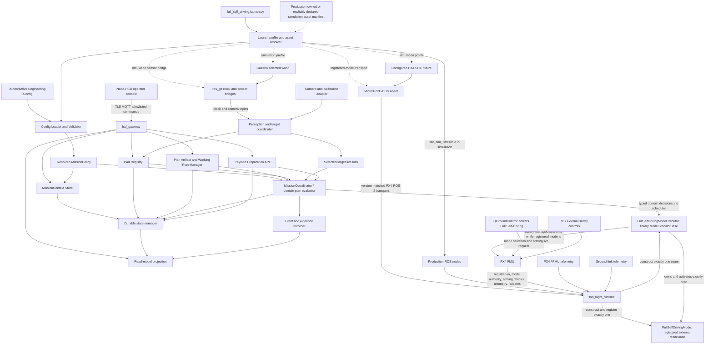
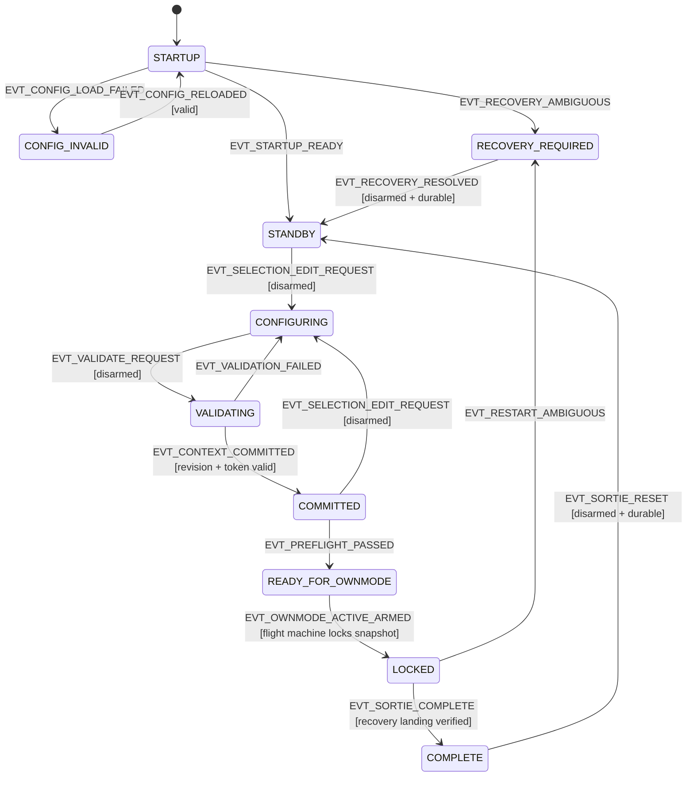

# Design Document: Full Self-Driving

## Document Status

- **Product:** Full Self-Driving
- **ROS 2 package:** `full_self_driving`
- **Specification:** `full-self-driving`
- **Deployment scope:** Generic autonomous field operations across multiple maps, scenarios, vehicles, and payload adapters
- **Design detail:** High-level architecture and low-level implementation design
- **Notation:** Structured pseudocode for algorithms, interfaces, data models, and assertions
- **Launch scope:** Integrated simulation bringup is the initial implementation scope; Raspberry Pi 4 hardware bringup is explicitly deferred
- **Implementation status:** Design only; this document does not create or modify production source code

This design defines one production ROS 2 package with one public launch entry point and modular internal libraries/processes. The package is generic: an installed deployment receives its operational behavior from one authoritative engineering/system configuration file, a disarmed operator selection, and a configuration-selected launch profile. The initial launch profile orchestrates the KMITL Gazebo simulation fixture; no field, map, scenario, payload, altitude, mass, range, marker set, or route is embedded as a flight-code mission literal.

The existing prototype is a read-only behavioral reference. The production package is implemented independently and MUST NOT import, link, depend on, copy, or expose the prototype's packages, public messages, services, topics, class names, parameter names, or launch files. Useful behavioral semantics are retained only where they are expressed as new production contracts: immutable QGroundControl plan artifacts, generated working plans with checkpoints, separate all-ID observations and selected-target lock, durable map registry records, map-assisted Direct navigation, precision landing phases, route progression, payload feedback, and adapter-owned PX4 control.

## Overview

The product performs a complete autonomous sortie after the operator has prepared and committed a mission context while the vehicle is disarmed, selected the dynamically registered custom PX4 external mode `Full Self-Driving` in QGroundControl, and armed through PX4's normal checks. The single owning `FullSelfDrivingModeExecutor` activates that `ModeBase` and drives its internal behavior/state strategy through the mission sequence: takeoff, the configured inbound route using `TransitIn`, map-assisted `Direct` or `Search` according to the active target's trusted registry record, live visual target acquisition, precision landing, landed-target verification, the configured payload operation with hardware feedback, a second takeoff, `TransitOut` or another configured return route, and the configured `ReturnStrategy` such as a supported PX4/ModeExecutor RTL action or route-to-recovery strategy.

Node-RED is an operator console and preparation plane, not a flight controller. It can upload and select safe managed plan artifacts, select a map/scenario and working plan, inspect and clear the active pad registry, select the target identity, prepare the named payload operation, validate and commit the operator selection, and inspect health/progress/recovery. It cannot arm, disarm, select Ownmode, take off, publish raw setpoints, command RTL, issue raw GPIO/servo commands, or trigger an in-flight release. Server-side gates enforce this boundary even if the UI is stale, modified, disconnected, or bypassed.

### Scope and Design Goals

- Provide one standalone package, `full_self_driving`, with one launch entry point and internal modular libraries/processes.
- Load and validate one authoritative engineering configuration file at startup, compute a canonical configuration hash, and latch all resolved values into every mission snapshot.
- Keep deployment-specific values out of flight code. Code contains only universal safety invariants, schema rules, adapter contracts, and state-machine logic.
- Preserve manual QGroundControl `.plan` artifacts as immutable source records and keep generated working plans/checkpoints separate.
- Keep the pad registry scoped by map/scenario and distinguish all-ID observations from the configured target's live lock.
- Use one registered `FullSelfDrivingMode` and its version-matched `FullSelfDrivingModeExecutor` (`ModeExecutorBase`/current equivalent) from `px4_ros2_cpp` for all companion flight control. In the initial architecture, `MissionCoordinator` and the domain `MissionPlan` make decisions and persist state while that single executor applies transitions; `MissionExecutor` and `ActionInterface` are not additional schedulers. Any future use of those separate facilities is a pinned-release, design-approved alternative that replaces rather than supplements this executor arrangement.
- Make persistence, recovery, event evidence, and operator status first-class production behavior.
- Implement the integrated simulation launch first, with KMITL as a configuration-selected simulation fixture/default; define the Raspberry Pi 4 hardware launch branch without pretending that its bringup exists.
- Preserve identical domain behavior across configured profiles; simulation process orchestration and future hardware adapters remain launch/integration concerns, not flight-policy literals.

### Non-Goals

- Replacing PX4 attitude/rate control, estimator, geofence, arming checks, envelope protection, RTL, or failsafe behavior.
- Making Node-RED a general ROS, PX4, actuator, filesystem, or parameter RPC tunnel.
- Treating a map coordinate as a substitute for a fresh live visual target.
- Automatically repeating an actuator operation whose result is unknown after a timeout or restart.
- Mutating the read-only prototype or using any of its public contracts in production.
- Treating a future Raspberry Pi 4 hardware profile as implemented before its camera, PX4, payload, telemetry, and process wiring are validated; an incomplete hardware profile must fail clearly or require declared external adapters.
- Allowing a retained MQTT message, cached UI state, or old status snapshot to authorize a flight or a mutation.

### Golden Rules / Assumptions and Constraints

The following rules are the single normative product-boundary summary. Later sections add implementation detail and test evidence; they do not weaken these rules.

1. **Product boundary:** production is one standalone ROS 2 package, `full_self_driving`, with one public launch entry point. The existing prototype and `gazebo_models` are read-only behavioral/asset references and are never imported, linked, launched, copied, or exposed as production contracts.
2. **Engineering ownership:** one administrator-selected engineering configuration is authoritative for policy, adapters, launch manifests, resource limits, and safety thresholds. Engineers own it; Node-RED cannot edit it, override it through parameters, or replace its resolved hash.
3. **Preparation authority:** Node-RED/MQTT is a typed, revision-guarded preparation and inspection plane. It can mutate operator selection and approved pre-arm payload preparation only while disarmed. It cannot arm, disarm, select Ownmode, take off, land, command RTL, publish flight setpoints, access arbitrary ROS/filesystem paths, issue raw GPIO/servo commands, or trigger in-flight release.
4. **Locked snapshot:** a committed snapshot contains the complete resolved configuration, operator selection, plan/working-plan generation, target identity, payload state, hashes, and checkpoint. It is immutable after it is latched for an armed sortie.
5. **Exclusive flight path:** the only companion flight-control path is the version-matched Auterion `px4_ros2_cpp` registered `FullSelfDrivingMode` and its `FullSelfDrivingModeExecutor`/`ModeExecutorBase` owner. No Offboard mode, `OffboardControlMode`, direct `/fmu/in/offboard_control_mode`, direct `/fmu/in/trajectory_setpoint`, generic setpoint service, raw PX4 flight bridge, or alternate flight-control library exists under any profile, test, or recovery path.
6. **Authority ordering:** PX4, QGroundControl, RC, and PX4 failsafes remain stronger authorities than the companion runtime. Mode loss, takeover, watchdog expiry, or transport failure stops library-managed mode work and yields to PX4 safety behavior.
7. **Map/live-target separation:** registry records are scoped by map/scenario and selected target identity. All-ID observations may update registry data, but only a fresh qualified live observation matching marker ID, dictionary, and namespace can create a target lock. A registry coordinate can assist navigation (`Direct`) but never authorizes precision descent, landing verification, or payload release.
8. **Payload safety:** all payload actions use named allowlisted operations and hardware feedback. Landing, stability, target, policy, count, and adapter gates precede an internal operation. A duplicate operation ID is idempotent; an unknown actuator outcome is persisted and never automatically retried.
9. **Durability and recovery:** safety-relevant mutations, action boundaries, checkpoints, lock transitions, payload intents/results, and takeover/deactivation state are durable or explicitly marked non-durable. Ambiguous restart state enters `RECOVERY_REQUIRED`; the system never auto-arms, auto-resumes, switches action, or repeats a release.
10. **No raw control surface:** all public ROS and MQTT contracts are typed, bounded, owned, and revision-guarded. No contract contains raw PX4/offboard/setpoint fields, arbitrary topic/service names, arbitrary paths, executable/plugin paths, or unbounded JSON.
11. **Perception is not an executive:** perception emits observations, target-lock data, and events only. It never selects a flight mode, arms, emits flight setpoints, or directly invokes an executor transition.
12. **Generic deployment:** field, map, scenario, vehicle, target, payload, route, altitude, range, marker catalog, simulation asset, and hardware adapter values are configuration/catalog data, never AAVC- or site-specific literals in flight code.

The rest of this design is the implementation contract for these rules. Universal invariants are not deployment policy and cannot be weakened by the engineering configuration.

## Architecture

### Flight-Control Exclusivity: `px4_ros2_cpp`, No Offboard

All production flight control is exclusively implemented through the version-matched Auterion `px4_ros2_interface_lib` / `px4_ros2_cpp` integration. `px4_ros2_cpp` is mandatory, not an optional adapter or replaceable transport. The production package has exactly one companion flight-control context: the registered `FullSelfDrivingMode` (`px4_ros2_cpp::ModeBase`, or the exact version-matched equivalent) and its library `FullSelfDrivingModeExecutor` (`ModeExecutorBase`, or the exact version-matched equivalent). That context may emit library-managed flight setpoints only while PX4 has granted control to the registered external mode.

The production system has no Offboard fallback under any circumstance. It never activates or publishes `OffboardControlMode`, never publishes directly to `/fmu/in/offboard_control_mode`, never publishes directly to `/fmu/in/trajectory_setpoint` for flight control, never exposes a raw `px4_msgs` flight-command/setpoint bridge from Node-RED, and never provides an alternate velocity or position control path. No launch profile, configuration, dependency, test fixture, or recovery path may add one. A generic setpoint service is also forbidden; flight actions must be requests to the library-owned executor and its supported action/command abstractions.

The prototype's `GotoGlobalSetpointType`, `GotoSetpointType`, and `TrajectorySetpointType` names do not imply Offboard control. When these types are used inside an active, registered `px4_ros2_cpp::ModeBase`, they are library-managed setpoint abstractions for that external PX4 mode and are explicitly permitted. Production code must use them only through the owning registered mode/executor context, never as a direct topic bridge. Static source/dependency scans must reject prohibited Offboard symbols/topics, direct flight-control publishers, and alternate control libraries.

### Product Boundary and Component Graph



See **Golden Rules / Assumptions and Constraints** for the single product-boundary and authority summary. Internal libraries communicate through new domain interfaces and new ROS contracts; no gateway, registry, perception, payload, persistence, evidence, or launch component owns flight setpoints.

The public launch file starts only production components and dependencies selected by the active profile. In the initial simulation profile it starts the selected Gazebo world, configured PX4 SITL/DDS transport required for external-mode registration and PX4 ROS 2 communication, a required MicroXRCE-DDS agent, configured `ros_gz` clock/sensor/TF bridges, and all `full_self_driving` runtime components. It does not invoke `gazebo_models/run_world.sh`, `px4_roscon_25/common.launch.py`, a prototype launch file, a manually maintained bridge sequence, or an Offboard bridge. The future hardware profile may start externally supplied adapters only after their manifest and health contracts pass; it never substitutes simulated components silently.

### ROS 2 Lifecycle Ownership and Startup Order

Lifecycle ownership is explicit. `rclcpp_lifecycle::LifecycleNode` is used for components whose external I/O can be safely configured, activated, deactivated, and cleaned up independently. The registered PX4 mode must live in a stable regular `rclcpp::Node`; lifecycle transitions must never destroy or recreate its `ModeBase`/`ModeExecutor` while PX4 may hold mode authority.

| Runtime component | ROS 2 ownership | `on_configure` / startup responsibility | `on_activate` responsibility | `on_deactivate` responsibility | `on_cleanup` / `on_shutdown` responsibility |
|---|---|---|---|---|---|
| `fsd_flight_runtime` | **Regular `rclcpp::Node`**, not a LifecycleNode | Load and validate the authoritative config; recover durable state; construct domain objects; create publishers/services/actions; remain unregistered until all dependency gates pass. | Internal readiness/flight state machine starts; construct/register exactly one `FullSelfDrivingMode` and its `FullSelfDrivingModeExecutor` only after required lifecycle nodes, PX4 transport, storage, and health signals are active. | Stop library-managed updates, persist a safe checkpoint, deactivate/yield the registered mode to PX4, and enter `FAILSAFE`/`RECOVERY_REQUIRED` as appropriate; never destroy an active mode object until authority is lost. | Flush the persistence/evidence clients, close adapters, and publish final health; no auto-resume or payload operation on restart. |
| `fsd_perception` | **`rclcpp_lifecycle::LifecycleNode`** | Load camera/calibration/TF contracts, detector allowlists, bounded queues, QoS, and frame validation; create inactive subscriptions/publishers. | Subscribe to camera/clock/TF, publish all-ID observations and target-lock data/events, and start bounded processing timers. | Stop accepting frames, stop processing, publish lock-loss if required, and report inactive health; do not request a flight transition. | Release image/detector resources; on shutdown flush diagnostic counters and close the camera adapter. |
| `fsd_pad_registry` | **`rclcpp_lifecycle::LifecycleNode`** | Open configured registry state/backup paths, validate map/scenario schema, load revisions, and create inactive observation/status endpoints. | Consume observations, apply scope/quality/age rules, persist accepted records, and publish complete snapshots/status. | Reject mutating requests, finish or mark pending persistence, and publish inactive/degraded status. | Close files only after durable flush; preserve the last valid revision and report cleanup failures. |
| `fsd_gateway` | **`rclcpp_lifecycle::LifecycleNode`** | Load broker/TLS/ACL configuration, command schema and rate limits; create fixed typed ROS clients/subscriptions without accepting commands. | Subscribe to complete read models, accept only allowlisted non-retained MQTT commands, enforce revisions/disarmed gates, and publish responses/status. | Stop accepting new mutations, reconcile in-flight request IDs, and retain read-only status until disconnected. | Close broker sessions, zero sensitive buffers where supported, and flush audit outcomes. |
| `fsd_evidence` | **`rclcpp_lifecycle::LifecycleNode`** | Validate event schema, storage/retention/integrity settings, bounded queues, and manifest writer. | Record ordered events, checkpoints, target locks, payload results, diagnostics, and final manifests without blocking the mode-update path. | Stop intake, drain within the configured bound, mark any dropped records, and publish evidence health. | Atomically finalize/close manifests and report gaps; evidence failure never creates a flight-control path. |
| `MissionContextStore`, `PlanManager`, `ConfigLoader`, `PersistenceManager`, `PayloadController` | **ROS-independent libraries hosted by `fsd_flight_runtime`**; not nodes and have no lifecycle callbacks | Constructed and validated by the regular runtime node; authoritative state ownership stays in one process. | Called through typed runtime services/actions and internal executor interfaces; no arbitrary ROS or filesystem access. | Reject unsafe mutations and persist checkpoints through the host runtime. | Host node closes them in dependency order and marks unresolved state for recovery. |
| `full_self_driving.launch.py` and simulation/hardware adapters | Launch-managed process supervisor and external adapter processes; not ROS lifecycle nodes | Validate profile/manifest/executable/working-directory/resource paths; start dependencies and wait for declared readiness. | Keep process supervision, `/clock`/sensor/TF bridges, and reverse-order shutdown active. | Stop accepting flight readiness when a child fails; terminate children in reverse dependency order. | Collect exit diagnostics; never replace a missing hardware dependency with a simulator. |

The configure/activate order is: (1) launch validates the selected engineering file, profile, and asset/process manifests; (2) launch starts Gazebo, PX4 SITL/transport, MicroXRCE-DDS, and bridges for simulation, or only declared external adapters for a future hardware profile; (3) `fsd_flight_runtime` starts as a regular node, validates configuration and recovery, and publishes `EngineeringConfigStatus` while explicitly **not** registering the external mode; (4) launch requests `on_configure` for perception, registry, evidence, and gateway, in that order, and each node waits for the config hash and storage contracts; (5) launch requests `on_activate` for registry, perception, evidence, then gateway last; (6) runtime waits for all required active/healthy signals, PX4 transport compatibility, and mode-registration prerequisites; (7) runtime constructs/registers `FullSelfDrivingMode` and `FullSelfDrivingModeExecutor`, then publishes `READY_FOR_OWNMODE` and its arming checks.

A lifecycle transition failure causes launch supervision to stop readiness, deactivate already-active nodes in reverse order, preserve the last durable state, and shut down child processes in reverse dependency order. If failure occurs after registration, the regular runtime yields control to PX4, persists deactivation/ambiguity, and exposes `FAILSAFE` or `RECOVERY_REQUIRED`; it never re-registers a competing mode or falls back to Offboard. Observability and gateway health are not flight-control dependencies unless the resolved policy explicitly marks their signal required for readiness.

### Package Layout and Launch Ownership

The package owns the public launch contract and its simulation integration metadata. A representative installed layout is:

```text
full_self_driving/
├── launch/
│   └── full_self_driving.launch.py          # one public launch entry point
├── msg/                                     # concrete public ROS 2 messages
├── srv/                                     # typed preparation/recovery services
├── action/                                  # internal committed-sortie action
├── config/
│   └── schemas/                             # structural schemas; policy values stay external
├── simulation/
│   ├── manifests/                           # profile, world, vehicle, process, bridge manifests
│   ├── worlds/                              # production-owned world assets when selected
│   ├── materials/textures/                  # resources referenced by installed worlds
│   └── bridges/                              # ros_gz / PX4 bridge configurations
├── full_self_driving/                       # runtime Python launch/support modules
├── src/                                     # domain, runtime, and adapter implementations
├── test/                                    # domain, interface, launch, security, and integration fixtures
└── resource/                                # ament package/resource index only
```


The initial simulation fixture catalog resolves the world identifier `kmitl_airfield` to an installed or explicitly declared asset manifest. That manifest owns the world path, relative material/texture roots, x500 downward-camera vehicle fixture, PX4 SITL transport settings, DDS-agent requirement, and camera/clock bridge configuration. The identifier is a fixture/catalog value, not a domain-code constant. If the deployment chooses an external asset bundle instead of installed assets, the bundle and package/version must be declared in the manifest and validated before launch; the old `gazebo_models` directory remains a read-only reference and is never a runtime dependency.

The package layout separates launch assets from the authoritative engineering file. The engineering file selects policy, adapter IDs, and approved manifest IDs; launch arguments select only a valid profile/world/headless presentation within those approved choices. No launch argument can override route, altitude, payload, target, safety, or other flight-policy values.

### Simulation-to-Hardware HAL Contract / Adapter Porting Guide

A profile switch changes adapters and process manifests, not the domain contract. `simulation:=false` is a deliberately deferred hardware path until its manifest and external adapters pass validation; it never silently starts simulated components and it is not a claim that Raspberry Pi 4 bringup exists.

| Concern | Simulation profile (`simulation:=true`) | Future hardware profile (`simulation:=false`) | Contract that remains identical |
|---|---|---|---|
| PX4 transport | Manifest-configured PX4 SITL executable, working directory, ROMFS/autostart, DDS transport, and MicroXRCE-DDS agent | Real FMU transport and approved radio/serial/UDP adapter with version-matched `px4_msgs`/`px4_ros2_cpp` | Registered `FullSelfDrivingMode`, `ModeExecutorBase` ownership, mode requirements, arming checks, watchdog, deactivation, and no-Offboard rule |
| Camera and frames | Gazebo camera topics, simulated clock, configured `ros_gz` image/camera-info/TF bridges, declared calibration fixture | Real camera driver, measured calibration artifact, lens distortion model, mounting transform, hardware timestamp and TF source | `fsd_perception` messages, target identity/lock qualification, freshness/covariance rules, registry scope, and coordinator ownership |
| Payload | Simulation adapter with deterministic commanded/feedback states and fault injection | Approved isolated GPIO/servo/lock-feedback adapter; electrical safety, power supervision, and latency validation required | Named operations, allowlist, feedback semantics, idempotency key, durable intent/result, no automatic unknown-result retry |
| Ground link/telemetry | SITL heartbeat and simulated telemetry transport selected by manifest | Declared radio/telemetry adapter, link metrics, loss/failure reporting, and QGroundControl observation | `ground_link_health` semantics, PX4/QGC/RC authority, readiness gates, and safety response policy |
| Launch/processes | Gazebo world/resources, PX4 SITL, MicroXRCEAgent, `/clock`/camera/TF bridges, production nodes, readiness summary, reverse-order supervision | FMU/driver processes, real camera/payload/telemetry adapters, production nodes, resource paths, and external-process manifest | One public `full_self_driving.launch.py`, dependency/readiness contract, lifecycle order, shutdown order, and typed ROS/MQTT API |
| Storage/resources | Simulation workspace paths from the engineering config; bounded logs/evidence and deterministic fault injection | Protected state/evidence/backup paths on the target companion computer; measured free space, fsync behavior, temperature, and power-loss behavior | Snapshot/journal schema, hashes, atomic durability protocol, recovery state machine, and evidence correlation |

**Porting steps:** (1) select and pin the hardware adapter/process manifest and validate executable identity, permissions, working directory, device paths, and resource limits; (2) replace only the PX4/camera/payload/ground-link/clock adapter IDs in a new engineer-owned configuration revision; (3) run the same ROS interface and domain tests with hardware adapters behind deterministic fakes; (4) measure camera distortion, timestamp/latency, TF alignment, payload feedback latency, telemetry freshness, battery/energy estimates, CPU/memory/temperature/storage budgets, and power-loss recovery; (5) run controlled ground tests with arming disabled, then tethered/indoor tests, then supervised field tests; (6) verify dynamic `Full Self-Driving` visibility in QGroundControl, arming readiness, mode takeover, watchdog, PX4 failsafe, and evidence; (7) approve the hardware manifest only after the acceptance and soak gates pass. A hardware profile that lacks any required adapter or test result fails launch/readiness with `HARDWARE_PROFILE_NOT_CONFIGURED`.

**Simulation limitations:** Gazebo cannot establish real camera rolling-shutter/distortion behavior, physical GPIO/servo power faults, radio interference, FMU timing under load, battery sag/energy-model accuracy, real coordinate-frame mounting error, or power-removal durability. Simulation can exercise route/state ordering, registry/lock separation, action persistence, lifecycle supervision, message/QoS contracts, fault injection, and the complete single-command bringup. Real-camera distortion/latency, GPIO latency and stuck/fault feedback, telemetry loss/recovery, battery/energy triggers, scheduler timing, calibration/TF, and power interruption require hardware-in-the-loop or field validation before enabling a hardware profile. Raspberry Pi 4 bringup remains deferred until those tests and its process manifest are complete.

### Authority and Control Planes

There are two intentionally separate control planes:

**Operator preparation plane (Node-RED):** edits only `OperatorSelection` and approved preparation state while disarmed. It can request validation and commit. It cannot operate PX4 or directly actuate an in-flight payload.

**Flight-control plane (QGroundControl/PX4 plus the registered companion mode):** PX4 dynamically registers the companion `FullSelfDrivingMode` and exposes `Full Self-Driving` to QGroundControl. QGroundControl selects that registered external mode and requests arming through PX4's normal `ModeRequirements`/arming checks. Once PX4 grants the mode, `FullSelfDrivingModeExecutor` schedules the configured sequence through the owning `ModeBase`; it does not create a competing flight-control scheduler. PX4, QGroundControl, RC, and PX4 failsafes can take control away or deactivate the mode at any time.

The custom mode activation and arming-readiness gates are server-side. They must reject or clearly report every missing prerequisite, including:

- no committed mission context;
- no selected map/scenario;
- no selected immutable plan artifact;
- no valid working-plan generation/checkpoint state;
- no selected target identity;
- no valid payload preparation and hardware feedback;
- no healthy durable storage or unresolved recovery state;
- stale PX4/vehicle, camera, target, link, or adapter health required by the configured policy;
- a configuration hash mismatch or a snapshot that cannot be validated.

Node-RED cannot make a failed gate pass by publishing a different status or by changing an internal ROS parameter.

### Configuration Lifecycle

Configuration state and flight state are separate dimensions. `fsd_flight_runtime` owns the authoritative configuration state machine; Node-RED can request only disarmed preparation transitions. A status projection may be stale, but it cannot satisfy a guard.



Configuration states are `STARTUP`, `STANDBY`, `CONFIGURING`, `VALIDATING`, `COMMITTED`, `READY_FOR_OWNMODE`, `LOCKED`, `COMPLETE`, `CONFIG_INVALID`, and `RECOVERY_REQUIRED`. `COMMITTED` is a durable preparation state; `LOCKED` means the snapshot is immutable for the active sortie.

### Flight Lifecycle

The flight machine is owned by the single `FullSelfDrivingModeExecutor`/`ModeExecutorBase` and its one registered `FullSelfDrivingMode`. `MissionCoordinator` supplies domain decisions and guards; it is not a second scheduler. PX4 reports mode authority, arming, vehicle state, and safety events. Perception publishes observations and lock events only; it never performs a flight transition.

```mermaid
stateDiagram-v2
    [*] --> WAITING_FOR_MODE
    WAITING_FOR_MODE --> TAKEOFF: EVT_MODE_ACTIVE_ARMED [locked snapshot + readiness]
    TAKEOFF --> TRANSIT_IN: EVT_TAKEOFF_COMPLETE [settled + durable]
    TRANSIT_IN --> ACQUIRE_TARGET: EVT_TRANSIT_IN_COMPLETE [route checkpoint durable]
    ACQUIRE_TARGET --> DIRECT: EVT_ACQUISITION_DIRECT_SELECTED [trusted record + path gate]
    ACQUIRE_TARGET --> SEARCH: EVT_ACQUISITION_SEARCH_SELECTED [working plan valid]
    DIRECT --> PRECISION_LAND: EVT_DIRECT_COMPLETE [safe position; start PrecisionLand SEARCH]
    DIRECT --> SEARCH: EVT_DIRECT_FALLBACK [record stale/path gate/timeout]
    SEARCH --> PRECISION_LAND: EVT_TARGET_LOCK_QUALIFIED [coordinator guard]
    SEARCH --> SEARCH: EVT_SEARCH_CHECKPOINTED [no lock + within bounds]
    PRECISION_LAND --> LANDED_VERIFIED: EVT_LANDED_VERIFY_PASSED [hierarchical state complete]
    LANDED_VERIFIED --> PAYLOAD_OPERATION: EVT_PAYLOAD_GATES_PASSED
    PAYLOAD_OPERATION --> TAKEOFF_AFTER_DELIVERY: EVT_PAYLOAD_SUCCESS
    PAYLOAD_OPERATION --> RETURN_STRATEGY: EVT_PAYLOAD_UNKNOWN_OR_FAILURE
    TAKEOFF_AFTER_DELIVERY --> TRANSIT_OUT: EVT_SECOND_TAKEOFF_COMPLETE
    TRANSIT_OUT --> RETURN_STRATEGY: EVT_TRANSIT_OUT_COMPLETE
    RETURN_STRATEGY --> RETURN_LANDED: EVT_RECOVERY_LANDING_VERIFIED
    RETURN_LANDED --> [*]

    state PRECISION_LAND {
        [*] --> SEARCH
        SEARCH --> APPROACH: EVT_TARGET_LOCK_QUALIFIED
        SEARCH --> SEARCH: EVT_TARGET_LOCK_LOST [continue search]
        APPROACH --> DESCEND: EVT_APPROACH_SETTLED [fresh lock]
        APPROACH --> SEARCH: EVT_TARGET_LOST [reacquisition policy]
        DESCEND --> LANDED_VERIFY: EVT_LANDING_STABLE
        DESCEND --> APPROACH: EVT_TARGET_LOST [stop descent + reacquire]
        DESCEND --> SEARCH: EVT_DESCENT_ABORTED [configured climb/search]
        LANDED_VERIFY --> [*]: EVT_LANDING_VERIFIED
    }

    TAKEOFF --> HOLD: EVT_HEALTH_DEGRADED [configured hold]
    TRANSIT_IN --> HOLD: EVT_HEALTH_DEGRADED [configured hold]
    SEARCH --> HOLD: EVT_HEALTH_DEGRADED [configured hold]
    HOLD --> TAKEOFF: EVT_HOLD_RECOVERED [same action checkpoint]
    HOLD --> RETURN_STRATEGY: EVT_HOLD_TIMEOUT [safe return]
    TAKEOFF --> FAILSAFE: EVT_PX4_RC_QGC_TAKEOVER
    TRANSIT_IN --> FAILSAFE: EVT_PX4_RC_QGC_TAKEOVER
    PRECISION_LAND --> FAILSAFE: EVT_PX4_RC_QGC_TAKEOVER
    PAYLOAD_OPERATION --> FAILSAFE: EVT_WATCHDOG_OR_MODE_LOSS
    FAILSAFE --> [*]: EVT_CONTROL_YIELDED
```



`PRECISION_LAND` is hierarchical: `SEARCH` may accept a live-lock event, `APPROACH` holds a safe altitude on target loss, `DESCEND` stops descent before reacquisition or abort, and `LANDED_VERIFY` requires vehicle stability and target/landing checks. The outer flight machine cannot enter payload operation until the hierarchy completes.

### State Transition Table

Event IDs are stable uppercase identifiers emitted by the named source. Every event carries `mission_id`, `sortie_id`, `snapshot_hash`, monotonic `event_sequence`, and `idempotency_key`; duplicate events with the same key are acknowledged without repeating side effects. Perception event IDs are data events (`EVT_ALL_ID_OBSERVATION`, `EVT_TARGET_LOCK_QUALIFIED`, `EVT_TARGET_LOCK_LOST`) and are consumed by the coordinator; they never call a mode-switch API.

| Machine | Current state | Event/condition (source) | Guard | Next state | Action/persistence effect |
|---|---|---|---|---|---|
| Configuration | `STARTUP` | `CFG-001 / EVT_STARTUP_READY` (config loader + persistence) | Config schema/hash valid; durable recovery clear; required adapters reported | `STANDBY` | Publish config status and readiness; persist startup sequence. |
| Configuration | `STARTUP` | `CFG-002 / EVT_CONFIG_LOAD_FAILED` (config loader) | Any unsafe path, parse, schema, relationship, adapter, or hash failure | `CONFIG_INVALID` | Disable Ownmode readiness; persist field-level errors; no mode registration. |
| Configuration | `STARTUP` | `CFG-003 / EVT_RECOVERY_AMBIGUOUS` (persistence manager) | Snapshot/journal/plan/payload/executor contradiction or checksum failure | `RECOVERY_REQUIRED` | Freeze mutations and flight activation; expose ambiguity and durable sequence. |
| Configuration | `STANDBY` | `CFG-004 / EVT_SELECTION_EDIT_REQUEST` (typed gateway service) | Vehicle disarmed; expected selection revision matches; command allowlisted | `CONFIGURING` | Apply only `OperatorSelection`; increment revision and atomically persist. Idempotent request IDs return the prior result. |
| Configuration | `CONFIGURING` | `CFG-005 / EVT_VALIDATE_REQUEST` (typed gateway service) | Disarmed; current revision and config hash match | `VALIDATING` | Validate map/scenario, artifact, working plan, target, payload, health, and persistence; emit validation token. |
| Configuration | `VALIDATING` | `CFG-006 / EVT_VALIDATION_FAILED` (context store) | Any validation violation | `CONFIGURING` | Keep selection unchanged; persist report; no readiness change. |
| Configuration | `VALIDATING` | `CFG-007 / EVT_CONTEXT_COMMITTED` (context store) | Token, expected revision, storage durability, and all gates pass | `COMMITTED` | Serialize complete snapshot, hash it, persist commit journal, publish committed snapshot. |
| Configuration | `COMMITTED` | `CFG-008 / EVT_PREFLIGHT_PASSED` (flight runtime) | Snapshot valid; all required health/transport/lifecycle signals fresh | `READY_FOR_OWNMODE` | Publish all readiness gates; still do not arm or command flight. |
| Configuration | `READY_FOR_OWNMODE` | `CFG-009 / EVT_OWNMODE_ACTIVE_ARMED` (PX4 + QGroundControl, observed by runtime) | Registered external mode active; PX4 arming checks pass; snapshot lock persisted | `LOCKED` | Latch immutable snapshot; persist sortie start; flight machine may start. |
| Flight | `WAITING_FOR_MODE` | `FLY-001 / EVT_OWNMODE_ACTIVE_ARMED` (PX4/runtime) | Configuration state `LOCKED`; mode authority belongs to `FullSelfDrivingMode` | `TAKEOFF` | Start library-supported takeoff action; persist action intent. |
| Flight | `TAKEOFF` | `FLY-002 / EVT_TAKEOFF_COMPLETE` (PX4 telemetry + executor) | Height, settle, energy, geofence, and transport gates pass | `TRANSIT_IN` | Persist takeoff result and route checkpoint; select the internal `TRANSIT_IN` strategy. |
| Flight | `TRANSIT_IN` | `FLY-003 / EVT_TRANSIT_IN_COMPLETE` (executor) | All route points settled; checkpoint durable; return gate remains valid | `ACQUIRE_TARGET` | Persist inbound completion and evaluate registry lookup. |
| Flight | `ACQUIRE_TARGET` | `FLY-004 / EVT_ACQUISITION_DIRECT_SELECTED` (coordinator) | Matching trusted registry record, current scope, path/energy gates | `DIRECT` | Persist branch decision; select the internal `DIRECT` strategy through the owned mode. |
| Flight | `ACQUIRE_TARGET` | `FLY-005 / EVT_ACQUISITION_SEARCH_SELECTED` (coordinator) | Working plan valid and Direct unavailable/disabled | `SEARCH` | Persist branch decision; resume checkpointed working plan. |
| Flight | `DIRECT` | `FLY-006 / EVT_DIRECT_COMPLETE` (Direct behavior) | Safe position reached and settle gate passes; a live lock is not assumed | `PRECISION_LAND.SEARCH` | Persist navigation completion only; the hierarchy searches/reacquires and requires a qualified lock before Approach or descent. |
| Flight | `DIRECT` | `FLY-007 / EVT_DIRECT_FALLBACK` (Direct behavior/coordinator) | Record stale, path unsafe, timeout, or transport/energy gate fails; working plan valid | `SEARCH` | Stop Direct setpoint updates; checkpoint reason; start Search. |
| Flight | `SEARCH` | `FLY-008 / EVT_TARGET_LOCK_QUALIFIED` (perception → coordinator) | Identity, scope, freshness, quality, covariance, consecutive count, transform, and spatial gates pass | `PRECISION_LAND.APPROACH` | Persist lock evidence; coordinator requests the hierarchy transition; perception does not switch mode. |
| Flight | `PRECISION_LAND.APPROACH` | `FLY-009 / EVT_TARGET_LOST` (perception → coordinator) | Lock stale/lost; target-loss policy permits reacquisition | `PRECISION_LAND.SEARCH` | Stop lateral descent progression; persist loss event and last fresh pose. |
| Flight | `PRECISION_LAND.DESCEND` | `FLY-010 / EVT_TARGET_LOST` (perception → coordinator) | Lock stale/lost during descent | `PRECISION_LAND.APPROACH` or `SEARCH` | Immediately stop descent; hold/climb according to policy; persist non-durable/durable outcome explicitly. |
| Flight | `PRECISION_LAND.DESCEND` | `FLY-011 / EVT_LANDING_STABLE` (PX4 telemetry + coordinator) | Landed, stable, fresh lock/target verification, dwell complete | `PRECISION_LAND.LANDED_VERIFY` | Stop descent; persist landing observation and verification intent. |
| Flight | `PRECISION_LAND.LANDED_VERIFY` | `FLY-012 / EVT_LANDING_VERIFIED` (coordinator) | Vehicle landed/stable; target identity/scope and payload prerequisites pass | `LANDED_VERIFIED` | Persist landing verification and enable internal payload action only. |
| Flight | `LANDED_VERIFIED` | `FLY-013 / EVT_PAYLOAD_GATES_PASSED` (coordinator + payload) | Named operation allowed; feedback valid; count and idempotency checks pass | `PAYLOAD_OPERATION` | Persist operation intent before adapter command. |
| Flight | `PAYLOAD_OPERATION` | `FLY-014 / EVT_PAYLOAD_SUCCESS` (payload adapter) | Hardware feedback confirms commanded result | `TAKEOFF_AFTER_DELIVERY` | Persist result/evidence; increment successful count; start second takeoff. |
| Flight | `PAYLOAD_OPERATION` | `FLY-015 / EVT_PAYLOAD_UNKNOWN` (payload adapter/persistence) | Timeout, power loss, contradictory feedback, or restart ambiguity | `RETURN_STRATEGY` or `ABORT` | Persist `UNKNOWN`; never retry automatically; follow configured safe return and recovery decision. |
| Flight | `PAYLOAD_OPERATION` | `FLY-016 / EVT_PAYLOAD_FAILURE` (payload adapter) | Explicit negative hardware result or policy rejection after intent | `RETURN_STRATEGY` or `ABORT` | Persist failure and evidence; no release retry unless a new disarmed sortie is explicitly authorized. |
| Flight | `TAKEOFF_AFTER_DELIVERY` | `FLY-017 / EVT_SECOND_TAKEOFF_COMPLETE` (PX4 telemetry + executor) | Takeoff/settle/energy/geofence gates pass | `TRANSIT_OUT` | Persist action completion; start configured outbound route. |
| Flight | `TRANSIT_OUT` | `FLY-018 / EVT_TRANSIT_OUT_COMPLETE` (executor) | Distinct outbound route or configured return-route gate passes | `RETURN_STRATEGY` | Persist route checkpoint; invoke configured return strategy. |
| Flight | `RETURN_STRATEGY` | `FLY-019 / EVT_RECOVERY_LANDING_VERIFIED` (PX4 telemetry + coordinator) | Recovery target/RTL result and landing verification pass | `RETURN_LANDED` | Persist recovery result and evidence; request configuration `COMPLETE`. |
| Flight | Any active action | `FLY-020 / EVT_PX4_RC_QGC_TAKEOVER` (PX4/RC/QGroundControl) | Authority no longer belongs to registered mode | `FAILSAFE` | Stop library-managed updates; persist safe checkpoint; yield to PX4; never fight takeover. |
| Flight | Any active action | `FLY-021 / EVT_MODE_WATCHDOG_EXPIRED` (px4_ros2_cpp/runtime) | Mode update or transport deadline missed | `FAILSAFE` | Stop action and report watchdog; PX4 safety behavior remains final authority. |
| Configuration/Flight | Any state | `SYS-001 / EVT_PERSISTENCE_FAILED` (persistence manager) | Required durable boundary fails or storage reserve exhausted | `HOLD`, `ABORT`, or `RECOVERY_REQUIRED` | Preserve last valid snapshot; mark the failed boundary; block unsafe progression and expose exact durability status. |
| Configuration/Flight | Any state after process start | `SYS-002 / EVT_RESTART_AMBIGUOUS` (recovery loader) | Hash, sequence, checkpoint, payload, or executor state cannot be reconciled | `RECOVERY_REQUIRED` / `FAILSAFE` | Disable auto-arm/resume/release; require disarmed explicit decision and fresh preflight. |
| Configuration | `LOCKED`/`COMPLETE` | `CFG-010 / EVT_SORTIE_COMPLETE` (runtime + persistence) | Return landing and evidence durable; vehicle disarmed for finalization | `COMPLETE` then `STANDBY` on reset | Finalize manifest; make next selection editable only after disarm and reset event. |
| Configuration | `COMPLETE` | `CFG-011 / EVT_SORTIE_RESET` (typed gateway service) | Disarmed; expected revision and recovery state clear | `STANDBY` | Create next editable selection; preserve immutable source artifacts and prior evidence. |

The table is normative for event ownership and persistence effects. A rejected guard leaves the current state unchanged or enters an explicit safety overlay; it never silently advances.

### End-to-End Sortie Sequence

```mermaid
sequenceDiagram
    participant Admin as Engineer/System Administrator
    participant N as Node-RED
    participant G as Gateway
    participant C as MissionContext Store
    participant P as Working Plan Manager
    participant R as Pad Registry
    participant Q as QGroundControl
    participant X as FullSelfDrivingModeExecutor (owns FullSelfDrivingMode)
    participant PX as PX4 FMU
    participant V as Perception
    participant Y as Payload Adapter
    participant D as Durable State/Evidence

    Admin->>G: deployment starts with selected engineering config file
    G->>C: startup loader validates and hashes resolved config
    C->>D: recover snapshots, journals, registry, plan, payload, executor state
    N->>G: upload .plan artifact to managed directory
    G->>P: parse, hash, store immutable manual source
    N->>G: select map/scenario, plan, working plan, target identity
    G->>C: mutate OperatorSelection while disarmed
    N->>G: reset working plan when requested (new generation, 0%)
    N->>G: named payload preparation operation
    G->>Y: approved pre-arm operation only
    N->>G: validate and commit mission context
    G->>C: latch context plus resolved config hash into snapshot
    C-->>N: readiness and explicit gate results

    X->>PX: verify matching PX4/px4_msgs message set and px4_ros2_cpp compatibility
    X->>PX: construct and register FullSelfDrivingMode + ModeExecutor
    PX-->>Q: expose registered Full Self-Driving external mode
    Q->>PX: select registered Full Self-Driving and arm
    PX->>X: registered-mode activation and arming readiness request
    X->>C: revalidate committed context, storage, plan, target, payload, health
    C-->>X: accept or reject with reason
    X->>D: persist locked snapshot and executor checkpoint
    X->>PX: TAKEOFF through ModeExecutor/ModeBase
    X->>PX: TransitIn using configured route and policy
    X->>X: choose Direct if trusted target record exists; otherwise Search
    V-->>R: all-ID observations scoped to active map/scenario
    V-->>X: selected target live lock only for configured identity
    X->>PX: Direct to trusted registry position above target when eligible
    X->>PX: Search working plan when Direct is unavailable
    X->>X: coordinator receives qualified lock; perception does not switch mode
    X->>PX: PrecisionLand Search/Approach/Descend using fresh live lock
    PX-->>X: landed/stable state
    X->>X: verify landed, target, map/scenario, and payload conditions
    X->>Y: internal PayloadOperation release request
    Y-->>X: commanded state and hardware feedback
    X->>D: persist release result/evidence; unknown result is not retried
    X->>PX: take off again
    X->>PX: TransitOut or configured outbound/return route
    X->>PX: configured ReturnStrategy, including optional PX4 RTL/land action
    PX-->>X: recovery landing verified
    X->>D: persist completion, evidence, and next-sortie readiness
    G-->>N: status, progress, target, registry, payload, and recovery read models
```

The acquisition decision belongs to `MissionCoordinator` as a domain decision, and is applied by the single owning `FullSelfDrivingModeExecutor`/`FullSelfDrivingMode` path. A perception callback only publishes observations and a qualified selected-target lock; it must not call a mode-switch API. `Direct` is navigation assistance to a trusted map record. Even after `Direct` reaches the target area, the coordinator must obtain a fresh live lock before `PrecisionLand` can approach or descend.

### Resource and Timing Architecture

The flight update path is isolated from image conversion, disk I/O, MQTT callbacks, and large plan parsing. Camera and live-target queues use bounded latest-sample semantics; mission events and state transitions use bounded ordered queues with backpressure reporting. Monotonic time governs freshness, watchdogs, action timeouts, and checkpoint cadence. Wall or ROS time is used only for display, evidence, and simulation alignment.

The engineering configuration chooses rates, queue depths, timeouts, QoS, image dimensions, and retention within validated resource limits. The code does not assume a fixed processor, camera rate, telemetry interval, or storage size. Resource exhaustion is observable and fails closed for the affected operation.

## Components and Interfaces

### Domain Core

`fsd_domain` is ROS-independent. It owns immutable value objects, `MissionPolicy` validation, operator-selection validation, state transitions, route gates, target-lock qualification, payload interlocks, idempotency decisions, and evidence event construction. It accepts timestamps and immutable snapshots and returns decisions such as `Accept`, `Reject`, `Hold`, `Abort`, `SelectInternalStrategy`, `RequestLibraryAction`, and `RecoveryRequired`.

It does not include `rclcpp`, PX4 message types, MQTT, OpenCV, direct GPIO access, or filesystem calls. Adapters translate domain decisions into ROS, PX4, camera, payload, gateway, and persistence operations.

### Engineering Config Loader and MissionPolicy Resolver

The loader reads exactly one administrator-selected engineering/system configuration file at startup. The file contains all operational values: routes, search, Direct, precision landing, target locking, registry policy, geofence, home/recovery, energy, links, payload, camera, storage, timeouts, QoS/rates, and adapter selection. A deployment may keep templates or backups, but the running deployment has one authoritative file and one resolved hash.

Startup processing is:

1. Resolve only the configured selector path; reject empty, relative, traversing, symlink-escape, package-share-write, or unauthorized paths.
2. Parse the file with bounded size and a strict schema.
3. Validate types, finite values, positivity/non-negativity, enumerations, relationships, route geometry, path safety, and adapter availability.
4. Canonically serialize the resolved values with stable key ordering and units.
5. Calculate SHA-256 over the canonical representation.
6. Publish a read-only `EngineeringConfigStatus` projection and retain the resolved object in the MissionContext Store.
7. Refuse `READY_FOR_OWNMODE` until the file, hash, storage, and required adapters are healthy.

ROS parameters may expose the config-file selector and read-only projections for observability. Dynamic parameter updates are disabled for engineering values. Node-RED commands cannot edit or override the file, its resolved object, or its hash.

### MissionContext Store and Snapshot Manager

The store owns two distinct objects:

- `EngineeringConfig` / resolved `MissionPolicy`: administrator-controlled operational behavior.
- `OperatorSelection`: disarmed operator selection and preparation state.

The store validates and commits them together into a `MissionSnapshot`. The snapshot contains the complete resolved configuration values, not only a hash, so a sortie is reproducible even if the engineering file is changed later. A configuration change requires a new disarmed snapshot and never mutates an armed snapshot.

The store uses expected-revision checks for every mutation. It persists the draft/selection, committed snapshot, lock state, and recovery state. A gateway cache is only a projection and cannot authorize a mutation.

### QGroundControl Plan and Working Plan Manager

The plan manager accepts a plan artifact upload, not an arbitrary filesystem path. It writes to an administrator-configured managed directory using a safe basename or generated artifact ID, validates bounded file size and JSON structure, computes SHA-256, and atomically commits the artifact. An existing artifact is never silently overwritten; a repeated upload is idempotent only when its hash matches.

The parser supports the approved QGroundControl `.plan` subset, walks nested mission items, preserves source indexes, rejects unsupported safety-relevant constructs, and generates a canonical `SearchRoute` plus route hash. Manual artifacts are immutable. A working plan is a separate generated record containing source artifact hash, map/scenario scope, generation, canonical route hash, checkpoint, progress, and update reason.

`reset_working_plan` is explicit, disarmed-only, and revision-guarded. It creates a new generation, clears checkpoint state, sets progress to generation zero and `0%`, persists the result, and reports it to Node-RED. It never modifies the manual source.

### Map/Scenario-Scoped Pad Registry

The registry key includes `map_id`, `scenario_id`, target namespace, dictionary, and marker ID. Records from one map/scenario cannot satisfy a lookup for another. Each record stores coordinate, observation quality, observation age, covariance or uncertainty, revision, source/calibration provenance, and persistence status.

All-ID observations update the registry only when their transform, timestamp, quality, and scope pass policy. The selected target lock is a separate stream and is never inferred from registry existence. `clear_pad_registry` requires disarmed state, active map/scenario, expected registry revision, explicit confirmation, and a durable backup before clearing. The dashboard shows revision, record count, age/quality, persistence health, and backup result.

### Perception and Target Coordinator

`fsd_perception` continuously produces:

- all-ID observations for every accepted marker detection, including ID, dictionary, namespace, pose, frame, covariance, calibration revision, timestamp, and quality;
- a selected-target candidate only when marker ID, dictionary, and target namespace match the committed `OperatorSelection`;
- a qualified live lock after configured consecutive-observation, freshness, quality, covariance, transform, and spatial-consistency thresholds pass;
- explicit lock loss and stale transitions.

The coordinator consumes the live lock and sends a typed transition decision to the runtime; the single `FullSelfDrivingModeExecutor`/`FullSelfDrivingMode` path applies it. Perception does not select Ownmode, arm, take off, switch to Direct, or switch to PrecisionLand itself. The target identity is persisted in the selection and snapshot; changing it is disarmed-only.

### Registered PX4 Mode and Executor Responsibilities

`fsd_flight_runtime` is not a generic PX4 setpoint adapter. It contains the production owning `FullSelfDrivingMode` (or an equivalent production name), derived from the pinned `px4_ros2_cpp::ModeBase` API, and `FullSelfDrivingModeExecutor`, derived from the pinned library `ModeExecutorBase` API or its exact version-matched equivalent. The mode is dynamically registered with PX4 and is visible to QGroundControl as the selectable external mode `Full Self-Driving`. PX4 owns mode authority, `ModeRequirements`, arming checks, failsafes, and takeover; the companion executor emits library-managed setpoints only after registration and only while PX4 reports that mode active.

The production mapping is:

- **`FullSelfDrivingMode`** is the one registered and only flight-control `ModeBase`. It owns all library-managed setpoint abstractions and contains the internal behavior/state strategy for `TAKEOFF`, `TRANSIT_IN`, `ACQUIRE_TARGET`, `DIRECT`, `SEARCH`, `PRECISION_LAND`, `LANDED_VERIFIED`, `PAYLOAD_OPERATION`, `TAKEOFF_AFTER_DELIVERY`, `TRANSIT_OUT`, and `RETURN_STRATEGY`. None of `TransitIn`, `TransitOut`, `Search`, `Direct`, or `PrecisionLand` is a separately registered `ModeBase` in the initial architecture.
- **`FullSelfDrivingModeExecutor`** is the one `ModeExecutorBase` owner. It owns exactly one activation `ModeBase`, activation/deactivation, and the library-supported top-level actions such as takeoff, land, and configured RTL/return where the pinned release provides them. It is the only flight scheduler. `MissionCoordinator` and the domain `MissionPlan` provide decisions, persistence boundaries, and transition requests; they do not schedule modes, publish setpoints, or invoke PX4 actions directly.
- **`TransitIn`, `TransitOut`, `Search`, `Direct`, and `PrecisionLand`** are internal behavior/state strategies selected by the owning mode. They must not independently register or switch PX4 modes, create a second executor, publish raw PX4 flight topics, or expose flight-control services.
- If the pinned release documents a supported `scheduleMode` or child-mode mechanism, it may be evaluated only as an implementation alternative after verification. The initial design does not assume child `ModeBase` instances or any undocumented API. Exact `ModeExecutorBase` constructors, hooks, action calls, result types, and strategy handoff signatures are implementation gates that must be checked against the pinned release before production coding and CI acceptance.

The official Auterion library model is used as intended: dynamically registered PX4 ROS 2 modes integrate mode requirements, arming checks, and failsafe behavior; library setpoint abstractions operate within the active external mode; and `ModeExecutorBase` owns exactly one activation `ModeBase` while scheduling only the documented library actions/mode operations. It is an alternative to traditional Offboard control, not a wrapper around it. Mode deactivation, loss of registration, watchdog failure, RC takeover, QGroundControl takeover, or PX4 failsafe stops the active library work and yields to PX4.

**Read-only prototype evidence, not a production dependency:** `transit_in/TransitIn.cpp` and `transit_out/TransitOut.cpp` derive from `px4_ros2::ModeBase`, construct `GotoGlobalSetpointType`, consume `OdometryGlobalPosition` and `OdometryLocalPosition`, call `completed(...)`, and register through `px4_ros2::NodeWithMode`. `search/src/SearchMode.cpp` derives from `ModeBase`, uses `GotoSetpointType`, and registers through `NodeWithMode`. `precision_land/PrecisionLand.cpp` derives from `ModeBase`, uses `TrajectorySetpointType`, and calls `completed(...)`. These files establish behavioral semantics only; production code is written anew with production names/contracts and does not depend on, copy, or expose prototype packages, topics, messages, parameters, or launch files.

**`TransitIn` internal behavior module**

- follows the locked inbound route;
- selects each point's explicit altitude or the configured route default;
- applies configured speed, acceleration, vertical-speed, heading, arrival, and settle limits;
- checks geofence/no-fly/clearance and health before each setpoint;
- persists route checkpoints at configured meaningful boundaries.

**`Search` internal behavior module**

- follows the active working plan and checkpoint, not the immutable source directly;
- publishes durable route progress and checkpoint percentage;
- keeps searching while a selected target is absent, subject to configured area and timeout;
- persists a safe checkpoint on deactivation or interruption.

**`Direct` internal behavior module**

- requires a trusted current-map registry record matching the selected identity;
- navigates to a configured safe position above the record using route and clearance policy;
- uses registry coordinates only for navigation assistance;
- never creates a live target lock, authorizes descent, or releases payload;
- returns control to the coordinator for live-lock qualification.

**`PrecisionLand` internal behavior module**

- executes configurable `Search`, `Approach`, and `Descend` substates;
- uses only a fresh selected-target live pose for lateral correction and descent;
- applies lock thresholds, target-loss timers, approach/descent limits, landing-stability checks, and abort/hold policy;
- reports landed/stable/target verification without performing payload release.

**`TransitOut` internal behavior module**

- follows the configured outbound route or configured return route strategy;
- does not assume that the inbound route is valid in the reverse direction;
- applies its own route geometry, altitude, energy, and clearance validation.

**`ReturnStrategy` strategy**

- selects one validated strategy from the snapshot, such as route-to-recovery, route-then-PX4-RTL, PX4/ModeExecutor RTL, or another approved adapter action;
- requires an explicit configured recovery target or PX4 return authority;
- never hardcodes one field's home, route, or RTL behavior.

### FullSelfDrivingModeExecutor Strategy Schedule

The initial production scheduler is the single `FullSelfDrivingModeExecutor`/`ModeExecutorBase`, and it owns exactly one `FullSelfDrivingMode`. `MissionCoordinator` and the domain `MissionPlan` evaluate the locked snapshot, persistence, perception, and policy gates and return typed decisions; they do not register modes, maintain a second action queue, or call PX4 APIs. The executor applies those decisions to the internal strategy state of its owned mode. It does not expose a generic `run(Action)` registry, and no child `ModeBase` is created in the initial architecture.

The internal strategy progression is:

1. Use the library-supported takeoff operation when available, then select the mode's `TRANSIT_IN` strategy.
2. At the inbound checkpoint, select `DIRECT` when the trusted registry record and path gates pass; otherwise select `SEARCH` from the working-plan checkpoint.
3. After Direct navigation or Search acquisition, select `PRECISION_LAND`; its internal `SEARCH`, `APPROACH`, `DESCEND`, and `LANDED_VERIFY` substates require a fresh qualified live lock.
4. After verified landing, enter the internal `PAYLOAD_OPERATION` strategy. The operation is coordinator-guarded, durable, named, feedback-confirmed, and never gateway-invoked.
5. On payload success, use the library-supported second takeoff operation when available and select `TRANSIT_OUT`; on failure or unknown result, select the configured safe return/abort strategy without an automatic retry.
6. Select the configured `RETURN_STRATEGY`, using an approved route strategy or the pinned release's supported RTL/land operation, then verify recovery landing and finalize the sortie.

Every transition has a readiness guard, durable intent/result boundary, bounded completion condition, and explicit deactivation/failure result. A Direct completion never bypasses live-lock qualification, and a payload operation is never automatically resumed after an ambiguous interruption. Exact executor hooks and action calls are pinned-release implementation gates; the normative requirement is one owning executor, one registered mode, and internal strategies rather than a second scheduler.

### Payload Adapter and Preparation Controller

The payload abstraction is a configured adapter contract, not a raw servo or GPIO interface. The engineering file selects the adapter and named operations. The Node-RED control presents bounded operations such as `OPEN_FOR_LOADING`, `VERIFY_SECURED`, and `PREPARE_FOR_SORTIE`; it does not accept a pin number, pulse width, arbitrary command bytes, or an in-flight release action.

The controller reports commanded state and hardware feedback separately. `cargo_loaded`/`secured` readiness requires the configured feedback signals and valid adapter health. Pre-arm preparation is disarmed-only. The internal `PAYLOAD_OPERATION` strategy checks landing, stability, target identity/lock, configured conditions, operation count, and hardware state before issuing an approved operation. It waits for feedback and records an idempotency key. If the result is unknown, the state becomes `RELEASE_UNKNOWN` and the strategy follows the configured safe return/abort path without an automatic retry.

### Gateway and Dashboard Read Model

The gateway has one MQTT/TLS contract and one command allowlist. It converts ROS snapshots and events into a dashboard read model; it never exposes arbitrary ROS names, parameters, setpoints, filesystem paths, GPIO operations, or PX4 commands.

The dashboard contains these user-facing groups:

1. **Connection and health:** companion ROS/runtime health; PX4/FMUs transport health; ground-control/telemetry link health; gateway connection health; armed/disarmed; landed/airborne/takeoff; active PX4 mode/Ownmode; current executor phase; battery and energy state; failsafe and safety overlay. Ground-link health means observable PX4/telemetry transport and heartbeat data. The companion MUST NOT claim that the QGroundControl GUI process is open unless an optional, explicitly configured application-presence signal exists. The read model distinguishes `GROUND_LINK_HEALTH` from `QGC_APPLICATION_PRESENCE` (`NOT_CONFIGURED`, `OBSERVED`, `NOT_OBSERVED`, or `UNKNOWN`).
2. **Search plan and mission context:** safe plan upload; list/select field/map/scenario IDs; list/select immutable plan artifacts; create/select associated working plan; source and working hashes; generation; durable checkpoint; progress percentage; reset to generation zero and `0%` while disarmed; switch map, scenario, plan, or stage only while disarmed. The UI receives managed IDs and artifact metadata, never arbitrary filesystem paths.
3. **Known ArUco/pad locations:** active map/scenario, registry revision, record count, observation age/quality, transform/calibration health, persistence health, backup status, and a revision-confirmed clear operation available only while disarmed. Registry records from another map/scenario are not displayed as active records.
4. **Target selection:** marker ID, dictionary, and target namespace; configured target identity; whether a valid trusted registry record exists; whether the target is currently detected and live-locked; lock age/quality; and all-ID observations in a separate view. Target changes are disarmed-only and become part of the selection/snapshot.
5. **Payload preparation:** a named bounded preparation operation or toggle for the configured adapter; commanded state; hardware feedback; `cargo_loaded`/`secured` readiness; adapter health; and last operation result. Only approved pre-arm preparation operations are exposed. Release is not a gateway button.

The allowed Node-RED operations are `upload_plan_artifact`, `list_plan_artifacts`, `select_map_scenario`, `select_plan_artifact`, `create_or_select_working_plan`, `reset_working_plan`, `select_target_identity`, `inspect_pad_registry`, `clear_pad_registry`, `prepare_payload`, `validate_mission_context`, `commit_mission_context`, `inspect_recovery`, `resolve_recovery`, `get_status`, and `get_evidence_manifest`. Every mutating operation is rejected while armed, during `LOCKED`, or when its expected revision is stale.

The gateway explicitly rejects `arm`, `disarm`, `select_ownmode`, `takeoff`, `land`, `rtl`, `goto`, `setpoint`, `raw_setpoint`, `release`, `release_cargo`, `raw_gpio`, `raw_servo`, arbitrary ROS topic/service calls, dynamic engineering-config edits, arbitrary filesystem paths, and MQTT-retained commands. A rejection contains a stable error code and current read-only state.

### Low-Level Domain Interfaces

```pascal
INTERFACE EngineeringConfigLoader
  FUNCTION load(path_selector: ConfigPathSelector) RETURNS Result<ResolvedEngineeringConfig, ConfigError>
  FUNCTION validate(config: EngineeringConfig) RETURNS ValidationReport
  FUNCTION canonicalHash(config: ResolvedEngineeringConfig) RETURNS Sha256
  FUNCTION readOnlyProjection() RETURNS EngineeringConfigStatus
END INTERFACE

INTERFACE MissionContextStore
  FUNCTION readSelection() RETURNS Result<OperatorSelection, StoreError>
  FUNCTION mutateSelection(request: SelectionMutation, expected_revision: UInt64)
    RETURNS Result<OperatorSelection, StoreError>
  FUNCTION validateSelection() RETURNS ValidationReport
  FUNCTION commitContext(expected_revision: UInt64)
    RETURNS Result<MissionSnapshot, StoreError>
  FUNCTION lockForArmedSortie(snapshot_hash: Sha256, sortie_id: String)
    RETURNS Result<LockedMissionSnapshot, StoreError>
  FUNCTION readLockedSnapshot() RETURNS Optional<LockedMissionSnapshot>
  FUNCTION readReadiness() RETURNS ReadinessReport
END INTERFACE

INTERFACE PlanManager
  FUNCTION uploadArtifact(name: SafeArtifactName, bytes: ByteArray)
    RETURNS Result<PlanArtifact, PlanError>
  FUNCTION listArtifacts() RETURNS List<PlanArtifactSummary>
  FUNCTION selectArtifact(artifact_id: ArtifactId, expected_revision: UInt64)
    RETURNS Result<OperatorSelection, PlanError>
  FUNCTION createWorkingPlan(artifact_id: ArtifactId, map_id: String,
                             scenario_id: String, expected_revision: UInt64)
    RETURNS Result<WorkingPlan, PlanError>
  FUNCTION resetWorkingPlan(working_plan_id: WorkingPlanId,
                            expected_revision: UInt64)
    RETURNS Result<WorkingPlan, PlanError>
  FUNCTION checkpoint(working_plan_id: WorkingPlanId,
                      checkpoint: SearchCheckpoint, reason: String)
    RETURNS Result<WorkingPlan, PlanError>
  FUNCTION routeForSearch(working_plan_id: WorkingPlanId)
    RETURNS Result<CanonicalSearchRoute, PlanError>
END INTERFACE

INTERFACE PadRegistry
  FUNCTION snapshot(map_id: String, scenario_id: String) RETURNS PadRegistrySnapshot
  FUNCTION observe(batch: AllIdObservationBatch) RETURNS RegistryUpdate
  FUNCTION lookup(identity: TargetIdentity, map_id: String, scenario_id: String)
    RETURNS Result<TrustedPadRecord, RegistryError>
  FUNCTION clear(map_id: String, scenario_id: String,
                 expected_revision: UInt64, confirmation: String)
    RETURNS Result<RegistryClearResult, RegistryError>
END INTERFACE

INTERFACE TargetCoordinator
  FUNCTION observeAllIds(batch: AllIdObservationBatch) RETURNS ObservationResult
  FUNCTION currentLock(identity: TargetIdentity, now: MonotonicTime)
    RETURNS Optional<LiveTargetLock>
  FUNCTION qualify(candidate: TargetCandidate, policy: TargetLockPolicy)
    RETURNS LockDecision
END INTERFACE

INTERFACE PayloadController
  FUNCTION prepare(operation: NamedPreparationOperation)
    RETURNS Result<PayloadStatus, PayloadError>
  FUNCTION preflight(selection: OperatorSelection) RETURNS PayloadReadiness
  FUNCTION executeInternalOperation(request: PayloadOperationRequest)
    RETURNS Result<PayloadOperationResult, PayloadError>
  FUNCTION status() RETURNS PayloadStatus
END INTERFACE

INTERFACE EvidenceSink
  PROCEDURE append(event: MissionEvent)
  PROCEDURE recordCheckpoint(checkpoint: DurableCheckpoint)
  PROCEDURE recordTarget(lock: LiveTargetLock)
  PROCEDURE recordPayload(result: PayloadOperationResult)
  FUNCTION finalizeSortie(sortie_id: String) RETURNS EvidenceManifest
END INTERFACE
```

### PX4 Integration Contract

The production integration targets a pinned, version-matched `px4_ros2_cpp` and `px4_msgs` release selected by engineering configuration and build metadata. Startup and CI run compatibility checks. The initial architecture uses:

- one registered `FullSelfDrivingMode` derived from the pinned `px4_ros2_cpp::ModeBase`; `TransitIn`, `TransitOut`, `Search`, `Direct`, and `PrecisionLand` are internal behavior/state strategies in that mode;
- one `FullSelfDrivingModeExecutor` derived from the pinned `ModeExecutorBase` (or exact version-matched equivalent), owning exactly the one registered mode;
- the documented `ModeExecutorBase` concepts for activation/deactivation, state progression, and library-supported top-level actions such as takeoff, land, RTL, or mode scheduling where the pinned release provides them;
- `modeRequirements()` and `checkArmingAndRunConditions` for mode-specific requirements;
- `HealthAndArmingCheckReporter` for clear gate failures;
- the library watchdog and explicit result categories for success, rejection, timeout, deactivation, and mode failure;
- failsafe deferral only for narrowly bounded transitions approved by the safety policy.

The separately documented `px4_ros2::MissionExecutor` facility is a distinct high-level mission option, not part of the initial scheduler. `ActionInterface` is likewise optional and version-gated. If a future pinned-release review selects either facility, it must replace this executor arrangement rather than run beside `FullSelfDrivingModeExecutor`; the design, API mapping, and acceptance tests must be revised before implementation. No normative pseudocode in this document relies on an unsupported `MissionExecutor` or `ActionInterface` signature.

No component exposes a generic setpoint service. The adapter stops issuing setpoints on watchdog/transport failure and leaves final safety action to PX4 and the configured safety strategy.

## Data Models

All production ROS topics use the `/full_self_driving` namespace except the version-matched PX4 integration and configured external sensor adapters. These are new production contracts, not compatibility aliases for the prototype.

### ROS 2 Interface Specification (Implementation Contract)

The following definitions are the public ROS 2 interface contract for the `full_self_driving` package. They are shown in the actual `.msg`, `.srv`, and `.action` syntax expected under `msg/`, `srv/`, and `action/`; they are not illustrative Pascal types. The package owns these interfaces and the corresponding publishers, service servers, and action server.

#### Interface Encoding and Validation Conventions

- All `string<=N` fields are UTF-8, must be valid UTF-8, and are rejected when longer than `N` bytes. IDs and enum names use printable ASCII; hashes use lowercase hexadecimal SHA-256. Empty strings are invalid for required fields.
- ROS 2 has no native optional, set, or JSON field in these contracts. Every optional scalar/message/string uses a `bool has_<field>` flag; its value is ignored when the flag is false. Bounded sequences use `Type[<=N]` and are rejected when the bound is exceeded.
- `builtin_interfaces/Time` is ROS/simulation time for display and evidence. `uint64 *_monotonic_ns` is a monotonic nanosecond timestamp for freshness, watchdogs, and timeout comparisons. `float32`/`float64` values must be finite; SI units and coordinate encodings are stated beside each field.
- `uint8` enum values are declared as constants in the owning message/service/action. Unknown values are rejected. Boolean fields are required unless explicitly paired with `has_`.
- Revision fields are monotonically increasing `uint64` values owned by the authoritative store. Every mutating service contains a bounded `request_id` and an expected revision; duplicate request IDs are idempotent for the retained durable request/result window.
- Public status messages are complete, self-consistent snapshots, not patches. Command interfaces contain only typed preparation/inspection operations. No message or service contains a raw PX4 command, Offboard field, setpoint, topic name, filesystem path, GPIO number, servo pulse, executable path, or arbitrary JSON.
- For an integer or counter whose domain is deployment-sized rather than a fixed ROS literal, the transport bound is the native ROS type range and the validator applies the smaller configured maximum (for example route count, operation count, queue depth, revision, and byte length). A value outside that policy maximum is invalid even when the ROS type can represent it.

#### Supporting Message Definitions

```msg
# msg/MessageHeader.msg
builtin_interfaces/Time stamp                    # required ROS/simulation timestamp; monotonic timing is separate
string<=64 frame_id                              # required for pose messages; empty only for global status
uint64 sequence                                  # required per-owner monotonic publication sequence
```

```msg
# msg/ErrorReport.msg
uint8 SEVERITY_INFO=0
uint8 SEVERITY_WARNING=1
uint8 SEVERITY_ERROR=2
uint8 SEVERITY_FATAL=3
uint8 CONFIG_STATE_UNKNOWN=0
uint8 CONFIG_STATE_STARTUP=1
uint8 CONFIG_STATE_STANDBY=2
uint8 CONFIG_STATE_CONFIGURING=3
uint8 CONFIG_STATE_VALIDATING=4
uint8 CONFIG_STATE_COMMITTED=5
uint8 CONFIG_STATE_READY_FOR_OWNMODE=6
uint8 CONFIG_STATE_LOCKED=7
uint8 CONFIG_STATE_COMPLETE=8
uint8 CONFIG_STATE_CONFIG_INVALID=9
uint8 CONFIG_STATE_RECOVERY_REQUIRED=10
uint8 FLIGHT_PHASE_UNKNOWN=0
uint8 FLIGHT_PHASE_WAITING_FOR_MODE=1
uint8 FLIGHT_PHASE_TAKEOFF=2
uint8 FLIGHT_PHASE_TRANSIT_IN=3
uint8 FLIGHT_PHASE_ACQUIRE_TARGET=4
uint8 FLIGHT_PHASE_DIRECT=5
uint8 FLIGHT_PHASE_SEARCH=6
uint8 FLIGHT_PHASE_PRECISION_LAND=7
uint8 FLIGHT_PHASE_LANDED_VERIFIED=8
uint8 FLIGHT_PHASE_PAYLOAD_OPERATION=9
uint8 FLIGHT_PHASE_TAKEOFF_AFTER_DELIVERY=10
uint8 FLIGHT_PHASE_TRANSIT_OUT=11
uint8 FLIGHT_PHASE_RETURN_STRATEGY=12
uint8 FLIGHT_PHASE_RETURN_LANDED=13
uint8 FLIGHT_PHASE_HOLD=14
uint8 FLIGHT_PHASE_ABORT=15
uint8 FLIGHT_PHASE_FAILSAFE=16
uint8 FLIGHT_PHASE_FAILED=17

MessageHeader header                         # required; stamp is ROS/sim time; frame_id <=64 bytes
string<=64 code                                # required stable ASCII error code
uint8 severity                                 # required; one SEVERITY_* constant
string<=32 component                           # required owner component ID
string<=512 message                             # required operator-safe UTF-8 explanation
uint8 config_state                              # required CONFIG_STATE_* value
uint8 flight_phase                              # required FLIGHT_PHASE_* value
bool has_expected_revision                     # optional convention
uint64 expected_revision                       # meaningful only when has_expected_revision=true
bool has_actual_revision                       # optional convention
uint64 actual_revision                         # meaningful only when has_actual_revision=true
bool has_durable_sequence                      # optional convention
uint64 durable_sequence                       # meaningful only when has_durable_sequence=true
string<=256 safe_action                        # required operator-safe next action
builtin_interfaces/Time occurred_at            # required evidence timestamp
```

```msg
# msg/TargetIdentity.msg
uint32 marker_id                               # required; 0..4294967295, deployment allowlist applies
string<=32 dictionary                          # required canonical detector dictionary name
string<=64 target_namespace                    # required non-empty namespace; map-scoped identity
```

```msg
# msg/PlanArtifactReference.msg
string<=64 artifact_id                          # required managed ID; never a filesystem path
string<=128 original_name                      # required safe display name; basename only
string<=64 sha256                              # required lowercase SHA-256 hex
uint64 byte_length                              # required; <= engineering maximum artifact bytes
bool immutable                                 # required and must be true after ingestion
```

```msg
# msg/SearchCheckpoint.msg
string<=64 working_plan_id                      # required managed working-plan ID
uint64 generation                               # required; increases on reset
uint32 next_source_index                        # required; bounded by route waypoint count
bool has_checkpoint_position                    # optional position convention
float64 checkpoint_latitude_deg                 # meaningful only when position exists; WGS-84 [-90,90]
float64 checkpoint_longitude_deg                # meaningful only when position exists; WGS-84 [-180,180]
float64 checkpoint_altitude_m                   # meaningful only when position exists; meters MSL/AGL per config frame
uint32 completed_waypoints                      # required; <= total_waypoints
uint32 total_waypoints                          # required; >0 and <= configured route bound
float32 progress_percent                        # required; finite [0,100]
string<=64 checkpoint_reason                    # required stable reason code
uint64 checkpoint_sequence                      # required durable sequence for this checkpoint
builtin_interfaces/Time updated_at              # required display/evidence timestamp
uint64 updated_monotonic_ns                     # required freshness timestamp
```

```msg
# msg/WorkingPlanStatus.msg
uint8 STATE_MISSING=0
uint8 STATE_READY=1
uint8 STATE_SEARCHING=2
uint8 STATE_COMPLETE=3
uint8 STATE_INVALID=4
uint8 STATE_RECOVERY_REQUIRED=5
uint8 DURABILITY_UNKNOWN=0
uint8 DURABILITY_SYNCED=1
uint8 DURABILITY_DIRTY=2
uint8 DURABILITY_FAILED=3

MessageHeader header                         # required; frame_id <=64 bytes
uint8 state                                    # required STATE_* value; owner is PlanManager
string<=64 working_plan_id                      # required unless state=MISSING
string<=64 map_id                              # required when a plan exists
string<=64 scenario_id                         # required when a plan exists
string<=64 source_artifact_sha256              # required lowercase SHA-256
string<=64 canonical_route_sha256              # required lowercase SHA-256
uint64 generation                               # required; reset increments it
SearchCheckpoint checkpoint                     # required complete checkpoint
uint8 durability_state                           # required DURABILITY_* value
string<=64 update_reason                        # required stable reason code
builtin_interfaces/Time updated_at              # required
```

```msg
# msg/ComponentHealth.msg
uint8 STATE_UNKNOWN=0
uint8 STATE_STARTING=1
uint8 STATE_ACTIVE=2
uint8 STATE_INACTIVE=3
uint8 STATE_DEGRADED=4
uint8 STATE_FAILED=5

string<=32 component_id                         # required stable component ID
uint8 state                                      # required STATE_* value
bool ready                                       # required; true only for declared readiness contract
uint64 last_update_monotonic_ns                  # required monotonic freshness timestamp
uint32 queue_depth                               # required bounded current depth
uint32 queue_drop_count                          # required cumulative drop count, saturating
string<=256 detail                               # required operator-safe detail
```

```msg
# msg/ReadinessReport.msg
bool ready                                       # required authoritative result
string<=64 readiness_revision                    # required token/revision of evaluated state
string<=64[<=64] failure_codes                   # bounded stable codes; empty only when ready
ErrorReport[<=64] failures                       # bounded field-level failures; owner is runtime
builtin_interfaces/Time evaluated_at             # required
uint64 evaluated_monotonic_ns                    # required
```

#### Required Status and Event Messages

```msg
# msg/EngineeringConfigStatus.msg
uint8 STATE_UNKNOWN=0
uint8 STATE_VALID=1
uint8 STATE_INVALID=2
uint8 STATE_RECOVERY_REQUIRED=3

MessageHeader header                         # required; config owner is fsd_flight_runtime
string<=16 schema_version                       # required schema identifier
string<=64 deployment_id                        # required engineer-owned deployment ID
string<=64 vehicle_id                           # required vehicle ID
uint64 engineering_config_revision              # required monotonic engineer revision
string<=64 resolved_config_sha256               # required lowercase SHA-256 of canonical resolved config
uint8 state                                     # required STATE_* value
bool read_only                                  # required and must be true for this projection
uint32 violation_count                          # required <=32
ErrorReport[<=32] violations                     # required complete bounded violation list
builtin_interfaces/Time loaded_at               # required
uint64 loaded_monotonic_ns                      # required
```

```msg
# msg/MissionContext.msg
uint8 CONFIG_STATE_UNKNOWN=0
uint8 CONFIG_STATE_STARTUP=1
uint8 CONFIG_STATE_STANDBY=2
uint8 CONFIG_STATE_CONFIGURING=3
uint8 CONFIG_STATE_VALIDATING=4
uint8 CONFIG_STATE_COMMITTED=5
uint8 CONFIG_STATE_READY_FOR_OWNMODE=6
uint8 CONFIG_STATE_LOCKED=7
uint8 CONFIG_STATE_COMPLETE=8
uint8 CONFIG_STATE_CONFIG_INVALID=9
uint8 CONFIG_STATE_RECOVERY_REQUIRED=10

MessageHeader header                         # required complete authoritative projection
string<=64 context_id                           # required managed context ID
uint8 config_state                              # required CONFIG_STATE_* value
uint64 selection_revision                        # required store revision
bool committed                                  # required
uint64 committed_revision                        # required; 0 only before commit
bool locked                                     # required; true only for armed sortie snapshot
string<=64 mission_id                           # required when committed/locked
string<=64 sortie_id                            # required when locked
string<=64 resolved_config_sha256               # required lowercase SHA-256
string<=64 policy_sha256                        # required lowercase SHA-256
bool has_plan_artifact                          # optional convention
PlanArtifactReference plan_artifact             # meaningful only when present
bool has_working_plan                           # optional convention
WorkingPlanStatus working_plan                  # meaningful only when present
bool has_target                                 # optional convention
TargetIdentity target                            # meaningful only when present
PayloadStatus payload                            # required complete payload preparation/status
ReadinessReport readiness                        # required complete readiness result
bool has_last_error                             # optional convention
ErrorReport last_error                           # meaningful only when present
builtin_interfaces/Time updated_at              # required
uint64 updated_monotonic_ns                     # required
```

The `MissionContext` ROS message is the bounded read-only selection/commit/lock projection. The authoritative durable `MissionSnapshot` still stores the complete resolved engineering configuration described by the domain model; the full configuration is not exposed as an arbitrary ROS/MQTT payload.

```msg
# msg/AllIdObservation.msg
uint8 QUALITY_REJECTED=0
uint8 QUALITY_ACCEPTED=1
uint8 QUALITY_OUTLIER=2

MessageHeader header                         # required; header.frame_id is pose_frame <=64 bytes
TargetIdentity identity                         # required detector identity
string<=64 map_id                              # required active map scope
string<=64 scenario_id                         # required active scenario scope
string<=64 pose_frame                           # required frame ID; must resolve through configured TF
geometry_msgs/Pose pose                         # required; meters/radians in pose_frame
float64[36] covariance                          # required row-major covariance; finite non-negative diagonal
float32 quality                                 # required finite [0,1]
builtin_interfaces/Time image_time              # required camera timestamp
uint64 received_monotonic_ns                    # required monotonic receive time
string<=64 calibration_sha256                   # required calibration artifact hash
uint8 observation_state                         # required QUALITY_* value
```

```msg
# msg/AllIdObservationBatch.msg
MessageHeader header                         # required batch timestamp
string<=64 map_id                              # required scope shared by observations
string<=64 scenario_id                         # required scope shared by observations
AllIdObservation[<=256] observations             # required bounded batch; each identity/scope is revalidated
uint32 dropped_before_batch                      # required bounded queue drop count since prior batch
```

```msg
# msg/LiveTargetLock.msg
uint8 STATE_NONE=0
uint8 STATE_CANDIDATE=1
uint8 STATE_QUALIFIED=2
uint8 STATE_STALE=3
uint8 STATE_LOST=4

MessageHeader header                         # required; owner is fsd_perception
TargetIdentity identity                         # required and must equal locked snapshot target
string<=64 map_id                              # required active map scope
string<=64 scenario_id                         # required active scenario scope
string<=64 pose_frame                           # required configured target frame
geometry_msgs/Pose pose                         # required only for CANDIDATE/QUALIFIED; meters/radians
float64[36] covariance                          # required finite covariance
float32 quality                                 # required finite [0,1]
uint32 consecutive_observations                 # required; <= configured maximum
builtin_interfaces/Time image_time              # required source timestamp
uint64 received_monotonic_ns                    # required freshness timestamp
uint8 lock_state                                # required STATE_* value
uint64 lock_sequence                            # required monotonic stream sequence
```

```msg
# msg/PadRecord.msg
MessageHeader header                         # required; owner is fsd_pad_registry
TargetIdentity identity                         # required record identity
string<=64 map_id                              # required record scope
string<=64 scenario_id                         # required record scope
float64 latitude_deg                            # required WGS-84 degrees [-90,90]
float64 longitude_deg                           # required WGS-84 degrees [-180,180]
float64 altitude_m                              # required meters in configured reference
float64 uncertainty_m                            # required finite >=0
float32 quality                                 # required finite [0,1]
uint64 observation_count                         # required saturating count
builtin_interfaces/Time first_observed_at       # required evidence time
builtin_interfaces/Time last_observed_at        # required evidence time
uint64 last_observed_monotonic_ns                # required freshness time
uint64 registry_revision                         # required owning revision
string<=64 calibration_sha256                   # required source calibration hash
string<=64 origin_session_id                     # required observation session ID
```

```msg
# msg/PadRegistrySnapshot.msg
uint8 ORIGIN_UNKNOWN=0
uint8 ORIGIN_CONFIGURED=1
uint8 ORIGIN_LEARNED=2
uint8 ORIGIN_IMPORTED=3
uint8 DURABILITY_UNKNOWN=0
uint8 DURABILITY_SYNCED=1
uint8 DURABILITY_DIRTY=2
uint8 DURABILITY_FAILED=3
uint8 BACKUP_UNKNOWN=0
uint8 BACKUP_READY=1
uint8 BACKUP_FAILED=2

MessageHeader header                         # required complete snapshot
string<=64 map_id                              # required active scope
string<=64 scenario_id                         # required active scope
uint64 revision                                 # required monotonic registry revision
PadRecord[<=1024] records                        # required bounded records for active scope
uint8 origin_state                              # required ORIGIN_* value
uint8 durability_state                           # required DURABILITY_* value
uint8 backup_state                               # required BACKUP_* value
builtin_interfaces/Time updated_at              # required
uint64 updated_monotonic_ns                     # required
```

```msg
# msg/PadRegistryStatus.msg
uint8 DURABILITY_UNKNOWN=0
uint8 DURABILITY_SYNCED=1
uint8 DURABILITY_DIRTY=2
uint8 DURABILITY_FAILED=3
uint8 BACKUP_UNKNOWN=0
uint8 BACKUP_READY=1
uint8 BACKUP_FAILED=2

MessageHeader header                         # required status timestamp
string<=64 map_id                              # required active scope
string<=64 scenario_id                         # required active scope
uint64 revision                                 # required current registry revision
uint32 record_count                             # required <=1024
uint32 stale_record_count                       # required bounded count
float32 minimum_quality                         # required finite [0,1]
uint64 oldest_record_age_ms                     # required display age
uint8 durability_state                           # same constants as PadRegistrySnapshot
uint8 backup_state                               # same constants as PadRegistrySnapshot
bool clear_allowed                              # required; true only disarmed with healthy backup path
ComponentHealth component_health                 # required owner health
```

```msg
# msg/PayloadStatus.msg
uint8 COMMAND_UNKNOWN=0
uint8 COMMAND_SECURED=1
uint8 COMMAND_OPEN=2
uint8 COMMAND_RELEASE_REQUESTED=3
uint8 COMMAND_FAULT=4
uint8 FEEDBACK_UNKNOWN=0
uint8 FEEDBACK_SECURED=1
uint8 FEEDBACK_OPEN=2
uint8 FEEDBACK_RELEASED=3
uint8 FEEDBACK_FAULT=4
uint8 RESULT_NONE=0
uint8 RESULT_SUCCESS=1
uint8 RESULT_FAILURE=2
uint8 RESULT_UNKNOWN=3

MessageHeader header                         # required; owner is payload adapter/controller
string<=32 adapter_id                           # required approved adapter ID
uint8 commanded_state                           # required COMMAND_* value
uint8 feedback_state                            # required FEEDBACK_* value
bool cargo_loaded                               # required; derived only from approved feedback
bool secured                                    # required; derived only from approved feedback
uint32 successful_operation_count               # required bounded by policy
bool has_last_operation_id                      # optional convention
string<=64 last_operation_id                    # meaningful only when present
uint8 last_operation_result                     # required RESULT_* value
bool unknown_result                             # required; true iff last result is RESULT_UNKNOWN
uint64 feedback_latency_us                       # required bounded latency
uint64 updated_monotonic_ns                     # required
string<=256 detail                              # required operator-safe adapter detail
```

```msg
# msg/RecoveryStatus.msg
uint8 STATE_CLEAR=0
uint8 STATE_REQUIRED=1
uint8 STATE_DECISION_PENDING=2
uint8 STATE_RESOLVED=3
uint8 STATE_FAILED=4
uint16 AMBIGUOUS_SNAPSHOT=1
uint16 AMBIGUOUS_JOURNAL=2
uint16 AMBIGUOUS_WORKING_PLAN=3
uint16 AMBIGUOUS_EXECUTOR=4
uint16 AMBIGUOUS_PAYLOAD=5
uint16 AMBIGUOUS_REGISTRY=6
uint16 AMBIGUOUS_CONFIG_HASH=7
uint8 DECISION_UNKNOWN=0
uint8 DECISION_MARK_SAFE_STANDBY=1
uint8 DECISION_DISCARD_AMBIGUOUS_WORKING_PLAN=2
uint8 DECISION_INSPECT_PAYLOAD_BEFORE_NEXT_SORTIE=3
uint8 DECISION_ABORT_SORTIE_AND_CLEAR_LOCK=4

MessageHeader header                         # required complete recovery projection
uint8 state                                     # required STATE_* value
uint64 durable_snapshot_sequence                # required
bool has_last_valid_snapshot_hash               # optional convention
string<=64 last_valid_snapshot_hash             # meaningful only when present
uint16[<=16] ambiguity_codes                     # bounded AMBIGUOUS_* values
bool safe_decision_required                      # required; false only for CLEAR/RESOLVED
bool has_decision                               # optional convention
uint8 decision                                   # meaningful only when present; service-defined enum
uint64 decision_revision                         # required monotonic recovery revision
builtin_interfaces/Time updated_at              # required
```

```msg
# msg/ReadinessGate.msg
string<=64 gate_id                              # required stable gate ID
bool passed                                     # required authoritative result
string<=256 reason                              # required operator-safe reason; empty only when passed
```

```msg
# msg/MissionEvent.msg
uint8 SEVERITY_INFO=0
uint8 SEVERITY_WARNING=1
uint8 SEVERITY_ERROR=2
uint8 SEVERITY_FATAL=3
uint8 SOURCE_RUNTIME=0
uint8 SOURCE_PX4=1
uint8 SOURCE_QGC=2
uint8 SOURCE_RC=3
uint8 SOURCE_PERCEPTION=4
uint8 SOURCE_PAYLOAD=5
uint8 SOURCE_GATEWAY=6
uint8 SOURCE_PERSISTENCE=7
uint8 SOURCE_LAUNCH=8

MessageHeader header                         # required; header.stamp is event time
string<=64 event_id                             # required stable event ID, e.g. EVT_TARGET_LOCK_QUALIFIED
string<=64 idempotency_key                      # required stable side-effect key
uint64 event_sequence                           # required strictly increasing per mission journal
string<=64 mission_id                            # required when committed
string<=64 sortie_id                             # required when locked
string<=64 snapshot_sha256                       # required lowercase hash when locked
uint8 severity                                  # required SEVERITY_* value
uint8 source                                    # required SOURCE_* value
uint8 config_state                              # required ErrorReport CONFIG_STATE_* registry
uint8 flight_phase                              # required ErrorReport FLIGHT_PHASE_* registry
string<=32 component                             # required emitting component
string<=512 detail                               # required bounded structured-free text; no JSON
bool has_error                                  # optional convention
ErrorReport error                               # meaningful only when has_error=true
bool durable                                    # required; true only after configured durability boundary
uint64 durable_sequence                         # required when durable=true, otherwise last known sequence
uint64 occurred_monotonic_ns                    # required monotonic event time
```

```msg
# msg/DashboardStatus.msg
uint8 SAFETY_NONE=0
uint8 SAFETY_HOLD=1
uint8 SAFETY_ABORT=2
uint8 SAFETY_FAILSAFE=3
uint8 TARGET_REGISTRY_NONE=0
uint8 TARGET_REGISTRY_TRUSTED=1
uint8 TARGET_REGISTRY_STALE=2
uint8 TARGET_REGISTRY_INVALID=3
uint8 TARGET_LOCK_NONE=0
uint8 TARGET_LOCK_CANDIDATE=1
uint8 TARGET_LOCK_QUALIFIED=2
uint8 TARGET_LOCK_STALE=3
uint8 TARGET_LOCK_LOST=4
uint8 QGC_PRESENCE_NOT_CONFIGURED=0
uint8 QGC_PRESENCE_OBSERVED=1
uint8 QGC_PRESENCE_NOT_OBSERVED=2
uint8 QGC_PRESENCE_UNKNOWN=3
uint8 TAKEOFF_UNKNOWN=0
uint8 TAKEOFF_NOT_STARTED=1
uint8 TAKEOFF_IN_PROGRESS=2
uint8 TAKEOFF_COMPLETE=3
uint8 LANDED_UNKNOWN=0
uint8 LANDED=1
uint8 AIRBORNE=2
uint8 LANDING=3
uint8 FAILSAFE_NONE=0
uint8 FAILSAFE_ACTIVE=1
uint8 FAILSAFE_PX4=2
uint8 FAILSAFE_RC=3
uint8 FAILSAFE_QGC=4

MessageHeader header                         # required complete latest-state snapshot
string<=16 schema_version                       # required interface schema version
uint8 config_state                              # required ErrorReport CONFIG_STATE_* value
uint8 flight_phase                              # required ErrorReport FLIGHT_PHASE_* value
uint8 safety_overlay                            # required SAFETY_* value
bool has_mission_id                             # optional convention
string<=64 mission_id                            # meaningful only when present
bool has_sortie_id                              # optional convention
string<=64 sortie_id                             # meaningful only when present
bool has_snapshot_revision                      # optional convention
uint64 snapshot_revision                         # meaningful only when present
bool has_resolved_config_sha256                 # optional convention
string<=64 resolved_config_sha256               # meaningful only when present
ComponentHealth companion_health                 # required
ComponentHealth ros_runtime_health               # required
ComponentHealth px4_transport_health             # required
ComponentHealth ground_link_health               # required
uint8 qgc_application_presence                  # required QGC_PRESENCE_*; not inferred from telemetry
ComponentHealth gateway_health                   # required
string<=64 ownmode_name                          # required; expected `Full Self-Driving` when registered
bool ownmode_active                              # required observed PX4 state
bool armed                                       # required observed PX4 state
bool airborne                                   # required observed PX4 state
uint8 takeoff_state                              # required TAKEOFF_* value
uint8 landed_state                               # required LANDED_* value
float32 battery_fraction                         # required finite [0,1] when reported
bool has_battery_fraction                        # optional convention
uint8 failsafe_state                             # required FAILSAFE_* value
string<=64 executor_phase                        # required bounded phase label
bool has_active_action                           # optional convention
string<=64 active_action                         # meaningful only when present
bool has_map_id                                  # optional convention
string<=64 map_id                                # meaningful only when present
bool has_scenario_id                             # optional convention
string<=64 scenario_id                           # meaningful only when present
bool has_plan_artifact                           # optional convention
PlanArtifactReference plan_artifact              # meaningful only when present
bool has_working_plan                            # optional convention
WorkingPlanStatus working_plan                   # meaningful only when present
bool has_selected_target                         # optional convention
TargetIdentity selected_target                   # meaningful only when present
uint8 target_registry_state                      # required TARGET_REGISTRY_* value
uint8 target_live_lock_state                     # required TARGET_LOCK_* value
uint32 all_id_observation_count                  # required bounded count in latest window
uint32 selected_target_observation_count         # required bounded count in latest window
PadRegistryStatus pad_registry                   # required complete registry summary
PayloadStatus payload                           # required complete payload state
RecoveryStatus recovery                         # required complete recovery state
ReadinessReport readiness                        # required all current gates
bool has_last_error                             # optional convention
ErrorReport last_error                           # meaningful only when present
builtin_interfaces/Time updated_at              # required display/evidence timestamp
uint64 updated_monotonic_ns                     # required freshness timestamp
```

#### Nested Message Dependency Graph

| Definition | Nested dependencies | Ownership/validation boundary |
|---|---|---|
| `DashboardStatus` | `MessageHeader`, `ComponentHealth`, `PlanArtifactReference`, `WorkingPlanStatus`, `TargetIdentity`, `PadRegistryStatus`, `PayloadStatus`, `RecoveryStatus`, `ReadinessReport`, `ErrorReport` | Runtime assembles one complete snapshot; nested revisions/scopes must agree with the top-level mission/config state. |
| `EngineeringConfigStatus` | `MessageHeader`, `ErrorReport` | Config loader owns hash/revision/violations; consumers cannot mutate the source. |
| `MissionContext` | `MessageHeader`, `PlanArtifactReference`, `WorkingPlanStatus`, `TargetIdentity`, `PayloadStatus`, `ReadinessReport`, `ErrorReport` | Context store owns revisions, commit/lock flags, and snapshot hash; optional nested values require `has_*`. |
| `WorkingPlanStatus` | `MessageHeader`, `SearchCheckpoint` | PlanManager owns artifact/generation/checkpoint consistency and source hash. |
| `AllIdObservationBatch` | `MessageHeader`, `AllIdObservation`; `AllIdObservation` contains `TargetIdentity` | Perception owns publication; registry revalidates scope, identity, timestamp, frame, and quality. |
| `LiveTargetLock` | `MessageHeader`, `TargetIdentity` | Perception owns data; coordinator owns transition decisions and snapshot identity matching. |
| `PadRecord` | `MessageHeader`, `TargetIdentity` | Registry owns record revision, map/scenario scope, provenance, and persistence. |
| `PadRegistrySnapshot` | `MessageHeader`, `PadRecord` | Registry owns complete active-scope snapshot; clear requires backup/revision/disarmed gates. |
| `PadRegistryStatus` | `MessageHeader`, `ComponentHealth` | Registry owns summary and clear eligibility; it never authorizes flight. |
| `PayloadStatus` | `MessageHeader` | Payload controller owns commanded/feedback state; no raw actuator fields. |
| `RecoveryStatus` | `MessageHeader` | Persistence manager owns ambiguity and decision revision; status cannot authorize auto-resume. |
| `MissionEvent` | `MessageHeader`, optional `ErrorReport` | Runtime/evidence owns event sequence and durability truth. |
| `ReadinessReport` | `ErrorReport[<=64]` | Runtime owns the evaluated gate set; consumers cannot alter readiness. |
| Services | `ErrorReport`, plus the response projection relevant to each operation | Gateway forwards typed requests only; runtime/registry remains authoritative. |
| `ExecuteCommittedSortie.action` | `ErrorReport`, `PayloadStatus` | Runtime action server accepts committed hash only; executor/PX4 remain flight authorities. |

The package build must list `builtin_interfaces`, `geometry_msgs`, and the package's own generated message dependencies in `rosidl` generation order. `MessageHeader` is used instead of the unbounded `std_msgs/Header` so the public contract can enforce its frame-ID bound; any external standard-message conversion occurs inside adapters.

#### Service Definitions

Each service is a fixed typed server under `/full_self_driving/`; request `request_id` is required, <=64 bytes, unique within the durable idempotency window. All request fields are required unless a `has_*` flag is shown; `uint64` revisions are required and `0` is not a wildcard. Responses always include required `accepted`; nested response values are ignored unless their `has_*` flag is true, and an `ErrorReport` is present when `has_error=true`. `bool` flags are not optional themselves. Strings, sequences, enum constants, and semantic bounds are enforced by the interface validator in addition to the ROS IDL bounds.

```srv
# srv/UploadPlanArtifact.srv
string<=64 request_id
string<=128 safe_name                            # basename/display name only; no slash, traversal, or path
uint8[<=8388608] content                          # bounded UTF-8/JSON bytes; max 8 MiB before config limit
uint64 expected_selection_revision
---
bool accepted
bool has_artifact
PlanArtifactReference artifact
bool has_error
ErrorReport error
```

```srv
# srv/SelectMapScenario.srv
string<=64 request_id
string<=64 map_id
string<=64 scenario_id
uint64 expected_selection_revision
---
bool accepted
MissionContext selection
bool has_error
ErrorReport error
```

```srv
# srv/SelectPlanArtifact.srv
string<=64 request_id
string<=64 artifact_id                         # managed ID, not path
uint64 expected_selection_revision
---
bool accepted
MissionContext selection
bool has_error
ErrorReport error
```

```srv
# srv/CreateOrSelectWorkingPlan.srv
string<=64 request_id
string<=64 artifact_id
string<=64 map_id
string<=64 scenario_id
uint64 expected_selection_revision
---
bool accepted
WorkingPlanStatus working_plan
bool has_error
ErrorReport error
```

```srv
# srv/ResetWorkingPlan.srv
string<=64 request_id
string<=64 working_plan_id
uint64 expected_selection_revision
string<=64 confirmation                      # exact configured confirmation token; not free-form command data
---
bool accepted
uint64 new_generation
WorkingPlanStatus working_plan
bool has_error
ErrorReport error
```

```srv
# srv/SelectTargetIdentity.srv
string<=64 request_id
TargetIdentity target
uint64 expected_selection_revision
---
bool accepted
MissionContext selection
bool has_error
ErrorReport error
```

```srv
# srv/PreparePayload.srv
uint8 OP_OPEN_FOR_LOADING=0
uint8 OP_VERIFY_SECURED=1
uint8 OP_PREPARE_FOR_SORTIE=2
string<=64 request_id
uint8 operation                              # required allowlisted OP_* value
uint64 expected_selection_revision
---
bool accepted
PayloadStatus status
bool has_error
ErrorReport error
```

```srv
# srv/ClearPadRegistry.srv
string<=64 request_id
string<=64 map_id
string<=64 scenario_id
uint64 expected_registry_revision
string<=64 confirmation                      # exact configured confirmation token
---
bool accepted
uint64 new_registry_revision
bool has_backup_reference
string<=128 backup_reference                # managed ID only, never path
bool has_error
ErrorReport error
```

```srv
# srv/ValidateMissionContext.srv
string<=64 request_id
uint64 expected_selection_revision
---
bool accepted
string<=64 validation_token                  # short-lived durable/read-only validation token
string<=64[<=64] failure_codes
ErrorReport[<=64] violations
bool has_error
ErrorReport error
```

```srv
# srv/CommitMissionContext.srv
string<=64 request_id
uint64 expected_selection_revision
string<=64 validation_token
---
bool accepted
MissionContext snapshot
bool has_error
ErrorReport error
```

```srv
# srv/ResolveRecovery.srv
uint8 DECISION_UNKNOWN=0
uint8 DECISION_MARK_SAFE_STANDBY=1
uint8 DECISION_DISCARD_AMBIGUOUS_WORKING_PLAN=2
uint8 DECISION_INSPECT_PAYLOAD_BEFORE_NEXT_SORTIE=3
uint8 DECISION_ABORT_SORTIE_AND_CLEAR_LOCK=4
string<=64 request_id
uint8 decision                                  # required DECISION_* value
uint64 expected_recovery_revision
string<=64 confirmation                         # exact configured confirmation token
---
bool accepted
RecoveryStatus recovery
bool has_error
ErrorReport error
```

#### Service Field Constraints

| Service | Request fields (ROS type and rule) | Response fields (ROS type and rule) |
|---|---|---|
| `UploadPlanArtifact` | `request_id: string<=64` required/idempotency; `safe_name: string<=128` required basename; `content: uint8[<=8388608]` required bounded bytes; `expected_selection_revision: uint64` required exact revision. | `accepted: bool` required; `has_artifact: bool` + `PlanArtifactReference` optional; `has_error: bool` + `ErrorReport` optional. |
| `SelectMapScenario` | `request_id: string<=64`; `map_id/scenario_id: string<=64` required catalog IDs; `expected_selection_revision: uint64`. | `accepted: bool`; `selection: MissionContext` valid when accepted; `has_error/error`. |
| `SelectPlanArtifact` | `request_id: string<=64`; `artifact_id: string<=64` managed ID; `expected_selection_revision: uint64`. | `accepted: bool`; `selection: MissionContext` on success; `has_error/error`. |
| `CreateOrSelectWorkingPlan` | `request_id: string<=64`; `artifact_id/map_id/scenario_id: string<=64` required managed IDs; `expected_selection_revision: uint64`. | `accepted: bool`; `working_plan: WorkingPlanStatus` complete projection; `has_error/error`. |
| `ResetWorkingPlan` | `request_id: string<=64`; `working_plan_id: string<=64`; `expected_selection_revision: uint64`; `confirmation: string<=64` exact configured token. | `accepted: bool`; `new_generation: uint64` valid on success; complete `working_plan`; `has_error/error`. |
| `SelectTargetIdentity` | `request_id: string<=64`; `target: TargetIdentity` required allowlisted identity; `expected_selection_revision: uint64`. | `accepted: bool`; `selection: MissionContext` on success; `has_error/error`. |
| `PreparePayload` | `request_id: string<=64`; `operation: uint8` one `OP_*` constant; `expected_selection_revision: uint64`. | `accepted: bool`; `status: PayloadStatus`; `has_error/error`. |
| `ClearPadRegistry` | `request_id: string<=64`; `map_id/scenario_id: string<=64`; `expected_registry_revision: uint64`; `confirmation: string<=64` exact token. | `accepted: bool`; `new_registry_revision: uint64`; `has_backup_reference: bool` + `string<=128` managed ID; `has_error/error`. |
| `ValidateMissionContext` | `request_id: string<=64`; `expected_selection_revision: uint64`. | `accepted: bool`; `validation_token: string<=64` only when accepted; `failure_codes: string<=64[<=64]`; `violations: ErrorReport[<=64]`; `has_error/error`. |
| `CommitMissionContext` | `request_id: string<=64`; `expected_selection_revision: uint64`; `validation_token: string<=64` short-lived exact token. | `accepted: bool`; `snapshot: MissionContext` complete when accepted; `has_error/error`. |
| `ResolveRecovery` | `request_id: string<=64`; `decision: uint8` one `DECISION_*`; `expected_recovery_revision: uint64`; `confirmation: string<=64` exact token. | `accepted: bool`; `recovery: RecoveryStatus`; `has_error/error`. |

The gateway validates all fields before forwarding. A validly typed request can still be rejected by disarmed, state-machine, scope, health, persistence, authorization, or revision guards; the response error identifies the failed guard without exposing secrets or arbitrary paths.

Services are rejected while armed, while configuration is `LOCKED`, during unresolved recovery, on revision mismatch, or when any typed field fails bounds/allowlist validation. No service is an arm, disarm, Ownmode, flight-action, setpoint, PX4 command, raw actuator, or arbitrary ROS/filesystem API.

#### Action Definition

```action
# action/ExecuteCommittedSortie.action
# Goal: internal supervisor intent; never exposed as a Node-RED flight-control command.
string<=64 request_id
string<=64 mission_id
string<=64 sortie_id
string<=64 snapshot_sha256
---
# Result
bool success
string<=64 result_code
bool has_evidence_manifest_id
string<=128 evidence_manifest_id
string<=64 final_snapshot_sha256
bool has_error
ErrorReport error
---
# Feedback
uint8 flight_phase                         # ErrorReport FLIGHT_PHASE_* value
string<=64 active_action
float32 plan_progress_percent               # finite [0,100]; -1 is forbidden, use has_plan_progress
bool has_plan_progress
uint8 target_live_lock_state                # DashboardStatus TARGET_LOCK_* value
PayloadStatus payload
uint64 durable_sequence
uint64 feedback_monotonic_ns
```

The action server is owned by `fsd_flight_runtime` and accepts only an already committed snapshot hash while the registered mode/executor owns the flight plane. It cannot arm, select Ownmode, publish raw setpoints, or issue a payload operation independently of the coordinator gates.

| Action part | Field constraints |
|---|---|
| Goal | `request_id/mission_id/sortie_id/snapshot_sha256: string<=64` required; IDs/hashes must match the durable snapshot and no path/command data is accepted. |
| Result | `success: bool` and `result_code: string<=64` required; `has_evidence_manifest_id` controls `string<=128 evidence_manifest_id`; `final_snapshot_sha256: string<=64` required on completion; `has_error` controls `ErrorReport error`. |
| Feedback | `flight_phase: uint8` is the `ErrorReport FLIGHT_PHASE_*` enum; `active_action: string<=64`; `has_plan_progress` controls finite `[0,100] float32 plan_progress_percent`; nested `PayloadStatus`; `durable_sequence` and `feedback_monotonic_ns: uint64` required. |


#### Public ROS Contract Mapping

| Contract | ROS type | Owner | Direction | QoS/retention | Mutability and validation |
|---|---|---|---|---|---|
| `/full_self_driving/status` | `full_self_driving/msg/DashboardStatus` | `fsd_flight_runtime` | runtime → consumers | reliable, transient-local, depth 1 | Complete latest snapshot; informational and never authorization. |
| `/full_self_driving/engineering_config/status` | `full_self_driving/msg/EngineeringConfigStatus` | runtime config loader | runtime → consumers | reliable, transient-local, depth 1 | Read-only; hash and violations are authoritative. |
| `/full_self_driving/mission_context` | `full_self_driving/msg/MissionContext` | runtime context store | runtime → consumers | reliable, transient-local, depth 1 | Complete selection/commit/lock projection; snapshot immutable when locked. |
| `/full_self_driving/working_plan/status` | `full_self_driving/msg/WorkingPlanStatus` | runtime PlanManager | runtime → consumers | reliable, transient-local, depth 1 | Complete generation/checkpoint/progress projection. |
| `/full_self_driving/perception/all_id_observations` | `full_self_driving/msg/AllIdObservationBatch` | `fsd_perception` | perception → registry/evidence | sensor-data compatible, bounded depth | Data only; every observation revalidated by registry. |
| `/full_self_driving/perception/live_target_lock` | `full_self_driving/msg/LiveTargetLock` | `fsd_perception` | perception → coordinator/evidence | reliable, bounded depth 5 | Data/event only; coordinator owns transitions. |
| `/full_self_driving/pad_registry` | `full_self_driving/msg/PadRegistrySnapshot` | `fsd_pad_registry` | registry → consumers | reliable, transient-local, depth 1 | Complete active map/scenario snapshot. |
| `/full_self_driving/pad_registry/status` | `full_self_driving/msg/PadRegistryStatus` | `fsd_pad_registry` | registry → consumers | reliable, transient-local, depth 1 | Revision, backup, durability, and clear eligibility. |
| `/full_self_driving/payload/status` | `full_self_driving/msg/PayloadStatus` | runtime payload controller | runtime → consumers | reliable, transient-local, depth 1 | Commanded and feedback state; never an actuator command. |
| `/full_self_driving/recovery/status` | `full_self_driving/msg/RecoveryStatus` | runtime persistence manager | runtime → consumers | reliable, transient-local, depth 1 | Complete recovery state; no auto-resume authorization. |
| `/full_self_driving/events` | `full_self_driving/msg/MissionEvent` | runtime/evidence | runtime → consumers | reliable, ordered, bounded retention | Append-only event stream plus durable journal. |
| `/full_self_driving/health` | `full_self_driving/msg/ComponentHealth` | each owned component | components → runtime/gateway | reliable, deadline-monitored, depth 5 | Readiness signal only; policy selects whether it gates flight. |
| `/full_self_driving/upload_plan_artifact` | `full_self_driving/srv/UploadPlanArtifact` | runtime via gateway | gateway → runtime | request/response | Managed bytes only; bounded and immutable after commit. |
| `/full_self_driving/select_map_scenario` | `full_self_driving/srv/SelectMapScenario` | runtime via gateway | gateway → runtime | request/response | Disarmed and revision-guarded. |
| `/full_self_driving/select_plan_artifact` | `full_self_driving/srv/SelectPlanArtifact` | runtime via gateway | gateway → runtime | request/response | Managed artifact ID only; disarmed and revision-guarded. |
| `/full_self_driving/create_or_select_working_plan` | `full_self_driving/srv/CreateOrSelectWorkingPlan` | runtime via gateway | gateway → runtime | request/response | Map/scenario/artifact scope checked. |
| `/full_self_driving/reset_working_plan` | `full_self_driving/srv/ResetWorkingPlan` | runtime via gateway | gateway → runtime | request/response | Disarmed, confirmation, expected revision, durable generation reset. |
| `/full_self_driving/select_target_identity` | `full_self_driving/srv/SelectTargetIdentity` | runtime via gateway | gateway → runtime | request/response | Target allowlist and disarmed gate. |
| `/full_self_driving/prepare_payload` | `full_self_driving/srv/PreparePayload` | runtime via gateway | gateway → runtime | request/response | Named pre-arm operation only; no raw actuator data. |
| `/full_self_driving/clear_pad_registry` | `full_self_driving/srv/ClearPadRegistry` | registry/runtime via gateway | gateway → registry | request/response | Active scope, backup, confirmation, revision, disarmed. |
| `/full_self_driving/validate_mission_context` | `full_self_driving/srv/ValidateMissionContext` | runtime via gateway | gateway → runtime | request/response | Returns bounded field-level report and token. |
| `/full_self_driving/commit_mission_context` | `full_self_driving/srv/CommitMissionContext` | runtime via gateway | gateway → runtime | request/response | Serializes and durably commits complete snapshot. |
| `/full_self_driving/resolve_recovery` | `full_self_driving/srv/ResolveRecovery` | runtime via gateway | gateway → runtime | request/response | Disarmed explicit decision; no automatic action. |
| `/full_self_driving/execute_committed_sortie` | `full_self_driving/action/ExecuteCommittedSortie` | `fsd_flight_runtime` | internal supervisor → runtime | action protocol, non-retained | Committed hash only; executor and PX4 remain the only flight-control owners. |

Interface generation must fail CI if an unbounded string/sequence, undeclared optional value, unknown enum, arbitrary JSON field, raw PX4/offboard/setpoint name, or gateway command outside the allowlist is added. The interface package is part of the one standalone product package; it is not a compatibility layer for the prototype.

The ROS definitions above are the implementation-facing transport contract. The following Pascal structures remain ROS-independent domain models and validation vocabulary; adapters must translate them to the concrete bounded messages/services/actions without introducing fields or authority not documented above.

### EngineeringConfig and MissionPolicy

`EngineeringConfig` is the administrator-authored document. `ResolvedEngineeringConfig` is the validated, normalized object used by runtime code. `MissionPolicy` is the policy portion of the resolved object. The following fields are the minimum contract; deployments may add fields without changing ownership or safety invariants.

```pascal
STRUCTURE EngineeringConfig
  schema_version: String
  deployment_id: String
  vehicle_id: String
  engineering_config_revision: UInt64

  routes: RoutePolicy
  search: SearchPolicy
  direct: DirectPolicy
  precision_land: PrecisionLandPolicy
  target_lock: TargetLockPolicy
  target_identity_constraints: TargetIdentityConstraints
  registry: RegistryPolicy
  geofence: GeofencePolicy
  home_and_recovery: HomeRecoveryPolicy
  battery_and_energy: EnergyPolicy
  link_health: LinkHealthPolicy
  payload: PayloadPolicy
  camera: CameraPolicy
  storage: StoragePolicy
  timeouts: ComponentTimeoutPolicy
  qos_and_rates: QosRatePolicy
  observability: ObservabilityPolicy
  security: SecurityPolicy
  simulation_launch: SimulationLaunchPolicy
  hardware_launch: HardwareLaunchPolicy
  adapters: AdapterSelection
END STRUCTURE

STRUCTURE RoutePolicy
  transit_in_points: List<RoutePoint>
  transit_out_points: List<RoutePoint>
  recovery_points: List<RoutePoint>
  per_point_altitude_enabled: Boolean
  route_default_altitude_m_agl: Optional<Real64>
  max_horizontal_speed_m_s: Real64
  max_horizontal_acceleration_m_s2: Real64
  max_vertical_speed_m_s: Real64
  max_vertical_acceleration_m_s2: Real64
  max_heading_rate_rad_s: Real64
  arrival_radius_m: Real64
  settle_speed_m_s: Real64
  settle_duration_s: Real64
END STRUCTURE

STRUCTURE SearchPolicy
  working_plan_required: Boolean
  search_route_altitude_m_agl: Real64
  search_area: PolygonOrManagedMapReference
  route_timeout_s: Real64
  target_acquisition_timeout_s: Real64
  waypoint_arrival_radius_m: Real64
  waypoint_settle_duration_s: Real64
  resume_from_checkpoint: Boolean
END STRUCTURE

STRUCTURE DirectPolicy
  enabled: Boolean
  trusted_record_max_age_s: Real64
  minimum_record_quality: Real64
  arrival_radius_m: Real64
  settle_speed_m_s: Real64
  settle_duration_s: Real64
  approach_altitude_m_agl: Real64
  path_clearance_m: Real64
END STRUCTURE

STRUCTURE PrecisionLandPolicy
  search_pattern: SearchPattern
  search_altitude_m_agl: Real64
  approach_altitude_m_agl: Real64
  minimum_descent_altitude_m_agl: Real64
  maximum_descent_speed_m_s: Real64
  maximum_lateral_speed_m_s: Real64
  approach_settle_duration_s: Real64
  landing_stability_duration_s: Real64
  target_loss_action: TargetLossAction
  target_loss_timeout_s: Real64
END STRUCTURE

STRUCTURE TargetLockPolicy
  minimum_quality: Real64
  maximum_pose_age_s: Real64
  minimum_consecutive_observations: UInt32
  maximum_position_uncertainty: Real64
  maximum_orientation_uncertainty: Real64
  required_frame: String
  spatial_consistency_radius_m: Real64
END STRUCTURE

STRUCTURE TargetIdentityConstraints
  allowed_dictionaries: Set<String>
  allowed_namespaces: Set<String>
  marker_id_min: UInt32
  marker_id_max: UInt32
  marker_id_allowlist: Optional<Set<UInt32>>
END STRUCTURE

STRUCTURE RegistryPolicy
  maximum_record_age_s: Real64
  minimum_record_quality: Real64
  maximum_record_uncertainty: Real64
  observation_outlier_policy: OutlierPolicy
  origin_policy: OriginPolicy
  backup_before_clear: Boolean
  map_scenario_isolation_required: Boolean
END STRUCTURE

STRUCTURE GeofencePolicy
  allowed_areas: List<PolygonOrManagedMapReference>
  no_fly_areas: List<PolygonOrManagedMapReference>
  minimum_clearance_m: Real64
  runtime_projection_horizon_s: Real64
  route_segment_sampling_m: Real64
END STRUCTURE

STRUCTURE HomeRecoveryPolicy
  launch_reference: ReferenceLocation
  home_reference: ReferenceLocation
  recovery_reference: ReferenceLocation
  return_strategy: ReturnStrategyKind
  rtl_action: Optional<ConfiguredPx4Action>
  recovery_route_required: Boolean
  landing_verification: LandingVerificationPolicy
END STRUCTURE

STRUCTURE EnergyPolicy
  minimum_ready_reserve_fraction: Real64
  return_trigger_fraction: Real64
  emergency_trigger_fraction: Real64
  energy_estimation_model: String
  reserve_hysteresis_fraction: Real64
END STRUCTURE

STRUCTURE LinkHealthPolicy
  required_px4_transport: LinkRequirement
  required_ground_link: LinkRequirement
  required_telemetry_metrics: Set<String>
  freshness_timeout_s: Real64
  degraded_action: HealthDegradationAction
END STRUCTURE

STRUCTURE PayloadPolicy
  adapter_id: String
  allowed_preparation_operations: Set<NamedPreparationOperation>
  allowed_inflight_operations: Set<NamedPayloadOperation>
  release_conditions: Set<ReleaseCondition>
  maximum_successful_operations: UInt32
  retry_policy: RetryPolicy
  feedback_timeout_s: Real64
  unknown_result_action: UnknownPayloadAction
END STRUCTURE

STRUCTURE CameraPolicy
  adapter_id: String
  calibration_artifact_id: String
  calibration_hash: Sha256
  camera_to_body_transform: Transform
  image_rate_hz: Real64
  image_width: UInt32
  image_height: UInt32
  detector_dictionary_allowlist: Set<String>
END STRUCTURE

STRUCTURE StoragePolicy
  state_directory: SafeWritableDirectory
  plan_directory: SafeManagedDirectory
  evidence_directory: SafeWritableDirectory
  backup_directory: SafeWritableDirectory
  atomic_write_mode: AtomicWriteMode
  fsync_policy: FsyncPolicy
  journal_retention: RetentionPolicy
  free_space_reserve_bytes: UInt64
  maximum_artifact_bytes: UInt64
END STRUCTURE

STRUCTURE ComponentTimeoutPolicy
  px4_status_timeout_s: Real64
  camera_timeout_s: Real64
  registry_timeout_s: Real64
  payload_feedback_timeout_s: Real64
  gateway_request_timeout_s: Real64
  action_timeout_s: Real64
  persistence_timeout_s: Real64
  recovery_decision_timeout_s: Real64
END STRUCTURE

STRUCTURE QosRatePolicy
  status_rate_hz: Real64
  health_rate_hz: Real64
  all_id_observation_qos: QosProfile
  live_target_qos: QosProfile
  status_qos: QosProfile
  event_qos: QosProfile
  gateway_command_rate_limit: UInt32
  gateway_queue_depth: UInt32
END STRUCTURE

STRUCTURE ObservabilityPolicy
  structured_log_level: String
  log_directory: SafeWritableDirectory
  maximum_log_bytes: UInt64
  rotation_count: UInt32
  diagnostics_rate_hz: Real64
  metrics_enabled: Boolean
  metrics_adapter_id: Optional<String>
  tracing_enabled: Boolean
  trace_sampling_fraction: Real64
  redaction_profile_id: String
  alert_profile_id: String
END STRUCTURE

STRUCTURE SecurityPolicy
  tls_profile_id: String
  broker_acl_profile_id: String
  secret_store_id: String
  require_dds_security: Boolean
  dds_domain_id: UInt32
  maximum_request_age_s: Real64
  maximum_mqtt_payload_bytes: UInt64
  maximum_command_rate_per_minute: UInt32
  configuration_signature_required: Boolean
  asset_signature_required: Boolean
  evidence_integrity_profile_id: String
END STRUCTURE

STRUCTURE SimulationLaunchPolicy
  profile_id: String
  world_catalog_id: String
  default_world_id: String
  asset_manifest_id: String
  vehicle_fixture_id: String
  px4_sitl_adapter_id: String
  px4_sitl_autostart_id: UInt32
  dds_agent_required: Boolean
  dds_agent_adapter_id: Optional<String>
  bridge_config_id: String
  required_clock_topic: String
  required_camera_topics: Set<String>
  use_sim_time_required: Boolean
  readiness_timeout_s: Real64
  shutdown_timeout_s: Real64
END STRUCTURE

STRUCTURE HardwareLaunchPolicy
  external_adapter_manifest_id: Optional<String>
  required_adapter_ids: Set<String>
  external_process_manifest_id: Optional<String>
END STRUCTURE

STRUCTURE AdapterSelection
  px4_transport_adapter_id: String
  camera_adapter_id: String
  payload_adapter_id: String
  ground_link_adapter_id: String
  clock_adapter_id: String
  simulation_asset_manifest_id: Optional<String>
  simulation_world_id: Optional<String>
  simulation_vehicle_fixture_id: Optional<String>
  simulation_bridge_config_id: Optional<String>
  simulation_px4_sitl_adapter_id: Optional<String>
  simulation_dds_agent_adapter_id: Optional<String>
  hardware_adapter_manifest_id: Optional<String>
END STRUCTURE
```

#### Config Validation Relationships

The validator returns all deterministic violations with field paths and severity. At minimum it enforces:

- every required scalar is present, finite, and in its declared domain; durations, rates, distances, speeds, queue sizes, and capacities are positive unless a schema explicitly permits zero;
- every minimum is less than or equal to its corresponding maximum; every timeout is positive; every freshness threshold is compatible with the publishing rate and the component timeout;
- route points contain valid finite coordinates, valid altitude values, and explicit or valid route-default altitude; route order and segment geometry are deterministic;
- all configured route, search, Direct, approach, descent, launch, home, and recovery references are inside allowed areas and outside no-fly areas with the configured clearance;
- an outbound or recovery strategy has the route/action/reference required by its selected kind; `RTL` is an explicit configured PX4/ModeExecutor action or return strategy, never an implicit hardcoded behavior;
- target ID, dictionary, and namespace selections belong to the configured allowlists/ranges, and the same identity is used by registry lookup, perception filtering, live lock, evidence, and payload guards;
- trusted registry age, quality, uncertainty, target-lock age, quality, consecutive-observation, and spatial-consistency thresholds are internally coherent;
- payload release conditions include the universal landing/stability/target requirements and cannot configure automatic retry for an unknown result; configured operation count and retry limits are bounded and positive where applicable;
- camera calibration artifacts, adapter IDs, and map/scenario references resolve to approved managed resources; frame names and transforms are consistent;
- the simulation profile resolves every required launch dependency from the selected manifest: world identifier and canonical asset root, relative material/texture resources, vehicle fixture, PX4 SITL/transport adapter, DDS-agent requirement, `/clock` bridge, and configured camera bridge topics; the profile cannot resolve an arbitrary filesystem path or silently substitute a missing dependency;
- `simulation_launch.default_world_id` belongs to the declared world catalog; the initial simulation catalog may mark `kmitl_airfield` as its default fixture, but that identifier is not embedded in domain behavior;
- the hardware profile either resolves a complete, approved external adapter/process manifest or is rejected with an explicit deferred-bringup error; it cannot start fake camera, PX4, payload, or telemetry components;
- the selected simulation profile requires `use_sim_time=true` for every production ROS node and has a readiness timeout/shutdown timeout within configured bounds; `/clock` and all configured camera topics must be bridgeable before runtime readiness;
- writable directories are outside installed package share, cannot escape through traversal or symlink resolution, and have enough space for the configured durability policy;
- QoS and rate combinations are compatible with their topics, queue depth is bounded, and gateway command rate/size limits are positive;
- observability log/diagnostic/metric rates, log sizes, rotation counts, trace sampling, exporter IDs, redaction profiles, and alert profiles are bounded and resolve to approved local adapters; metrics/traces cannot be configured to block the mode-update path;
- security profile IDs resolve to approved TLS/ACL/secret-store/DDS-Security/evidence policies; request age, MQTT payload size, rate limits, domain IDs, signature requirements, and permissions are within deployment bounds, and missing security material fails closed;
- the resolved configuration has a deterministic canonical hash. Any change to any resolved value produces a different hash.

No validation relationship imposes a universal deployment value for altitude, payload mass, range, telemetry distance, marker count, camera rate, or route geometry. Those values come from the one authoritative file and are recorded in the snapshot.

### OperatorSelection, MissionContext, and MissionSnapshot

```pascal
STRUCTURE TargetIdentity
  marker_id: UInt32
  dictionary: String
  target_namespace: String
END STRUCTURE

STRUCTURE PlanArtifactReference
  artifact_id: String
  original_name: String
  sha256: Sha256
  byte_length: UInt64
  immutable: Boolean
END STRUCTURE

STRUCTURE SearchCheckpoint
  working_plan_id: String
  generation: UInt64
  next_source_index: UInt32
  checkpoint_position: Optional<Wgs84Coordinate>
  completed_waypoints: UInt32
  total_waypoints: UInt32
  progress_percent: Real64
  checkpoint_reason: String
  checkpoint_sequence: UInt64
  updated_at: Time
END STRUCTURE

STRUCTURE WorkingPlanReference
  working_plan_id: String
  source_artifact_sha256: Sha256
  map_id: String
  scenario_id: String
  canonical_route_sha256: Sha256
  generation: UInt64
  checkpoint: SearchCheckpoint
  durable_state: DurabilityState
END STRUCTURE

STRUCTURE PayloadPreparation
  operation_id: String
  commanded_state: NamedPreparationState
  hardware_feedback_state: HardwarePayloadState
  cargo_loaded: Boolean
  secured: Boolean
  adapter_health: HealthState
  prepared_at: Optional<Time>
END STRUCTURE

STRUCTURE OperatorSelection
  selection_revision: UInt64
  map_id: String
  scenario_id: String
  plan_artifact: Optional<PlanArtifactReference>
  working_plan: Optional<WorkingPlanReference>
  target: Optional<TargetIdentity>
  payload_preparation: PayloadPreparation
  resolved_engineering_config_hash: Sha256
  selected_stage: String
  selected_at: Time
END STRUCTURE

STRUCTURE MissionContext
  context_id: String
  selection: OperatorSelection
  validation_report: ValidationReport
  committed: Boolean
  committed_revision: UInt64
  committed_at: Optional<Time>
END STRUCTURE

STRUCTURE MissionSnapshot
  mission_id: String
  sortie_id: String
  snapshot_revision: UInt64
  operator_selection: OperatorSelection
  resolved_engineering_config: ResolvedEngineeringConfig
  resolved_config_hash: Sha256
  policy_hash: Sha256
  source_plan_sha256: Optional<Sha256>
  working_plan_generation: Optional<UInt64>
  executor_checkpoint: ExecutorCheckpoint
  payload_state: PayloadDurableState
  persistence_state: DurabilityState
  immutable_after_lock: Boolean
END STRUCTURE
```

The operator can edit only `OperatorSelection` and approved payload preparation state while disarmed. The engineering configuration is not part of the Node-RED edit form. The snapshot captures the selection, the complete resolved engineering values, the configuration hash, the working-plan generation/checkpoint, target identity, payload state, and executor checkpoint.

### Runtime, Registry, Perception, Payload, and Recovery Models

```pascal
ENUM ConfigState
  STARTUP
  STANDBY
  CONFIGURING
  VALIDATING
  COMMITTED
  READY_FOR_OWNMODE
  LOCKED
  COMPLETE
  CONFIG_INVALID
  RECOVERY_REQUIRED
END ENUM

ENUM FlightPhase
  WAITING_FOR_MODE
  TAKEOFF
  TRANSIT_IN
  ACQUIRE_TARGET
  DIRECT
  SEARCH
  PRECISION_LAND
  LANDED_VERIFIED
  PAYLOAD_OPERATION
  TAKEOFF_AFTER_DELIVERY
  TRANSIT_OUT
  RETURN_STRATEGY
  RETURN_LANDED
  HOLD
  ABORT
  FAILSAFE
  FAILED
END ENUM

STRUCTURE AllIdObservation
  map_id: String
  scenario_id: String
  marker_id: UInt32
  dictionary: String
  target_namespace: String
  pose_frame: String
  pose: Pose
  covariance: List<Real64>
  quality: Real64
  image_time: Time
  received_time: MonotonicTime
  calibration_hash: Sha256
END STRUCTURE

STRUCTURE LiveTargetLock
  identity: TargetIdentity
  map_id: String
  scenario_id: String
  pose_frame: String
  pose: Pose
  covariance: List<Real64>
  quality: Real64
  consecutive_observations: UInt32
  image_time: Time
  received_time: MonotonicTime
  lock_state: LockState
END STRUCTURE

STRUCTURE PadRecord
  identity: TargetIdentity
  map_id: String
  scenario_id: String
  coordinate: Wgs84Coordinate
  uncertainty: Real64
  quality: Real64
  observation_count: UInt64
  first_observed_at: Time
  last_observed_at: Time
  registry_revision: UInt64
  calibration_hash: Sha256
  origin_session_id: String
END STRUCTURE

STRUCTURE PadRegistrySnapshot
  map_id: String
  scenario_id: String
  revision: UInt64
  records: List<PadRecord>
  origin_state: OriginState
  persistence_state: DurabilityState
  backup_state: BackupState
  updated_at: Time
END STRUCTURE

STRUCTURE PayloadStatus
  adapter_id: String
  commanded_state: NamedPayloadState
  feedback_state: HardwarePayloadState
  cargo_loaded: Boolean
  secured: Boolean
  successful_operation_count: UInt32
  last_operation_id: Optional<String>
  last_operation_result: PayloadResultState
  unknown_result: Boolean
  updated_at: Time
END STRUCTURE

STRUCTURE RecoveryStatus
  state: RecoveryState
  durable_snapshot_sequence: UInt64
  last_valid_snapshot_hash: Optional<Sha256>
  detected_ambiguities: Set<RecoveryAmbiguity>
  safe_decision_required: Boolean
  decision: Optional<RecoveryDecision>
  decision_revision: UInt64
  updated_at: Time
END STRUCTURE
```

### Dashboard Status Read Model

`/full_self_driving/status` is a complete, versioned read model rather than a stream of partial UI mutations.

```pascal
STRUCTURE DashboardStatus
  schema_version: String
  config_state: ConfigState
  flight_phase: FlightPhase
  safety_overlay: Optional<FlightPhase>
  mission_id: Optional<String>
  sortie_id: Optional<String>
  snapshot_revision: Optional<UInt64>
  resolved_config_hash: Optional<Sha256>

  companion_health: ComponentHealth
  ros_runtime_health: ComponentHealth
  px4_transport_health: LinkHealth
  ground_link_health: LinkHealth
  qgc_application_presence: QgcPresenceObservation
  gateway_health: ComponentHealth

  ownmode_name: String
  ownmode_active: Boolean
  armed: Boolean
  airborne: Boolean
  takeoff_state: VehicleTakeoffState
  landed_state: VehicleLandedState
  battery_state: BatteryStatus
  failsafe_state: FailsafeStatus
  executor_phase: String
  active_action: Optional<String>

  map_id: Optional<String>
  scenario_id: Optional<String>
  plan_artifact: Optional<PlanArtifactReference>
  working_plan_id: Optional<String>
  working_plan_generation: Optional<UInt64>
  working_plan_checkpoint: Optional<SearchCheckpoint>
  plan_progress_percent: Optional<Real64>

  selected_target: Optional<TargetIdentity>
  target_registry_state: RegistryTargetState
  target_live_lock_state: LiveTargetLockState
  all_id_observation_summary: ObservationSummary
  pad_registry_state: PadRegistrySummary

  payload_state: PayloadStatus
  persistence_state: DurabilitySummary
  recovery_state: RecoveryStatus
  readiness: ReadinessReport
  last_error: Optional<ErrorReport>
  updated_at: Time
END STRUCTURE
```

`ground_link_health` reports observable PX4/telemetry transport and ground-link metrics. `qgc_application_presence` is independent and is `UNKNOWN` or `NOT_CONFIGURED` when no optional presence adapter exists; a healthy ground link does not mean that the QGroundControl GUI process is open.

### ROS QoS and Contract Ownership

The concrete `.msg`, `.srv`, and `.action` definitions and their complete type mapping are specified in **ROS 2 Interface Specification (Implementation Contract)** above. This section records runtime QoS and ownership rules without duplicating those definitions.

- Complete status/snapshot topics use reliable, transient-local delivery with depth 1. A late subscriber receives one internally consistent snapshot; retained status is informational and never authorization.
- `/full_self_driving/events` uses reliable ordered delivery, bounded depth/retention, and local durable journaling. An event is not claimed durable until its configured persistence boundary succeeds.
- `/full_self_driving/perception/all_id_observations` uses bounded sensor-data semantics and deadline monitoring; `/full_self_driving/perception/live_target_lock` uses reliable bounded delivery with stale/lost events. Neither topic is a command stream.
- `/full_self_driving/health` uses reliable bounded heartbeats and explicit deadline/freshness checks. Only health signals selected by `link_health`/readiness policy gate Ownmode.
- Service servers are owned by the runtime/registry authority. `fsd_gateway` is a typed client/translation boundary; it cannot create a service name from input, pass through arbitrary ROS calls, or bypass disarmed/revision/persistence guards.
- `ExecuteCommittedSortie` is the concrete internal action in the appendix. It accepts only a committed snapshot hash and reports feedback; QGroundControl Ownmode/PX4 arming initiate the flight plane, not the gateway or action client.
- QoS, deadline, queue depth, publication rates, and `use_sim_time` are selected by the authoritative engineering configuration and validated before activation. QoS incompatibility withdraws readiness rather than creating a lossy command fallback.

### MQTT Gateway Contract

The gateway uses a deployment-selected, non-wildcard prefix under the vehicle identity:

```text
<configured-prefix>/<vehicle-id>/command
<configured-prefix>/<vehicle-id>/response
<configured-prefix>/<vehicle-id>/status
<configured-prefix>/<vehicle-id>/events
<configured-prefix>/<vehicle-id>/registry
<configured-prefix>/<vehicle-id>/evidence
```

Commands are bounded JSON envelopes with schema, request ID, timestamp, command name, expected revision, and typed payload. `command` is never retained. `status`, `registry`, and recovery projections may be retained for display but are never authorization.

```json
{
  "schema": "full_self_driving.command.v1",
  "request_id": "operator-request-id",
  "command": "select_target_identity",
  "sent_at_unix_ms": "deployment-time",
  "expected_revision": "current-selection-revision",
  "payload": {
    "marker_id": "configured-id",
    "dictionary": "configured-dictionary",
    "target_namespace": "configured-namespace"
  }
}
```

The gateway validates request size, age, schema, command allowlist, expected revision, disarmed state, active map/scenario, and persistence health before forwarding a typed request. Duplicate request IDs are idempotent for the process lifetime. After restart, an uncertain response is reconciled against the authoritative durable revision rather than blindly retried. `list_plan_artifacts`, `inspect_pad_registry`, `inspect_recovery`, `get_status`, and `get_evidence_manifest` are read-only catalog/read-model operations backed by managed projections; they cannot be used to mutate state or authorize flight and do not expose arbitrary paths or raw evidence bytes.

## Low-Level Design

### Single Mode and ModeExecutorBase Construction

The following is neutral design pseudocode, not a claim about exact C++ signatures. Constructor names, hook signatures, result types, and the availability of `takeoff`, `rtl`, `scheduleMode`, and `runState` must be replaced by the APIs verified for the pinned `px4_ros2_cpp` release. The invariant is that one executor owns one registered mode.

```pascal
PROCEDURE constructFullSelfDrivingControl(node, domain, adapters)
  mode ← constructFullSelfDrivingMode(node, domain, adapters)
  executor ← constructPinnedModeExecutor(node, mode)

  ASSERT executor.owned_mode = mode
  ASSERT noOtherFlightControlModeIsRegistered()
  ASSERT noOffboardControlPathExists()

  RETURN ControlContext(mode, executor)
END PROCEDURE

PROCEDURE activateOwnedMode(control, snapshot)
  REQUIRE allLifecycleAndReadinessGatesPass(snapshot)
  REQUIRE control.executor.owned_mode = control.mode

  // Conceptual ModeExecutorBase hook that activates its owned ModeBase;
  // exact signature is pinned-release gated.
  control.executor.onActivate(snapshot)
  control.mode.selectInternalStrategy(TAKEOFF)
END PROCEDURE

PROCEDURE updateOwnedMode(control, now)
  decision ← coordinator.evaluate(snapshot, now)

  IF decision.library_action = TAKEOFF THEN
    // Use only when the pinned ModeExecutorBase documents this operation.
    control.executor.takeoff()
  ELSE IF decision.library_action = RTL THEN
    // Use only for the explicitly configured and verified return action.
    control.executor.rtl()
  ELSE
    // Transit, Direct, Search, PrecisionLand, payload, and verification remain
    // internal strategies of the one registered FullSelfDrivingMode.
    control.mode.selectInternalStrategy(decision.strategy)
  END IF

  // Conceptual executor/state progression hook; exact signature is pinned-release gated.
  control.executor.runState(now)
END PROCEDURE

PROCEDURE deactivateOwnedMode(control, reason)
  persistSafeCheckpointBeforeDeactivation(reason)
  // The executor deactivates its one owned mode; exact hook is pinned-release gated.
  control.executor.onDeactivate(reason)
  control.mode.stopInternalStrategy(reason)
  recordModeDeactivation(reason)
END PROCEDURE
```

If the pinned release exposes `scheduleMode`, it may be used only for the already-owned `FullSelfDrivingMode`; it must not create or schedule a second child `ModeBase`. The single executor/mode path persists before and after every meaningful internal-strategy or library-action boundary. Completion is not inferred from a callback alone: the coordinator verifies state, telemetry, policy gates, and the durable checkpoint before allowing the next decision.

### Startup, Config Resolution, and Ownmode Gate

```pascal
PROCEDURE startup(config_selector)
  config_result ← config_loader.load(config_selector)
  IF config_result is Error THEN
    publishConfigInvalid(config_result.error)
    disableOwnmodeReadiness()
    RETURN
  END IF

  storage_result ← persistence.recover(config_result.value.storage)
  IF storage_result.requiresRecoveryDecision THEN
    publishRecoveryRequired(storage_result.ambiguities)
    disableOwnmodeReadiness()
  ELSE IF storage_result.invalid THEN
    publishPersistenceFault(storage_result.error)
    disableOwnmodeReadiness()
  ELSE
    mission_store.initialize(config_result.value, storage_result.state)
    publishReadiness()
  END IF
END PROCEDURE

FUNCTION ownmodeReadiness(context, vehicle, health) RETURNS ReadinessReport
  failures ← []
  IF NOT context.committed THEN failures.add("NO_COMMITTED_MISSION_CONTEXT") END IF
  IF context.selection.map_id is empty OR context.selection.scenario_id is empty THEN
    failures.add("MAP_SCENARIO_NOT_SELECTED")
  END IF
  IF context.selection.plan_artifact is missing THEN failures.add("PLAN_NOT_SELECTED") END IF
  IF context.selection.working_plan is missing OR
     NOT workingPlanIsValid(context.selection.working_plan) THEN
    failures.add("WORKING_PLAN_INVALID")
  END IF
  IF context.selection.target is missing THEN failures.add("TARGET_NOT_SELECTED") END IF
  IF NOT context.selection.payload_preparation.secured THEN
    failures.add("PAYLOAD_NOT_READY")
  END IF
  IF NOT health.persistence.ready THEN failures.add("PERSISTENCE_NOT_HEALTHY") END IF
  IF health.recovery.state != CLEAR THEN failures.add("RECOVERY_REQUIRED") END IF
  IF context.selection.resolved_engineering_config_hash !=
     health.resolved_engineering_config_hash THEN
    failures.add("CONFIG_HASH_MISMATCH")
  END IF
  IF NOT vehicle.px4_transport_ready THEN failures.add("PX4_TRANSPORT_NOT_READY") END IF
  RETURN ReadinessReport(failures.isEmpty(), failures)
END FUNCTION
```

The same gate is evaluated by the authoritative store and by the registered mode's arming/readiness hooks through the single `FullSelfDrivingModeExecutor`. A Node-RED status projection cannot override it.

### Acquisition Branch and Coordinator Ownership

```pascal
FUNCTION evaluateAcquisition(snapshot) RETURNS StrategyDecision
  identity ← snapshot.operator_selection.target
  registry_result ← registry.lookup(identity,
                                    snapshot.operator_selection.map_id,
                                    snapshot.operator_selection.scenario_id)

  IF snapshot.resolved_engineering_config.direct.enabled AND
     registry_result is Trusted AND
     trustedRecordIsCurrent(registry_result.record,
                            snapshot.resolved_engineering_config) THEN
    persistActionDecision("DIRECT_SELECTED", registry_result.record)
    RETURN SelectInternalStrategy(DIRECT, registry_result.record)
  END IF

  persistActionDecision("SEARCH_SELECTED", registry_result.reason)
  RETURN SelectInternalStrategy(SEARCH, snapshot.operator_selection.working_plan)
END FUNCTION

PROCEDURE Coordinator.onQualifiedTargetLock(lock)
  IF NOT identityMatchesSnapshot(lock.identity) THEN
    recordEvent("TARGET_LOCK_REJECTED_IDENTITY_MISMATCH")
    RETURN
  END IF
  IF NOT liveLockMeetsPolicy(lock) THEN
    recordEvent("TARGET_LOCK_REJECTED_POLICY")
    RETURN
  END IF
  persistTargetLock(lock)
  IF currentInternalStrategy IN {SEARCH, DIRECT, ACQUIRE_TARGET} THEN
    emitTransitionDecision(PRECISION_LAND, reason="QUALIFIED_LIVE_LOCK")
  END IF
END PROCEDURE
```

The runtime applies the coordinator's decision through the one owned `FullSelfDrivingModeExecutor`/`FullSelfDrivingMode` path at a durable state boundary. A Direct completion does not bypass `onQualifiedTargetLock`. If the trusted record ages out or the path gate fails, the coordinator can request Search only if the working plan remains valid; otherwise it enters an explicit hold/abort state.

### Direct Behavior

```pascal
PROCEDURE DirectMode.onActivate(snapshot, pad_record)
  REQUIRE pad_record.identity = snapshot.operator_selection.target
  REQUIRE pad_record.map_id = snapshot.operator_selection.map_id
  REQUIRE pad_record.scenario_id = snapshot.operator_selection.scenario_id
  REQUIRE trustedRecordIsCurrent(pad_record, snapshot.resolved_engineering_config)
  REQUIRE pathIsInsidePolicy(currentPosition(), pad_record.coordinate)

  target_position ← positionAboveRecord(pad_record.coordinate,
                                        snapshot.resolved_engineering_config.direct)
  setpoint.initialize(target_position,
                      snapshot.resolved_engineering_config.routes)
  publishActivity("DIRECT")
END PROCEDURE

PROCEDURE DirectMode.update(dt)
  IF NOT runtimeGatesFresh() OR NOT projectedPathIsSafe() THEN
    stopSetpointUpdates()
    complete(ModeFailure, "DIRECT_RUNTIME_GATE_FAILED")
    RETURN
  END IF

  setpoint.update(dt)
  IF arrivedWithinConfiguredRadius() AND
     speedBelowConfiguredSettleLimit() AND
     dwellCompletedConfiguredDuration() THEN
    complete(Success, "DIRECT_POSITION_REACHED")
  END IF
END PROCEDURE
```

Direct never consumes a target pose and never emits `LiveTargetLock`. Its only success is a navigation position reached result.

### Search and Durable Checkpoint

```pascal
FUNCTION parsePlanArtifact(artifact) RETURNS Result<CanonicalSearchRoute, PlanError>
  document ← parseBoundedJson(artifact.bytes)
  REQUIRE supportedDocumentVersion(document)
  REQUIRE document.mission.items is array

  route ← EmptyRoute()
  FOR EACH item, source_index IN walkNestedItems(document.mission.items) DO
    IF item is supportedWaypoint THEN
      waypoint ← parseFiniteCoordinateAndAltitude(item)
      route.append(waypoint, source_index)
    ELSE IF item is supportedNonNavigationItem THEN
      route.recordMetadata(item, source_index)
    ELSE IF item affects safety and is unknown THEN
      RETURN Error(UNSUPPORTED_SAFETY_RELEVANT_ITEM)
    END IF
  END FOR

  IF route.isEmpty() THEN RETURN Error(NO_SEARCH_WAYPOINTS) END IF
  route.hash ← sha256(canonicalSerialize(route))
  RETURN Success(route)
END FUNCTION

FUNCTION routeFromWorkingPlan(working_plan) RETURNS CanonicalSearchRoute
  route ← EmptyRoute()
  IF working_plan.checkpoint.checkpoint_position exists THEN
    route.append(working_plan.checkpoint.checkpoint_position, CHECKPOINT_ENTRY)
  END IF
  FOR index FROM working_plan.checkpoint.next_source_index TO
      working_plan.source_route.last_index DO
    route.append(working_plan.source_route[index], index)
  END FOR
  IF route.isEmpty() THEN
    route.append(working_plan.source_route.last(),
                 working_plan.source_route.last_source_index)
  END IF
  RETURN route
END FUNCTION

PROCEDURE SearchMode.onWaypointSettled(index)
  checkpoint ← SearchCheckpoint(
    working_plan_id = activeWorkingPlan.id,
    generation = activeWorkingPlan.generation,
    next_source_index = nextUnsearchedSourceIndex(index),
    checkpoint_position = currentGlobalPositionIfValid(),
    completed_waypoints = completedCount(),
    total_waypoints = totalCount(),
    progress_percent = calculateProgress(),
    checkpoint_reason = "WAYPOINT_SETTLED")
  persistence.commitCheckpoint(checkpoint)
  publishProgress(checkpoint)
END PROCEDURE

PROCEDURE SearchMode.onDeactivate(reason)
  checkpoint ← checkpointAtSafeDeactivation(reason)
  IF checkpoint.positionUnavailable AND reason requires position THEN
    recordEvent("CHECKPOINT_NOT_SAVED_POSITION_UNAVAILABLE")
    enterRecoveryOrHold("SEARCH_CHECKPOINT_UNCERTAIN")
    RETURN
  END IF
  persistence.commitCheckpoint(checkpoint)
  recordEvent("SEARCH_CHECKPOINT_SAVED", checkpoint)
END PROCEDURE
```

Checkpoint persistence is not allowed to silently reset progress. A reset is a separate disarmed operation that creates a new generation and reports `0%`.

### PrecisionLand Search, Approach, and Descend

```pascal
PROCEDURE PrecisionLandMode.onActivate(snapshot)
  state ← SEARCH
  lock_lost_at ← None
  descent_enabled ← FALSE
  publishActivity("PRECISION_SEARCH")
END PROCEDURE

PROCEDURE PrecisionLandMode.update(dt)
  lock ← target_coordinator.currentLock(snapshot.operator_selection.target,
                                        monotonicNow())

  IF state = SEARCH THEN
    executeConfiguredLandingSearch(snapshot.resolved_engineering_config)
    IF lock is fresh and qualified THEN
      state ← APPROACH
      publishActivity("PRECISION_APPROACH")
    END IF
    RETURN
  END IF

  IF state = APPROACH THEN
    IF lock is missing or stale THEN
      handleTargetLoss("TARGET_LOST_APPROACH")
      RETURN
    END IF
    holdConfiguredApproachAltitudeAndCenterOn(lock.pose)
    IF approachPositionAndVelocitySettled() THEN
      descent_enabled ← TRUE
      state ← DESCEND
      publishActivity("PRECISION_DESCEND")
    END IF
    RETURN
  END IF

  IF state = DESCEND THEN
    IF NOT descent_enabled OR lock is missing or stale THEN
      stopDescentAndHandleTargetLoss("TARGET_LOST_DESCEND")
      RETURN
    END IF
    commandConfiguredDescentWithLiveLateralCorrection(lock.pose)
    IF landedDetected() AND vehicleStable() AND landingDwellComplete() THEN
      state ← FINISHED
      complete(Success, "PRECISION_LANDING_COMPLETE")
    END IF
  END IF
END PROCEDURE
```

During Search, a missing lock is expected and bounded by search policy. During Approach, the vehicle holds the safe altitude and attempts reacquisition. During Descend, it stops descent immediately on loss, then follows the configured hold/climb/abort policy. A stale pose is never reused.

### Payload Operation and Unknown Outcome

```pascal
FUNCTION executePayloadOperation(snapshot) RETURNS PayloadOperationResult
  REQUIRE executor.phase = LANDED_VERIFIED
  REQUIRE landingVerificationPassed(snapshot)
  REQUIRE selectedTargetWasLiveLockedForLanding(snapshot)
  REQUIRE payloadFeedbackIsValid()
  REQUIRE operationIsAllowed(snapshot.resolved_engineering_config.payload)
  REQUIRE successfulCount < maximumConfiguredOperations()

  operation_id ← stableOperationId(snapshot.sortie_id, nextOperationIndex())
  IF durableOperationAlreadyCompleted(operation_id) THEN
    RETURN priorResult(operation_id)
  END IF

  persistence.commitPayloadIntent(operation_id)
  result ← payload_adapter.executeApprovedOperation(operation_id)
  persistence.commitPayloadResult(result)

  IF result.state = UNKNOWN THEN
    markPayloadUnknown()
    RETURN result
  END IF
  RETURN result
END FUNCTION
```

A duplicate request with the same operation ID returns the durable prior result. An unknown result never generates a new automatic attempt. The coordinator records the safe-egress decision, and the single owning `FullSelfDrivingModeExecutor`/`FullSelfDrivingMode` path applies the configured return/abort strategy and marks recovery required when a restart makes the state ambiguous.

### Transit and Return Strategy

```pascal
PROCEDURE TransitMode.activate(direction, snapshot)
  route ← snapshot.resolved_engineering_config.routes.forDirection(direction)
  REQUIRE route is valid and nonempty
  REQUIRE currentPositionAndHomeAreFresh()
  REQUIRE energySupports(route, snapshot.resolved_engineering_config.battery_and_energy)
  setpoint.initialize(route, snapshot.resolved_engineering_config.routes)
  publishActivity(direction)
END PROCEDURE

PROCEDURE TransitMode.update(dt)
  IF NOT routeGatePasses() OR NOT runtimeHealthPasses() THEN
    stopSetpointUpdates()
    complete(ModeFailure, "TRANSIT_RUNTIME_GATE_FAILED")
    RETURN
  END IF
  followCurrentRoutePointWithConfiguredLimits(dt)
  IF currentPointArrivedAndSettled() THEN
    persistRouteCheckpoint()
    advanceOrComplete()
  END IF
END PROCEDURE

PROCEDURE executeReturnStrategy(snapshot, control)
  strategy ← snapshot.resolved_engineering_config.home_and_recovery.return_strategy
  IF strategy = CONFIGURED_ROUTE THEN
    control.mode.selectInternalStrategy(TRANSIT_OUT_OR_RECOVERY_ROUTE)
  ELSE IF strategy = ROUTE_THEN_PX4_RTL THEN
    control.mode.selectInternalStrategy(TRANSIT_OUT)
    WHEN transitOutCompletes:
      control.executor.rtl()  // only if the pinned release documents this action
  ELSE IF strategy = PX4_RTL THEN
    control.executor.rtl()  // configured PX4/ModeExecutor action, exact API is pinned-release gated
  ELSE
    control.mode.selectInternalStrategy(CONFIGURED_RETURN(strategy))
  END IF
END PROCEDURE
```

The route and return strategy are applied inside the one owned mode/executor context. `rtl()` is a conceptual library action here; the exact action name, arguments, acknowledgement, and completion result must be verified against the pinned release. No return branch creates a second mode or scheduler.

The route direction and return strategy are snapshot values. `TransitOut` is never implemented as an unexamined reversal of `TransitIn`, and RTL is never assumed without an explicit configured action or strategy.

### Persistence and Recovery

The persistence protocol is visible to operators and test fixtures through explicit durable sequence/status fields. The following diagrams are normative ordering, not implementation-specific filesystem calls.

#### Commit Mission Snapshot

```mermaid
sequenceDiagram
    participant N as Node-RED
    participant G as fsd_gateway
    participant S as MissionContextStore
    participant C as Config/Policy Validator
    participant P as PersistenceManager
    participant F as Filesystem
    participant J as Journal/Backup
    participant R as Read Model

    N->>G: CommitMissionContext(request_id, expected_revision, validation_token)
    G->>G: Validate schema, age, ACL, non-retained command, and idempotency key
    G->>S: Typed commit request
    S->>S: Check disarmed state, revision, validation token, config hash, and all gates
    S->>C: Resolve and canonicalize complete engineering config + selection
    C-->>S: Resolved snapshot + canonical SHA-256
    S->>P: Serialize MissionSnapshot(snapshot_hash)
    P->>F: Write sibling temporary snapshot file
    P->>F: Flush bytes; fsync/equivalent per policy
    P->>F: Atomic rename temporary file to active snapshot
    P->>F: Fsync parent directory when supported
    P->>J: Append commit journal sequence and bounded backup
    J-->>P: Durable sequence and backup result
    P-->>S: Durable commit result
    S->>R: Publish complete MissionContext + EngineeringConfigStatus
    S-->>G: Accepted snapshot and durable sequence
    G-->>N: Typed response with snapshot/hash/revision

    alt Any write, flush, rename, or journal step fails
        P-->>S: Persistence failure with last valid sequence
        S->>R: Publish dirty/failed durability and block readiness
        G-->>N: ErrorReport; no committed state is claimed
    end
```

The store does not publish `committed=true` or advance the authoritative revision before the configured atomic write, durability, journal, and backup requirements pass. A duplicate `request_id`/idempotency key returns the original durable result; it does not create a second snapshot.

#### Restart Recovery

```mermaid
sequenceDiagram
    participant L as Launch Supervisor
    participant X as fsd_flight_runtime
    participant P as PersistenceManager
    participant S as Snapshot
    participant J as Journal
    participant R as Registry/Working Plan
    participant Y as Payload State
    participant E as Executor Checkpoint
    participant N as Node-RED

    L->>X: Start regular runtime node; mode registration disabled
    X->>P: Load snapshot, journal, registry, working plan, payload, executor records
    P->>S: Read active snapshot and checksum
    P->>J: Read ordered journal and backup sequence
    P->>R: Read map/scenario registry and working-plan source/generation
    P->>Y: Read payload intent/result/unknown state
    P->>E: Read action/phase checkpoint and sortie identity
    P->>P: Validate hashes, sequences, schema, config compatibility, and scope
    alt All records reconcile and no ambiguity exists
        P-->>X: Recovery clear; durable state valid
        X->>X: Publish STANDBY/READY_FOR_OWNMODE gates; still do not auto-arm
    else Ambiguity or corruption exists
        P-->>X: RECOVERY_REQUIRED with ambiguity codes
        X->>N: Publish complete RecoveryStatus and ErrorReport
        N-->>X: Explicit disarmed ResolveRecovery decision
        X->>P: Validate decision and fresh preflight
        P->>P: Serialize resolved recovery state and append durable decision
        P-->>X: New durable recovery sequence
        X->>N: Publish resolved status; require normal commit/arming flow
    end
```

Recovery never infers a safe payload result from a missing record, never resumes an ambiguous executor action, and never registers/activates the external mode until the resolved state and all dependencies pass a fresh readiness check.

#### End-to-End Payload Operation

```mermaid
sequenceDiagram
    participant C as MissionCoordinator
    participant P as PersistenceManager
    participant A as Approved Payload Adapter
    participant H as Hardware Feedback
    participant E as Evidence
    participant X as FullSelfDrivingModeExecutor

    C->>C: Verify LANDED_VERIFIED, target identity/live-lock evidence, policy, count, and adapter health
    C->>P: Persist PayloadOperationIntent(operation_id, snapshot_hash)
    P-->>C: Intent durable
    C->>A: Execute named allowlisted operation(operation_id)
    A->>H: Command isolated hardware interface
    H-->>A: Feedback state/latency
    A-->>C: SUCCESS, FAILURE, or UNKNOWN result
    C->>P: Persist PayloadOperationResult(operation_id, result)
    P-->>C: Result durable
    C->>E: Record intent, feedback, result, and evidence references
    alt SUCCESS
        C->>X: Select internal TAKEOFF_AFTER_DELIVERY strategy
    else FAILURE
        C->>X: Select configured abort/return strategy
    else UNKNOWN or timeout
        C->>X: Select safe return/abort; mark recovery required as configured
        Note over C,X: No automatic retry and no new operation ID is generated
    end
```

Durable state is stored outside installed package share in administrator-configured directories. The minimum durable records are:

- engineering-config hash and validation result;
- selected map/scenario, plan artifact ID/hash, working-plan ID/generation/checkpoint/progress;
- target identity and registry records/revision/backup state;
- committed mission snapshot with resolved configuration values;
- executor action/phase checkpoint and sortie identity;
- payload commanded state, hardware feedback, successful-operation count, operation intent/result, and unknown state;
- recovery marker, detected ambiguity, safe decision, and decision revision;
- ordered event journal and evidence manifest references.

Every meaningful waypoint, route gate, action intent, action result, target-lock transition, payload operation boundary, and safe mode deactivation invokes the durability manager. The durability protocol is:

1. Validate and serialize the complete next snapshot or journal entry.
2. Write to a sibling temporary file in the same directory.
3. Flush and apply the configured fsync/equivalent durability policy.
4. Atomically rename the temporary file into place.
5. Fsync the parent directory when the platform supports it.
6. Append a journal sequence and maintain a bounded backup according to policy.
7. Publish `synced`, `dirty`, or `failed` status with the durable sequence.

A write failure preserves the last known valid snapshot and reports the failed boundary; it never reports progress as durable when it is not. Registry clear always creates a backup before committing an empty revision.

On restart, the loader validates schema, hashes, journal ordering, snapshot checksums, map/scenario scope, config hash compatibility, working-plan source hash, executor checkpoint, and payload operation state. Any missing or contradictory state enters `RECOVERY_REQUIRED`. The runtime does not automatically arm, resume, switch to an action, or issue a payload operation. Node-RED displays the ambiguity and an operator/preflight decision must explicitly choose a safe outcome while disarmed. Resume is allowed only after a fresh readiness/preflight evaluation and only for actions whose semantics are resume-safe. A payload release with unknown outcome is never auto-resumed or auto-repeated.

## Error Handling

All errors have a stable code, severity, owning component, current revision/sequence, safe action, and operator-visible explanation. Errors do not silently change the selected context or flight phase.

| Error condition | Immediate behavior | Recovery |
|---|---|---|
| Engineering file missing, malformed, unsafe, or relationship-invalid | `CONFIG_INVALID`; no Ownmode/arming readiness; publish field-level violations | Administrator edits the authoritative file and restarts/reloads through the approved deployment procedure |
| Config hash changes after context commit | Invalidate readiness; do not arm or lock the old context | Revalidate and commit a new snapshot while disarmed |
| Storage path unsafe, full, or fsync fails | Mark persistence degraded; reject new commit or flight readiness; preserve last valid state | Restore safe storage and reconcile durable sequence |
| Restart finds conflicting snapshot/journal/executor/payload state | Enter `RECOVERY_REQUIRED`; no auto-resume, release, or mode activation | Operator selects a safe recovery decision and completes preflight while disarmed |
| Plan upload has arbitrary path, unsafe name, malformed content, or unsupported safety item | Reject upload; source directory remains unchanged | Upload a valid artifact through the managed interface |
| Manual artifact hash changes | Treat as a new artifact; never overwrite existing immutable source | Select the intended artifact and create a new working plan if needed |
| Map/scenario switch, target change, registry clear, or working-plan reset while armed | Reject with `DISARMED_OPERATION_REQUIRED` | Disarm and repeat with current revision/confirmation |
| Working-plan checkpoint write fails | Keep previous valid checkpoint; mark progress durability uncertain; do not reset | Retry while safe; require recovery decision if position/progress is ambiguous |
| Registry record belongs to another map/scenario | Exclude it from lookup and active dashboard | Select the correct map/scenario or observe new records |
| Trusted registry record is stale/low quality | Skip Direct and choose Search if valid; never guess a coordinate | Refresh observations or update policy/config while disarmed |
| All-ID observation does not match selected identity | Update all-ID registry stream only; do not create selected live lock | Continue perception and selected-target qualification |
| Live target stale/lost in Approach or Descend | Hold/stop descent, then use configured reacquisition/abort action | Reacquire within configured bounds or return safely |
| PX4/FMUs transport stale or incompatible | Stop product setpoints; PX4 watchdog/failsafe remains authoritative | Recover compatible transport and pass readiness again |
| Ground-link telemetry degraded | Publish link-specific health; apply configured Hold/ReturnStrategy policy | Restore link or follow PX4 safety behavior; do not claim QGC GUI presence |
| QGC Ownmode/arming gate missing context | Reject activation/arming readiness with all missing prerequisites | Complete Node-RED preparation and commit a valid context |
| Node-RED gateway disconnected or command malformed | Stop accepting mutations; flight continues from locked snapshot; status may show stale gateway | Reconnect and reconcile authoritative state; do not replay uncertain commands blindly |
| Payload preparation feedback absent | `cargo_loaded/secured` remains false; readiness fails | Inspect adapter/hardware and repeat only approved disarmed operation |
| Payload operation conditions fail | Do not issue operation; enter explicit action failure/hold/return path | Resolve landing, target, hardware, or policy condition through approved flow |
| Payload result unknown | Persist `UNKNOWN`; do not send a second command automatically | Follow safe return/abort and require post-sortie inspection/recovery decision |
| Battery/energy below configured threshold | Stop progression and execute configured safe return/abort; PX4 remains final authority | Recover only after a fresh valid state and policy decision |
| Geofence/no-fly/clearance projection fails | Reject route/action or enter `HOLD`/`ABORT`; never continue through the violation | Reconfigure while disarmed or follow safe return |
| QGC/RC/PX4 takeover deactivates mode | Persist safe checkpoint and yield control; status shows `FAILSAFE` or deactivation | Explicit recovery/preflight decision; no automatic action resumption |
| Lifecycle configure/activate/deactivate transition fails | Withdraw readiness, stop accepting mutations, deactivate already-active nodes in reverse order, and preserve durable state | Launch supervisor reports component/stage; runtime remains unregistered or yields to PX4 and requires a fresh start/recovery |
| TLS certificate, broker ACL, DDS-Security permission, or secret-store check fails | Reject gateway/graph access, stop mutations, and keep only safe read-only status; never fall back to plaintext or anonymous access | Rotate/revoke/restore approved credentials and pass security readiness again |
| Typed ROS/MQTT request exceeds bounds, uses unknown enum, stale revision, or forbidden operation | Return bounded `ErrorReport`; no store, PX4, payload, filesystem, or mode side effect | Correct the request and reconcile authoritative revision; never replay blindly |
| Metrics/logging/tracing exporter fails or becomes unavailable | Publish local diagnostic and bounded drop/failure counter; do not block the mode-update path | Restore exporter/storage; only gate readiness if explicitly required by policy |
| Evidence or image recorder backlog/full | Mark evidence degraded and bound queues; never block flight update loop | Rotate/archive storage and reconcile missing artifacts |

### Error Response Contract

```pascal
STRUCTURE ErrorReport
  code: String
  severity: Severity
  component: String
  message: String
  current_config_state: ConfigState
  current_flight_phase: FlightPhase
  expected_revision: Optional<UInt64>
  actual_revision: Optional<UInt64>
  durable_sequence: Optional<UInt64>
  safe_action: String
  occurred_at: Time
END STRUCTURE
```

A failed transition leaves the phase unchanged or enters an explicit safety overlay. A safety overlay is not cleared by a lower-priority UI action. The final disposition is always reflected in the read model and event journal.

## Observability

Observability is a read-only diagnostic plane. It may gate readiness only when the resolved engineering policy explicitly requires the corresponding health signal; it never becomes a second flight-control path and never runs in the real-time mode update callback.

### Structured Logging

Every component writes one JSON object per event to the configured journald/syslog sink and bounded rotating evidence log. A line contains: `time` (UTC/ROS display time), `monotonic_ns`, `severity` (`DEBUG`, `INFO`, `NOTICE`, `WARN`, `ERROR`, `FATAL`), `component`, `node_name`, `event_id`, `idempotency_key` when applicable, `request_id` when applicable, `mission_id`, `sortie_id`, `snapshot_sha256`, `config_sha256`, `config_state`, `flight_phase`, `event_sequence`, `durable_sequence`, `operation`, `result_code`, and a bounded `detail` map serialized with fixed keys. Logs are emitted at action boundaries, state transitions, guard failures, lifecycle transitions, adapter faults, persistence boundaries, and security rejections; high-rate image and mode-update loops emit counters rather than one line per update.

Severity is `DEBUG` for development-only bounded diagnostics, `INFO` for normal lifecycle/action events, `NOTICE` for degraded-but-safe operation, `WARN` for rejected/stale input or approaching limits, `ERROR` for a failed operation or dependency, and `FATAL` for startup/configuration failure requiring shutdown. Secret values, credentials, certificates, private keys, raw MQTT payloads, image contents, arbitrary paths, GPIO values, and full plan bytes are never logged. IDs and hashes may be logged for correlation; target identity is logged only as the configured bounded identity. Logs are size- and rate-bounded, rotated outside package share, and included in evidence by reference rather than copied into the flight update path. Clock jumps are recorded as diagnostics; monotonic time remains authoritative for ordering and freshness.

### ROS Diagnostics and Metrics

Each node publishes `diagnostic_msgs/DiagnosticArray` through `/diagnostics` using `diagnostic_updater`-style keys. Diagnostic status includes lifecycle state, readiness, last error code, dependency freshness, queue bounds, and durable sequence. An optional Prometheus/Grafana adapter scrapes a local read-only endpoint or consumes a local metrics exporter; it does not subscribe to or publish PX4 flight-control topics.

Metric names, types, and bounded labels are fixed as follows. Labels are limited to `vehicle_id`, `component`, `profile` (`simulation`/`hardware`), `action` from the finite action enum, `result` from finite result enums, and `lifecycle_state`; marker IDs, request IDs, hashes, paths, and arbitrary user strings are never labels.

| Metric | Type | Required labels | Meaning and alert use |
|---|---|---|---|
| `fsd_target_lock_latency_seconds` | Histogram | `vehicle_id`, `profile`, `result` | Time from first matching candidate to qualified lock; alert on policy percentile breach or repeated timeout. |
| `fsd_mode_registration_status` | Gauge (0/1) | `vehicle_id`, `profile` | Dynamic registered `Full Self-Driving` mode visible/registered; alert if false after dependencies are active. |
| `fsd_mode_activation_status` | Gauge (0/1) | `vehicle_id`, `profile` | PX4 has granted the registered mode; alert on unexpected loss and map to takeover/failsafe panel. |
| `fsd_library_mode_update_rate_hz` | Gauge | `vehicle_id`, `profile` | Rate of the active `px4_ros2_cpp` ModeBase update callback; this is library-managed registered-mode execution, **not Offboard**. |
| `fsd_library_managed_setpoint_publication_rate_hz` | Gauge | `vehicle_id`, `profile`, `component` | Rate of approved setpoint abstractions emitted by the owning registered mode while active; never a direct topic bridge and never an Offboard metric. |
| `fsd_action_duration_seconds` | Histogram | `vehicle_id`, `action`, `result` | Duration from durable action intent to result; alert on timeout/latency percentile. |
| `fsd_action_result_total` | Counter | `vehicle_id`, `action`, `result` | Counts success, failure, timeout, deactivation, and unknown action results. |
| `fsd_persistence_latency_seconds` | Histogram | `vehicle_id`, `component`, `result` | End-to-end serialize/flush/rename/journal latency; alert on policy budget breach. |
| `fsd_persistence_failures_total` | Counter | `vehicle_id`, `component`, `result` | Durability failures by finite result (`space`, `fsync`, `rename`, `journal`, `checksum`). |
| `fsd_checkpoint_age_seconds` | Gauge | `vehicle_id`, `component` | Age of last durable route/working-plan/executor checkpoint; alert before configured recovery window. |
| `fsd_queue_depth` | Gauge | `vehicle_id`, `component` | Current bounded queue depth; alert near configured capacity. |
| `fsd_queue_drops_total` | Counter | `vehicle_id`, `component` | Dropped observations/events/evidence due to bounded backpressure; flight safety remains independent. |
| `fsd_component_lifecycle_state` | Gauge | `vehicle_id`, `component`, `lifecycle_state` | One-hot lifecycle state for LifecycleNodes; regular runtime uses `ACTIVE/DEGRADED/FAILED`. |
| `fsd_px4_transport_freshness_seconds` | Gauge | `vehicle_id`, `profile` | Monotonic age of PX4 registration/telemetry/heartbeat; alert at configured timeout. |
| `fsd_cpu_usage_ratio` | Gauge | `vehicle_id`, `component` | Process CPU utilization [0,1+] with bounded component labels. |
| `fsd_memory_working_set_bytes` | Gauge | `vehicle_id`, `component` | Process resident/working-set memory. |
| `fsd_temperature_celsius` | Gauge | `vehicle_id`, `component` | Companion/adapter thermal sensor reading; alert at configured thermal limit. |
| `fsd_storage_free_bytes` | Gauge | `vehicle_id`, `component` | Free bytes in state/evidence/backup volumes; alert before reserve threshold. |
| `fsd_payload_feedback_latency_seconds` | Histogram | `vehicle_id`, `result` | Approved operation command-to-feedback latency; alert on timeout or unknown result. |
| `fsd_payload_unknown_total` | Counter | `vehicle_id`, `result` | Count of unknown payload outcomes; alert for inspection and safe-return review. |

Metrics are sampled on bounded timers and exported asynchronously. A failed metrics exporter increments a local diagnostic and log counter but does not block the `ModeBase` update path or create a readiness failure unless explicitly required by policy.

### Correlation and Optional Tracing

The gateway, config loader, persistence manager, and mission/context action boundaries may create OpenTelemetry spans with `trace_id`, `span_id`, `request_id`, `idempotency_key`, `mission_id`, `sortie_id`, `snapshot_sha256`, and `durable_sequence`. Spans cover MQTT request validation, typed ROS service handling, config resolution/hash, plan parsing, snapshot commit/recovery, lifecycle transitions, and action intent/result. The real-time registered-mode update callback, library-managed setpoint update path, camera image buffers, raw payload bytes, and PX4 transport loop are explicitly excluded from distributed tracing; they use local bounded counters only. Tracing is sampled and exported asynchronously to a configured local/approved collector, with secrets and arbitrary payloads redacted.

### Alerts and Operator Dashboard Mapping

| Alert condition | Severity/action | Dashboard mapping |
|---|---|---|
| Config invalid, hash mismatch, or recovery required | Critical; block readiness and show safe action | Configuration/recovery card with field codes and durable sequence. |
| Registered mode absent after dependencies active | Critical; do not expose Ownmode readiness | PX4 integration card: registration `FAILED`. |
| Registered mode deactivated unexpectedly, watchdog expired, or PX4 transport stale | Critical; show `FAILSAFE`, yield to PX4 | Flight/safety card with takeover source and last checkpoint. |
| Target lock latency/age, stale pose, or repeated loss exceeds policy | Warning/Critical by phase; stop descent or select return | Target card with lock state, age, quality, and phase. |
| Persistence failure, checkpoint age, low storage, or evidence gap | Critical before unsafe boundary; require recovery as configured | Durability card with last valid sequence and failed boundary. |
| Payload feedback timeout/unknown result | Critical; no retry and safe return/inspection | Payload card with operation ID, commanded/feedback state, and unknown flag. |
| Queue depth/drop, CPU/memory/temperature exceeds configured bound | Warning/Critical by policy; affected operation holds/fails closed | Resource/health card with component and current values. |
| Gateway TLS/ACL/replay/rate-limit rejection | Warning; no flight effect | Security/audit card with finite rejection code and request correlation. |

The complete `/full_self_driving/status` snapshot includes the health and recovery summaries needed by Node-RED. The dashboard distinguishes `GROUND_LINK_HEALTH` from optional `QGC_APPLICATION_PRESENCE`; neither is inferred from the other.

## Testing Strategy

### Unit Tests

Unit tests use the ROS-independent domain core and deterministic fake adapters. They cover:

- engineering config schema, finite/positive/min-max/path/adapter/QoS/rate relationships;
- canonical serialization and hash changes for every resolved value;
- disarmed-only selection mutations, expected-revision conflicts, commit, lock, and armed immutability;
- plan upload path safety, immutable artifact identity, nested plan parsing, unsupported-item rejection, canonical route hashing, working generations, reset-to-zero progress, and checkpoint entry calculation;
- map/scenario registry isolation, record age/quality/uncertainty, origin handling, revisioned clear, backup, and atomic persistence failures;
- all-ID versus selected live lock separation, identity matching, consecutive observation qualification, stale-pose expiry, and target-loss phase behavior;
- Direct eligibility and the invariant that a map record cannot create a live lock or authorize descent;
- route point/default altitude selection, speed/acceleration/heading limits, arrival and settle gates, geofence/no-fly projection, and energy gates;
- `PrecisionLand` Search/Approach/Descend transitions, target loss, landing stability, and completion guards;
- payload preparation allowlist, commanded-versus-feedback state, operation conditions, idempotency, count limits, unknown-result handling, and no automatic retry;
- configurable return strategies and distinct inbound/outbound route handling;
- gateway command allowlist, disallowed control commands, revision checks, request ID idempotency, bounded payloads, and retained-command rejection;
- recovery validation and safe decision requirements.

### Property-Based Testing

Use the project-approved C++ property-based library, such as RapidCheck, or an equivalent generator framework. Generate finite and non-finite numeric values, routes, polygons, nested plan item trees, map/scenario IDs, target identities, timestamps, revision races, duplicate gateway envelopes, storage interruptions, action sequences, and restart points.

```pascal
PROPERTY valid_config_has_no_unchecked_relationship_violation(config)
  FOR ALL config:
    report ← validate(config)
    IF report.isValid THEN
      ASSERT allRequiredValuesAreFinite(config)
      ASSERT everyMinimumIsAtMostItsMaximum(config)
      ASSERT allWritablePathsAreSafe(config)
      ASSERT allRoutesPassConfiguredGeometry(config)
    END IF
END PROPERTY

PROPERTY resolved_hash_changes_when_resolved_value_changes(config, field)
  FOR ALL valid config, mutable resolved field:
    original_hash ← canonicalHash(resolve(config))
    changed ← changeResolvedField(config, field)
    ASSERT canonicalHash(resolve(changed)) != original_hash
END PROPERTY

PROPERTY node_red_cannot_mutate_engineering_config(command, config)
  FOR ALL gateway command:
    before ← authoritativeConfigHash()
    result ← gateway.handle(command)
    after ← authoritativeConfigHash()
    ASSERT after = before
    ASSERT result does not expose engineering-config mutation
END PROPERTY

PROPERTY armed_snapshot_is_immutable(selection, config, command_sequence)
  FOR ALL valid committed selection/config and command sequence:
    locked ← lockSnapshot(selection, config)
    FOR EACH command IN command_sequence AFTER locked DO
      apply(command)
      ASSERT locked.snapshot_hash remains unchanged
      ASSERT locked.resolved_engineering_config remains unchanged
    END FOR
END PROPERTY

PROPERTY map_registry_isolation(record, other_map, other_scenario)
  FOR ALL valid record:
    ASSERT lookup(record.identity, other_map, other_scenario)
           cannot return record as an active trusted record
END PROPERTY

PROPERTY map_record_never_substitutes_for_live_lock(snapshot, trusted_record)
  FOR ALL valid snapshot and trusted record:
    direct ← directDecision(snapshot, trusted_record)
    ASSERT direct may navigate only
    ASSERT direct cannot produce live_target_lock
    ASSERT direct cannot authorize PrecisionLand descent or payload operation
END PROPERTY

PROPERTY selected_lock_requires_identity_and_freshness(observations, selection, policy)
  FOR ALL observations:
    lock ← qualify(observations, selection, policy)
    IF lock.accepted THEN
      ASSERT lock.identity = selection.target
      ASSERT lock.age <= policy.maximum_pose_age_s
      ASSERT lock.quality >= policy.minimum_quality
      ASSERT lock.consecutive_observations >= policy.minimum_consecutive_observations
    END IF
END PROPERTY

PROPERTY reset_creates_new_generation_at_zero(working_plan)
  FOR ALL valid working plan:
    reset ← resetWorkingPlan(working_plan)
    ASSERT reset.generation > working_plan.generation
    ASSERT reset.progress_percent = 0
    ASSERT reset.checkpoint.completed_waypoints = 0
    ASSERT reset.source_artifact_sha256 = working_plan.source_artifact_sha256
END PROPERTY

PROPERTY checkpoint_resume_does_not_restart_search(plan, checkpoint)
  FOR ALL valid plan and checkpoint:
    resumed ← routeFromWorkingPlan(checkpointed(plan, checkpoint))
    ASSERT resumed starts at checkpoint.position when present
       OR resumed.firstSourceIndex >= checkpoint.next_source_index
END PROPERTY

PROPERTY release_count_respects_policy_and_unknown_is_not_retried(commands, policy)
  FOR ALL command sequence and valid policy:
    result ← applyPayloadCommands(commands, policy)
    ASSERT successfulOperationCount(result) <= policy.maximum_successful_operations
    IF result contains UNKNOWN THEN
      ASSERT no automatic command with a new operation_id was issued
    END IF
END PROPERTY

PROPERTY duplicate_operation_id_is_idempotent(operation_id, request)
  first ← execute(operation_id, request)
  second ← execute(operation_id, request)
  ASSERT actuatorSideEffectCount(operation_id) <= 1
  ASSERT second.result = first.result
END PROPERTY

PROPERTY failed_transition_does_not_silently_advance(state, transition, context)
  result ← attemptTransition(state, transition, context)
  IF result is rejected THEN
    ASSERT currentState() = state OR currentState() is explicit safety overlay
  END IF
END PROPERTY

PROPERTY gateway_disallowed_commands_never_reach_px4(command)
  IF command.name IN {arm, disarm, select_ownmode, takeoff, land, rtl,
                      goto, setpoint, raw_setpoint, raw_gpio, raw_servo,
                      release, release_cargo} THEN
    gateway.handle(command)
    ASSERT px4CommandCountFromGateway() = 0
  END IF
END PROPERTY

PROPERTY durable_restart_requires_safe_decision(durable_state)
  FOR ALL durable state with an incomplete or ambiguous action:
    restarted ← recover(durable_state)
    ASSERT restarted.recovery_state = RECOVERY_REQUIRED
    ASSERT restarted.auto_arm = false
    ASSERT restarted.auto_resume = false
    ASSERT restarted.auto_payload_operation = false
END PROPERTY

PROPERTY generated_ros_interfaces_are_bounded_and_typed(interface_definition)
  FOR ALL generated .msg, .srv, and .action definitions:
    ASSERT every_string_has_declared_bound(interface_definition)
    ASSERT every_sequence_has_declared_bound(interface_definition)
    ASSERT optional_fields_have_has_flag(interface_definition)
    ASSERT no_field_is_raw_px4_or_offboard_setpoint(interface_definition)
    ASSERT no_field_is_arbitrary_path_gpio_servo_or_json(interface_definition)
END PROPERTY

PROPERTY only_registered_mode_emits_library_managed_updates(runtime)
  FOR ALL runtime update events:
    IF event.emits_library_managed_setpoint_abstraction THEN
      ASSERT event.owner = FullSelfDrivingMode
      ASSERT event.mode_registered = true
      ASSERT event.px4_mode_active = true
      ASSERT event.topic != "/fmu/in/offboard_control_mode"
      ASSERT event.topic != "/fmu/in/trajectory_setpoint"
    END IF
END PROPERTY

PROPERTY lifecycle_activation_precedes_mode_registration(startup_trace)
  ASSERT startup_trace.runtime_node_started_before_registration
  ASSERT startup_trace.lifecycle_states[fsd_perception] = ACTIVE
  ASSERT startup_trace.lifecycle_states[fsd_pad_registry] = ACTIVE
  ASSERT startup_trace.lifecycle_states[fsd_evidence] = ACTIVE
  ASSERT startup_trace.lifecycle_states[fsd_gateway] = ACTIVE
  ASSERT registration_sequence_after_all_required_health_signals
END PROPERTY

PROPERTY rejected_interface_request_has_no_control_side_effect(request)
  IF request violates bounds OR revision OR disarmed_gate OR allowlist OR security_policy THEN
    result ← handle(request)
    ASSERT result.accepted = false
    ASSERT px4_flight_side_effect_count(request.request_id) = 0
    ASSERT payload_side_effect_count(request.request_id) = 0
    ASSERT authoritative_revision_unchanged_when_mutation_rejected
  END IF
END PROPERTY

PROPERTY exact_simulation_launch_is_complete()
  result ← launch("ros2 launch full_self_driving full_self_driving.launch.py simulation:=true world:=kmitl_airfield headless:=false")
  ASSERT result.starts_gazebo_world_resources_px4_sitl_microxrce_bridges_and_production_nodes
  ASSERT result.readiness_summary_is_published
  ASSERT result.reverse_dependency_shutdown_is_configured
  ASSERT result.invokes_no_prototype_gazebo_models_or_offboard_component
END PROPERTY
```

### ROS 2 Interface and Lifecycle Contract Tests

- Run `rosidl` generation and compile every `.msg`, `.srv`, and `.action` definition in the package; inspect generated type support to confirm all bounded strings/sequences, nested dependencies, constants, and no accidental unbounded fields.
- Serialize/deserialize boundary values for every field, reject invalid UTF-8/lengths, NaN/Inf, out-of-range coordinates/progress/quality, unknown enum values, absent optional values without `has_*`, and noncanonical hashes. Verify status messages are complete snapshots and never patches.
- Exercise every typed service with valid and invalid request IDs, age, revisions, disarmed/armed state, confirmation, allowlists, bounds, and duplicate idempotency keys. Verify rejection has no filesystem, PX4, payload, or state side effect. Confirm no generated interface contains raw PX4, Offboard, setpoint, GPIO, servo, arbitrary path, or JSON command fields.
- Verify lifecycle order: runtime regular node starts with no registered mode; perception/registry/evidence configure successfully before activation; gateway activates last; mode registration and `READY_FOR_OWNMODE` occur only after required active/healthy signals. Inject each `on_configure`, `on_activate`, `on_deactivate`, `on_cleanup`, and `on_shutdown` failure and verify reverse-order cleanup, preserved durable state, readiness withdrawal, and no simulated fallback.
- Verify complete snapshot QoS, transient-local late joiners, event ordering, deadline diagnostics, bounded queue/drop metrics, and read-only status behavior after gateway disconnect.

### Launch, PX4, and Security Integration Tests

- Run the exact simulation acceptance command `ros2 launch full_self_driving full_self_driving.launch.py simulation:=true world:=kmitl_airfield headless:=false`; verify Gazebo, selected world/resources, manifest-configured PX4 SITL environment/executable/working directory/ROMFS/autostart, MicroXRCEAgent, `/clock`/camera/TF bridges, all production nodes, readiness summary, child supervision, and reverse-order shutdown.
- Verify `simulation:=false` fails explicitly as deferred/not configured unless a complete approved hardware manifest is supplied; it must not start fake camera, PX4, payload, telemetry, prototype, `gazebo_models`, or Offboard components.
- Start the pinned PX4 SITL or an approved hardware adapter and verify version compatibility, dynamic `Full Self-Driving` visibility in QGroundControl, mode requirements, arming readiness, library-managed update/setpoint abstraction rate, watchdog, deactivation, RC/QGC takeover, PX4 failsafe, and result categories. Scan source, dependencies, launch files, generated interfaces, and test fixtures for forbidden Offboard symbols/topics and direct flight-control publishers.
- Exercise one launch entry point with simulation and future hardware/replay adapter selections; verify adapter selection changes only integration endpoints and resource manifests, not domain safety behavior, ROS contracts, policy validation, persistence, or Node-RED API.
- Run TLS/broker/DDS-security tests for ACLs, certificate issuer/SAN/expiry/revocation/rotation, retained/replayed commands, unauthorized graph participants, rate limits, secret permissions/redaction, malformed plan/config/map input, manifest tampering, evidence rollback, and resource exhaustion. Verify every rejected interface request creates no control side effect.

### ROS 2 and PX4 Integration Tests

- Start the pinned PX4 SITL or hardware adapter and verify `px4_ros2_cpp` compatibility, Ownmode registration, mode requirements, arming readiness, watchdog, deactivation, and result categories.
- Exercise one launch entry point with hardware, simulation, and replay adapter selections; verify that adapter selection changes integration endpoints but not domain safety behavior.
- Verify the single registered `FullSelfDrivingMode` and its owning `FullSelfDrivingModeExecutor`/`ModeExecutorBase` apply the mission strategy ordering, persistence hooks, progress, readiness errors, failsafe handling, and safe deactivation checkpoints. If a pinned-release review selects `px4_ros2::MissionExecutor` or `ActionInterface`, verify that it replaces rather than supplements this scheduler and that no second scheduler is present.
- Run nested QGroundControl plan fixtures through upload, immutable storage, canonical parsing, working generation, reset, checkpoint, and restart recovery.
- Test all-ID observations, target identity filtering, registry revisions, map/scenario switching, trusted Direct branch, Search fallback, live lock, target loss, and precision landing phases.
- Test inbound and outbound routes with distinct geometry and the configured `ReturnStrategy`, including a PX4/ModeExecutor RTL adapter action where selected.
- Test stale PX4 transport, ground-link degradation, camera/calibration loss, energy triggers, geofence projection failure, mode takeover, and restart at every action boundary.
- Verify ROS QoS compatibility, transient-local late joiners, deadline diagnostics, bounded queues, and no sensor stream accidentally treated as a command stream.

### Gateway and Dashboard Tests

- Use a TLS broker with ACLs and distinct gateway/operator identities.
- Verify every allowed preparation command is disarmed-only, revision-guarded, typed, idempotent where applicable, and reflected in the complete read model.
- Verify upload uses managed IDs and rejects traversal, arbitrary paths, oversized content, malformed JSON, unsupported safety items, and source replacement.
- Verify target identity, map/scenario, registry, working-plan, payload, persistence, and recovery views remain separate and complete.
- Verify the dashboard distinguishes ground-link health from optional QGroundControl application presence.
- Verify rejected arm/disarm/Ownmode/takeoff/RTL/setpoint/raw-GPIO/release commands never reach PX4 or the payload adapter.
- Verify disconnect/reconnect, retained status, non-retained command, duplicate request ID, command timeout, queue overflow, stale revision, and restart reconciliation behavior.

### Payload, Storage, and Soak Tests

- Run payload adapter hardware-in-the-loop tests for preparation feedback, secured state, operation feedback, power interruption, duplicate operation ID, timeout, unknown state, and explicit recovery.
- Inject failures between every temporary write, fsync, rename, journal append, and backup step; verify last-valid-state preservation and recovery-required signaling.
- Run repeated sortie simulations with camera, registry, gateway, evidence, and PX4 transport active; verify CPU, memory, temperature, storage, queue, deadline, and evidence backpressure bounds on the target companion computer.
- Verify recovery after battery removal or process restart before, during, and after each action, including payload ambiguity and working-plan checkpoint persistence.

### Acceptance Scenarios

1. An invalid or stale engineering configuration blocks readiness and reports field-level reasons.
2. Node-RED changes only operator selection and approved pre-arm payload preparation; engineering values remain unchanged.
3. A plan uploaded through Node-RED is stored in a safe managed directory, remains immutable, and has a separate working-plan generation.
4. Reset while disarmed creates a new generation and reports `0%` without changing the manual source.
5. A map/scenario switch or target change while armed is rejected server-side.
6. Ownmode activation reports missing committed context, plan, target, working state, payload readiness, or persistence health rather than guessing.
7. The executor performs takeoff, `TransitIn`, acquisition decision, `Direct` or `Search`, live-lock-gated precision landing, verified payload operation, takeoff, `TransitOut`/return route, and configured return landing in order.
8. A known registry record permits Direct navigation assistance but never authorizes landing or release without a live target lock.
9. An all-ID observation does not create the selected target lock unless identity and lock thresholds pass.
10. A stale target stops descent and follows the configured recovery policy.
11. An unknown payload result is persisted and never automatically repeated.
12. QGroundControl/RC/PX4 takeover deactivates the product mode and persists safe state.
13. A restart requires an explicit recovery/preflight decision and never auto-resumes an ambiguous payload action.
14. Ground-link health and optional QGroundControl GUI presence are shown as distinct observations.
15. Every complete sortie has an ordered, durable, correlated evidence manifest.
16. The exact command `ros2 launch full_self_driving full_self_driving.launch.py simulation:=true world:=kmitl_airfield headless:=false` starts the selected Gazebo world/resources, manifest-configured PX4 SITL, MicroXRCEAgent, `/clock`/camera/TF bridges, all production nodes, readiness summary, supervision, and reverse-order shutdown without prototype or Offboard dependencies.
17. The launch supervisor starts the regular flight runtime without mode registration, activates all required LifecycleNodes, and registers the dynamic `Full Self-Driving` mode only after health/readiness; a lifecycle failure withdraws readiness and preserves durable state.
18. Every generated ROS interface is bounded, typed, optional-field explicit, enum-validated, and free of raw PX4/Offboard/setpoint/GPIO/path/JSON controls; rejected service requests produce no side effect.
19. TLS/DDS security, broker ACL, certificate rotation/expiry/revocation, secret permissions/redaction, plan/config/manifest sanitization, rate/queue/storage limits, and evidence integrity tests fail closed without adding a flight-control path.
20. A simulation-to-hardware adapter profile changes only declared transport, camera/TF, payload-feedback, telemetry, process-manifest, and resource-path adapters; domain behavior, ROS contracts, persistence, safety invariants, and Node-RED API remain identical.
21. A target-lock latency, registration/activation, library-managed mode update rate, action duration/result, persistence, checkpoint, queue, lifecycle, PX4 freshness, resource, or payload-feedback alert maps to the complete dashboard without blocking the real-time mode update path.

## Correctness Properties

These properties are cross-cutting invariants. Each property heading is immediately followed by the requirement-validation line required by the design contract. The executable forms are also covered by the property-based tests above.

### Property 1: Authoritative engineering configuration
**Validates: Requirements 1.1**

All operational values used by a sortie originate from the validated engineering configuration file or approved adapter introspection. The resolved object and canonical hash are captured in the mission snapshot; Node-RED cannot override them.

### Property 2: Configuration hash consistency
**Validates: Requirements 1.2**

A snapshot's resolved configuration hash equals the canonical hash of its resolved values, and every runtime policy decision for that sortie uses those same values.

### Property 3: Disarmed operator-selection isolation
**Validates: Requirements 2.1**

Node-RED can mutate only `OperatorSelection` and approved preparation state while disarmed. It cannot mutate engineering policy or any locked snapshot.

### Property 4: Plan immutability and safe paths
**Validates: Requirements 2.2**

A manual plan artifact is immutable after ingestion, is addressed by a managed artifact identity, and cannot be read or written through an arbitrary operator-supplied filesystem path.

### Property 5: Working-plan generation correctness
**Validates: Requirements 2.3**

Every reset creates a new working-plan generation with empty checkpoint state and `0%` progress, while preserving the source artifact hash. A normal resume never silently returns to the first source waypoint.

### Property 6: Map/scenario registry isolation
**Validates: Requirements 3.1**

A registry record is eligible only for the map/scenario and target identity under which it was recorded. Clear operations are revisioned, confirmed, backed up, and disarmed-only.

### Property 7: All-ID/live-lock separation
**Validates: Requirements 3.2**

All-ID observations may update registry data, but only a fresh, qualified observation matching the committed marker ID, dictionary, and target namespace can create a selected live lock.

### Property 8: Direct never substitutes for visual lock
**Validates: Requirements 3.3**

Direct can navigate to a trusted registry coordinate, but it cannot produce a live lock, transition to descent solely from the map record, verify the landing target, or authorize payload operation.

### Property 9: Ownmode readiness is complete and authoritative
**Validates: Requirements 4.1**

Ownmode activation and arming readiness fail with explicit reasons whenever committed context, map/scenario, plan, working state, target, payload readiness, persistence, configuration hash, or required health is missing.

### Property 10: Gateway command boundary
**Validates: Requirements 4.2**

The gateway accepts only the allowlisted preparation/inspection commands and never forwards arm, disarm, Ownmode, takeoff, land, RTL, setpoint, raw actuator, or in-flight release commands.

### Property 11: Mission sequence ordering
**Validates: Requirements 5.1**

A sortie cannot advance past each action until its preconditions and durable boundary pass. The nominal order is takeoff, `TransitIn`, Direct/Search acquisition, live-lock-gated `PrecisionLand`, landing verification, payload operation, second takeoff, `TransitOut`/configured return route, and `ReturnStrategy`/recovery landing.

### Property 12: Coordinator-owned mode transitions
**Validates: Requirements 5.2**

Perception publishes observations and lock decisions only. It cannot directly change flight modes; all strategy transitions are decided by the coordinator and applied by the single owning `FullSelfDrivingModeExecutor`/`FullSelfDrivingMode` path.

### Property 13: Precision landing freshness
**Validates: Requirements 5.3**

Approach and descent use only a live target pose within configured freshness, quality, covariance, identity, and spatial-consistency thresholds. Loss of freshness stops or reverses descent according to policy.

### Property 14: Payload operation safety
**Validates: Requirements 5.4**

A payload operation occurs only after configured landing, stability, target, policy, count, and hardware gates pass. A duplicate operation ID is idempotent, and an unknown result is not automatically retried.

### Property 15: Return-strategy explicitness
**Validates: Requirements 5.5**

Outbound and recovery behavior comes from the snapshot's configured route/return strategy. No implementation assumes that inbound reversal or a particular RTL behavior is valid for every deployment.

### Property 16: Durable boundary integrity
**Validates: Requirements 6.1**

A state reported as durable has completed the configured atomic write, flush/fsync or equivalent, rename, and journal/backup policy. Failed writes retain the last valid state and report uncertainty.

### Property 17: Recovery safety
**Validates: Requirements 6.2**

Any restart with ambiguous snapshot, executor, checkpoint, registry, or payload state enters `RECOVERY_REQUIRED`, disables auto-arm/auto-resume, and requires an explicit safe operator/preflight decision.

### Property 18: Status observability truthfulness
**Validates: Requirements 7.1**

The dashboard exposes companion, PX4 transport, ground-link, gateway, Ownmode, vehicle, executor, target, registry, payload, persistence, and recovery state. It never infers QGroundControl GUI presence from telemetry health.

### Property 19: Evidence correlation
**Validates: Requirements 7.2**

Every safety-relevant transition, route checkpoint, target lock, landing verification, payload result, recovery decision, and final completion is correlated by mission ID, sortie ID, snapshot hash, durable sequence, and ordered event sequence.

### Property 20: Stronger safety authority wins
**Validates: Requirements 7.3**

PX4 safety, QGroundControl, RC, and PX4 failsafes can override the companion runtime. A lower-priority gateway or UI state cannot suppress, reinterpret, or authorize a higher-priority safety transition.

### Property 21: Concrete ROS interface boundary
**Validates: Requirements 7.1**

Every public `.msg`, `.srv`, and `.action` field has a concrete ROS type, declared bound, explicit optional convention, validated enum, and documented owner. Complete status snapshots are read-only; typed requests are revision-guarded; no generated contract contains raw PX4, Offboard, setpoint, path, GPIO, servo, or arbitrary JSON control data.

### Property 22: Lifecycle activation precedes external-mode registration
**Validates: Requirements 5.2**

`fsd_flight_runtime` remains a stable regular `rclcpp::Node` and does not register `FullSelfDrivingMode` until required LifecycleNodes are active, PX4 transport is compatible, durable recovery is clear, and all policy-required health signals are fresh. A transition failure withdraws readiness, preserves durable state, and yields to PX4 without registering a competing mode.

### Property 23: Snapshot commit and recovery ordering
**Validates: Requirements 6.1**

A committed snapshot is published only after validation, canonical hash, temporary write, flush/fsync/equivalent, atomic rename, directory durability, journal sequence, and backup policy pass. Restart validation loads and reconciles every snapshot/journal/registry/working-plan/payload/executor record; ambiguity enters `RECOVERY_REQUIRED` with no auto-arm, auto-resume, or auto-release.

### Property 24: Simulation/hardware adapter invariance
**Validates: Requirements 1.1**

Changing from the simulation profile to an approved hardware profile can change only declared transport, camera/TF, payload feedback, telemetry, process-manifest, and resource-path adapters. Domain validation, MissionCoordinator, registered `px4_ros2_cpp` ModeBase/ModeExecutor ownership, ROS interfaces, persistence, safety invariants, and Node-RED preparation API remain identical.

### Property 25: Observability noninterference and truthfulness
**Validates: Requirements 7.1**

Logging, diagnostics, metrics, and optional traces use bounded asynchronous paths and cannot block or control the registered mode update loop. They expose registration/activation, library-managed update/setpoint abstraction rate, action, persistence, checkpoint, queue, lifecycle, PX4 freshness, resource, and payload metrics without inferring QGroundControl GUI presence from telemetry or elevating a stale projection to authority.

### Property 26: Security rejection has no flight side effect
**Validates: Requirements 4.2**

Invalid TLS/DDS identity, ACL, replay/retained command, revision, field bound, path/config/plan/manifest input, raw-control request, secret permission, or resource-limit condition is rejected and audited. The rejection cannot publish a flight command, Offboard topic, raw actuator operation, or state mutation, and security recovery never creates an alternate control path.

## Deployment, Configuration, and Launch

### Authoritative File and Filesystem Contract

Each deployment has one administrator-managed engineering file, selected before launch. A representative path is `/etc/full_self_driving/engineering_config.yaml`; the path is illustrative and is not a default mission value. The running process reads one file and records its canonical hash.

| Location | Access | Contents |
|---|---|---|
| Administrator-selected engineering file | Read-only to runtime | Complete `EngineeringConfig`, including all policy, storage, QoS, and adapter values |
| Installed package share | Read-only | Binaries, launch files, schemas, and optional safe structural resources; never runtime state |
| Managed plan directory | Runtime-controlled | Immutable uploaded `.plan` artifacts addressed by generated IDs |
| Writable state directory | Runtime read/write | Context, snapshots, working plans, registry, executor checkpoints, payload state, recovery markers |
| Evidence directory | Runtime append/write | Journal, event evidence, manifest, optional image/telemetry references |
| Secret store or protected descriptor | Read-only secret | Broker credentials, certificates, private keys, if required |

The startup validator rejects writable state or evidence paths inside installed package share, paths with traversal or symlink escape, and paths that do not satisfy the configured durability/space policy.

### Engineering Configuration Template

The following is a schema-shaped template, not a deployment default. `null` or placeholder values are intentionally rejected until an engineer/system administrator fills them with validated deployment values. Values are not editable through Node-RED.

```yaml
schema_version: null                 # required deployment value
engineering_config_revision: null    # required monotonic revision
deployment_id: null                  # required deployment identifier
vehicle_id: null                     # required vehicle identifier

routes:
  transit_in_points: []              # each point requires finite coordinate and policy-valid altitude
  transit_out_points: []
  recovery_points: []
  per_point_altitude_enabled: null
  route_default_altitude_m_agl: null
  max_horizontal_speed_m_s: null
  max_horizontal_acceleration_m_s2: null
  max_vertical_speed_m_s: null
  max_vertical_acceleration_m_s2: null
  max_heading_rate_rad_s: null
  arrival_radius_m: null
  settle_speed_m_s: null
  settle_duration_s: null

search:
  working_plan_required: true
  search_route_altitude_m_agl: null
  search_area: null                   # managed map reference or validated polygon
  route_timeout_s: null
  target_acquisition_timeout_s: null
  waypoint_arrival_radius_m: null
  waypoint_settle_duration_s: null
  resume_from_checkpoint: true

direct:
  enabled: null
  trusted_record_max_age_s: null
  minimum_record_quality: null
  arrival_radius_m: null
  settle_speed_m_s: null
  settle_duration_s: null
  approach_altitude_m_agl: null
  path_clearance_m: null

precision_land:
  search_pattern: null
  search_altitude_m_agl: null
  approach_altitude_m_agl: null
  minimum_descent_altitude_m_agl: null
  maximum_descent_speed_m_s: null
  maximum_lateral_speed_m_s: null
  approach_settle_duration_s: null
  landing_stability_duration_s: null
  target_loss_action: null
  target_loss_timeout_s: null

target_lock:
  minimum_quality: null
  maximum_pose_age_s: null
  minimum_consecutive_observations: null
  maximum_position_uncertainty: null
  maximum_orientation_uncertainty: null
  required_frame: null
  spatial_consistency_radius_m: null

target_identity_constraints:
  allowed_dictionaries: []
  allowed_namespaces: []
  marker_id_min: null
  marker_id_max: null
  marker_id_allowlist: null

registry:
  maximum_record_age_s: null
  minimum_record_quality: null
  maximum_record_uncertainty: null
  observation_outlier_policy: null
  origin_policy: null
  backup_before_clear: true
  map_scenario_isolation_required: true

geofence:
  allowed_areas: []
  no_fly_areas: []
  minimum_clearance_m: null
  runtime_projection_horizon_s: null
  route_segment_sampling_m: null

home_and_recovery:
  launch_reference: null
  home_reference: null
  recovery_reference: null
  return_strategy: null
  rtl_action: null
  recovery_route_required: null
  landing_verification: null

battery_and_energy:
  minimum_ready_reserve_fraction: null
  return_trigger_fraction: null
  emergency_trigger_fraction: null
  energy_estimation_model: null
  reserve_hysteresis_fraction: null

link_health:
  required_px4_transport: null
  required_ground_link: null
  required_telemetry_metrics: []
  freshness_timeout_s: null
  degraded_action: null

payload:
  adapter_id: null
  allowed_preparation_operations: []
  allowed_inflight_operations: []
  release_conditions: []
  maximum_successful_operations: null
  retry_policy: null
  feedback_timeout_s: null
  unknown_result_action: null

camera:
  adapter_id: null
  calibration_artifact_id: null
  calibration_hash: null
  camera_to_body_transform: null
  image_rate_hz: null
  image_width: null
  image_height: null
  detector_dictionary_allowlist: []

storage:
  state_directory: null
  plan_directory: null
  evidence_directory: null
  backup_directory: null
  atomic_write_mode: null
  fsync_policy: null
  journal_retention: null
  free_space_reserve_bytes: null
  maximum_artifact_bytes: null

timeouts:
  px4_status_timeout_s: null
  camera_timeout_s: null
  registry_timeout_s: null
  payload_feedback_timeout_s: null
  gateway_request_timeout_s: null
  action_timeout_s: null
  persistence_timeout_s: null
  recovery_decision_timeout_s: null

qos_and_rates:
  status_rate_hz: null
  health_rate_hz: null
  all_id_observation_qos: null
  live_target_qos: null
  status_qos: null
  event_qos: null
  gateway_command_rate_limit: null
  gateway_queue_depth: null

observability:
  structured_log_level: null
  log_directory: null
  maximum_log_bytes: null
  rotation_count: null
  diagnostics_rate_hz: null
  metrics_enabled: null
  metrics_adapter_id: null
  tracing_enabled: null
  trace_sampling_fraction: null
  redaction_profile_id: null
  alert_profile_id: null

security:
  tls_profile_id: null
  broker_acl_profile_id: null
  secret_store_id: null
  require_dds_security: null
  dds_domain_id: null
  maximum_request_age_s: null
  maximum_mqtt_payload_bytes: null
  maximum_command_rate_per_minute: null
  configuration_signature_required: null
  asset_signature_required: null
  evidence_integrity_profile_id: null

adapters:
  px4_transport_adapter_id: null
  camera_adapter_id: null
  payload_adapter_id: null
  ground_link_adapter_id: null
  clock_adapter_id: null
  simulation_world_id: null
```

A simulation launch may select a configured simulation adapter and an explicitly chosen `simulation_world_id`/map fixture, for example a locally available fixture identifier. That selection is an adapter option, not an architecture assumption or a default mission policy. Hardware and simulation use the same domain validation and safety invariants unless a test explicitly declares an adapter-level substitution.

### One Launch Entry Point

The production simulation acceptance command is exactly:

```bash
ros2 launch full_self_driving full_self_driving.launch.py simulation:=true world:=kmitl_airfield headless:=false
```

The command resolves the engineer-selected authoritative configuration and the approved `kmitl_airfield` catalog/asset manifest, then starts and supervises, in dependency order:

1. Gazebo with the selected world and production-owned/explicitly declared resources, including material and texture roots resolved relative to the validated manifest;
2. PX4 SITL with the manifest-configured environment, executable, working directory, ROMFS path, autostart ID, vehicle fixture, and version-matched PX4 ROS 2 transport;
3. `MicroXRCEAgent` with the configured transport and readiness check;
4. `/clock`, camera image/camera-info, and TF bridges with the configured `ros_gz`/PX4 bridge definitions;
5. `fsd_flight_runtime`, `fsd_perception`, `fsd_pad_registry`, `fsd_gateway`, and `fsd_evidence`, with simulation time injected where required and lifecycle activation in the documented order;
6. a readiness summary containing config hash/state, bridge topics, PX4 transport, registered-mode visibility, lifecycle states, persistence, and adapter health.

The launch supervisor validates all manifests, executable identities, paths, permissions, arguments, resource roots, and required topics before reporting readiness. It monitors child exit, publishes stage-specific diagnostics, stops readiness on any required-child failure, and shuts down in reverse order: gateway/evidence/perception/registry, flight runtime after yielding to PX4, bridges/agent, PX4 SITL, then Gazebo. No step invokes `gazebo_models/run_world.sh`, `px4_roscon_25/common.launch.py`, prototype packages, prototype launch files, a manually maintained bridge sequence, or an Offboard bridge. `world:=` selects only an allowlisted catalog ID and `headless:=` changes presentation; neither overrides route, altitude, payload, target, safety, or other policy values.

`simulation:=false` is an explicit deferred/not-configured hardware branch in the initial release. It must fail clearly with `HARDWARE_PROFILE_NOT_CONFIGURED` unless a complete approved external adapter/process manifest has passed validation; it does not launch fake camera, PX4, payload, telemetry, or Pi 4 components. A future hardware bringup will use the same public launch entry point and the Adapter Porting Guide, but Raspberry Pi 4 deployment remains deferred until its real-camera, FMU, payload, telemetry, timing, calibration, resource, and power-interruption tests pass.

```pascal
PROCEDURE launchFullSelfDriving(simulation, world, headless)
  config ← loadAndValidateAuthoritativeConfig()
  manifest ← resolveApprovedProfile(config, simulation, world, headless)
  REQUIRE config is valid
  REQUIRE manifest is complete and trusted

  startAndWait(manifest.gazebo_if_simulation)
  startAndWait(manifest.px4_sitl_or_fmu_transport)
  startAndWait(manifest.micro_xrce_agent_if_required)
  startAndWait(manifest.clock_camera_tf_bridges)
  startAndWait(productionNodesInLifecycleOrder())
  waitForReadinessSummary()

  ON childFailure:
    revokeReadiness()
    shutdownInReverseDependencyOrder()
END PROCEDURE
```

`full_self_driving.launch.py` is the one public launch entry point. It can choose composition or separate processes using the engineering configuration, but it cannot accept Node-RED overrides for policy values.

## Threat Model and Security Checklist

Security controls protect the preparation, data, adapter, and evidence planes without introducing a raw flight-control or Offboard path. The threat model assumes an untrusted Node-RED client or MQTT publisher, a compromised/stale dashboard projection, unauthorized ROS graph participants, malformed plans/configuration/assets, partial storage failure, and a malicious or faulty adapter. PX4, QGroundControl, RC, and PX4 failsafes remain the final safety authorities.

| Threat / trust boundary | Concrete mitigations | Owner | Verification and failure behavior |
|---|---|---|---|
| Node-RED/MQTT command injection, replay, duplicate, or retained command | TLS client identity and broker ACL; fixed command allowlist; typed bounded payloads; `request_id`, monotonic request age, expected revision, per-command idempotency record; commands published non-retained; status retention never authorizes mutation; reject raw ROS/PX4/path/actuator names. | `fsd_gateway` | Fuzz every service envelope, replay old/duplicate IDs, publish retained commands, stale revisions, oversized strings, and forbidden command names. Rejection is logged/audited and creates no runtime/PX4/payload side effect. |
| TLS certificate issuance, validation, rotation, expiry, revocation, or broker outage | Engineer-owned CA/trust store; validate chain, SAN/vehicle identity, validity window, key usage, and broker identity; support overlapping old/new certificates for rotation; reject expired/not-yet-valid/revoked certificates; configure CRL/OCSP or signed revocation list where supported; on validation/rotation failure gateway stops mutations, keeps only safe read-only status, and never falls back to plaintext. | Deployment security owner + `fsd_gateway` | Test valid/invalid issuer, wrong SAN, expired/not-yet-valid, revoked, rotated, missing CA, broker MITM, clock skew, and outage. Verify no plaintext reconnect and no command replay after recovery. |
| Secrets disclosure or unauthorized use (MQTT credentials, certificates/keys, PX4/transport credentials if applicable) | Store secrets outside config/package share in protected OS secret store or root/service-owned files (`0600`/equivalent); separate read permissions by adapter; rotate with bounded overlap and explicit reload; zero temporary buffers where supported; never accept secrets in MQTT or log/evidence fields; scrub crash/audit output. | Deployment + launch supervisor + adapter owners | Permission/ownership scan, secret-pattern log scan, rotation and revoked-key tests, process-user test, and core-dump policy test. Failure to load a secret blocks the affected adapter/readiness; it never uses a default or insecure channel. |
| Unauthorized ROS publishers, subscribers, services, or actions; DDS domain/namespace escape | Use SROS2/DDS-Security governance and permissions with signed enclaves where deployment supports them; fixed `ROS_DOMAIN_ID`, `/full_self_driving` namespace, allowlisted node identities and QoS; separate production and test domains; disable anonymous graph access; no generic service/topic bridge. | ROS/deployment owner + each node | Unauthorized publisher/subscriber/service/action integration tests, wrong domain/namespace tests, DDS permission tampering, and graph inventory comparison. Unauthorized access is rejected and readiness remains false for required contracts. |
| Plan upload/path traversal/oversized or malicious JSON; unsafe map/config input | Accept bytes only through `UploadPlanArtifact`; safe basename/generated ID, no slash/traversal/symlink escape/arbitrary path; 8 MiB interface bound and configured lower bound; bounded JSON size/depth/item count, duplicate-key rejection, finite coordinates, schema/item allowlist, unknown safety-item rejection, canonical hash, immutable atomic write; map/config identifiers and polygons are allowlisted and geometry-validated. | PlanManager + config/registry validators | Property/fuzz tests for traversal, symlink race, oversized/deep/duplicate/malformed JSON, NaN/Inf coordinates, nested item explosion, invalid polygons, unsupported commands, and hash collision handling. No source replacement or partial artifact becomes visible. |
| Engineering configuration tampering, unsafe reload, or hash confusion | Engineer/admin ownership and protected permissions; selector rejects relative/traversal/symlink-escape/package-share-write paths; strict schema/relationship validation; canonical serialization/hash; optional detached signature/key policy is an open deployment decision but, if enabled, signature verification precedes use; reload occurs only through approved restart/reload procedure and never mutates a locked snapshot; atomic replacement and backup. | ConfigLoader + deployment administrator | Ownership/mode/signature/hash-change tests, interrupted replacement/fsync tests, altered file after commit, config selector injection, and attempted Node-RED parameter override. Invalid/tampered config produces `CONFIG_INVALID`; old locked snapshot remains immutable. |
| Payload/GPIO/servo command injection or unsafe direct actuation | PayloadController exposes finite named operations only; adapter boundary owns physical pin/servo mapping and validates operation ID, count, state, timing, power and feedback; gateway and ROS graph have no raw GPIO/servo fields; operation intent is durable before command; duplicate operation ID is idempotent; unknown result is never retried. | PayloadController + approved payload adapter | Static interface scan for pin/pulse/raw command fields; unauthorized ROS/MQTT command tests; adapter fault-injection for stuck, timeout, power loss, duplicate, and contradictory feedback. Any ambiguity yields `UNKNOWN` and safe return/recovery. |
| Simulation asset/executable/plugin path trust or launch environment injection | Asset/process manifests contain approved IDs, canonical paths, hashes/signatures where available, executable and working-directory allowlists, scrubbed environment, bounded arguments, no shell expansion, no arbitrary plugin loading; old `gazebo_models` and prototype launch files are explicitly forbidden dependencies. | Launch supervisor + deployment administrator | Manifest tampering, path traversal, symlink, executable replacement, malicious environment/argument, plugin injection, and process identity tests. Launch fails before readiness and never substitutes an unapproved process. |
| Denial of service/resource exhaustion | Bounded ROS sequences/queues, image latest-sample policy, event backpressure, MQTT request/queue/rate/age limits, artifact/JSON limits, CPU/memory/temperature/storage reserve gates, separate executor callback groups, asynchronous evidence/metrics export, and bounded diagnostics. | All components; launch supervisor for resources | Flood MQTT/ROS/images/events, fill storage, exhaust CPU/memory, delay evidence, and inject slow adapters. Affected operation holds/fails closed; the mode-update path is not blocked and no unsafe fallback is enabled. |
| Evidence/log tampering, sequence rollback, clock/correlation manipulation | Ordered event journal with monotonic sequence, snapshot/journal hashes, atomic writes, append-only evidence permissions, bounded backup, durable `mission_id`/`sortie_id`/snapshot/event/idempotency correlation, monotonic freshness, wall-clock jump diagnostics, and optional signed manifest/export. | `fsd_evidence` + PersistenceManager | Modify/delete/reorder/truncate journal, restore old backup, duplicate event IDs, alter clock, and corrupt manifest tests. Recovery detects mismatch and enters `RECOVERY_REQUIRED`; logs redact secrets and status exposes the last valid sequence. |
| Perception spoofing, stale observation, or cross-map target confusion | Camera calibration/TF hash and frame allowlist; identity includes marker ID/dictionary/namespace; all-ID records are separate from live lock; freshness, quality, covariance, consecutive, spatial, map/scenario, and target-scope gates; registry coordinate cannot authorize descent/release. | `fsd_perception` + coordinator + registry | Synthetic wrong-ID/dictionary/namespace, stale pose, frame mismatch, replayed image timestamp, cross-map record, and outlier tests. Lock is rejected/lost and coordinator holds/searches; perception cannot switch mode. |

Security verification is part of every concrete interface review: generated `.msg`/`.srv`/`.action` files are scanned for unbounded fields and forbidden raw-control terms; every service is tested for bounds, optional flags, enum values, request age, expected revision, disarmed state, idempotency, and no side effect on rejection; every status topic is tested as read-only and complete; the action is tested as a committed-hash intent only. Security controls never add a publisher to PX4 Offboard topics, a direct flight-command service, or a second executor.

### Safety Authority Summary

PX4 geofence, arming checks, estimator, envelope protection, failsafe, QGroundControl selection, RC takeover, and PX4 transport authority cannot be bypassed. The only allowed companion flight updates are the library-managed abstractions inside the active registered `FullSelfDrivingMode`; direct `/fmu/in/offboard_control_mode`, direct `/fmu/in/trajectory_setpoint`, Offboard symbols, raw flight publishers, and alternate control libraries are forbidden by source/dependency scans and integration tests. A security, logging, gateway, or metrics failure cannot cause the runtime to seize control or reinterpret a PX4 safety transition.

## Traceability

| Operational concern | Design location |
|---|---|
| One standalone package, one public launch entry point, and read-only prototype boundary | Golden Rules; Architecture/Product Boundary; Package Layout; Deployment/Launch |
| Exact single-command KMITL simulation bringup and deferred hardware behavior | One Launch Entry Point; Simulation-to-Hardware HAL Contract; Testing/Acceptance Scenarios |
| One authoritative engineering/system config, ownership, canonical hash, and snapshot capture | Golden Rules; Components/Engineering Config; Data Models/EngineeringConfig; Deployment/File Contract |
| Operator selection separate from engineering policy and disarmed mutation | Golden Rules; Components/MissionContext; Configuration Lifecycle; ROS service contracts |
| Node-RED preparation-only boundary and QGC/PX4 authority | Golden Rules; Authority and Control Planes; Gateway/Dashboard; Threat Model; Properties 3, 10, 26 |
| Exclusive registered `px4_ros2_cpp` ModeBase/ModeExecutor path and no Offboard | Golden Rules; Flight-Control Exclusivity; PX4 Integration Contract; Safety Authority; source-scan tests; Properties 20–22 |
| Separate configuration/flight state machines and hierarchical PrecisionLand | Configuration Lifecycle; Flight Lifecycle; State Transition Table; Properties 11–13, 22 |
| Lifecycle ownership, configure/activate order, and failure supervision | ROS 2 Lifecycle Ownership and Startup Order; Interface/Lifecycle Contract Tests; Property 22 |
| Concrete bounded ROS 2 messages, services, action, dependencies, QoS, and ownership | ROS 2 Interface Specification; Public ROS Contract Mapping; Properties 21 and 26 |
| Generic takeoff, inbound, acquisition, Direct/Search, precision landing, payload, outbound, and return | Flight Lifecycle; End-to-End Sortie Sequence; FullSelfDrivingModeExecutor Strategy Schedule; Low-Level algorithms; Property 11 |
| Coordinator-owned transitions and perception data-only behavior | Perception/Target Coordinator; Flight Lifecycle; State Transition Table; Properties 7, 12, 22 |
| Map/scenario registry and all-ID/live-target separation | Registry/Perception components; concrete observation/lock messages; Properties 6–8 |
| Plan upload, immutable source, working generation, checkpoint, reset | Plan Manager; WorkingPlanStatus/plan services; Search algorithm; Properties 4–5 |
| Durable snapshot/registry/plan/executor/payload state and restart recovery | Persistence and Recovery sequence diagrams; Low-Level Persistence; RecoveryStatus; Properties 16–17, 23 |
| Payload feedback, named operations, idempotency, and no unknown-result retry | Payload component; PayloadOperation sequence; PayloadStatus; Property 14 |
| Simulation-to-hardware adapter boundary and Pi 4 deferral | Simulation-to-Hardware HAL Contract / Adapter Porting Guide; Hardware validation tests; Property 24 |
| Logging, diagnostics, bounded metrics, alerts, and noninterfering tracing | Observability; DashboardStatus/ComponentHealth; Property 25 |
| TLS, DDS security, secrets, input sanitization, launch trust, DoS, and evidence integrity | Threat Model and Security Checklist; Safety Authority Summary; Property 26 |
| Stable errors, safe recovery, and operator-visible status | Error Handling; ErrorReport/RecoveryStatus; DashboardStatus; Properties 17–19 |
| Generic policy values and validation relationships | Data Models/EngineeringConfig; Config Validation Relationships; Golden Rules |
| Unit, property, ROS/PX4, interface, lifecycle, launch, security, payload, storage, and soak coverage | Testing Strategy; Interface/Lifecycle Tests; Launch/Security Tests; Correctness Properties |

## Open Decisions Before Implementation

1. Select and pin the exact ROS 2 distribution, PX4, `px4_msgs`, and Auterion `px4_ros2_cpp`/`px4_ros2_interface_lib` versions; verify the single `ModeExecutorBase` owning one registered `ModeBase`, its activation/deactivation, arming checks, watchdog, internal-strategy handoff, and supported takeoff/land/RTL behavior in CI. Do not select `px4_ros2::MissionExecutor` or `ActionInterface` unless a later design explicitly replaces this scheduler and maps the pinned APIs.
2. Freeze the ROS interface schema version, generated package naming, maximum bounds, enum registries, QoS profiles, DDS-Security governance/permissions, and compatibility policy for future message changes.
3. Define the approved configuration schema version, canonical serialization rules, administrative file ownership, atomic reload/restart procedure, and whether detached configuration signatures are mandatory.
4. Define the managed map/scenario catalog, coordinate frames, allowed polygon representation, calibration artifact provenance, and map/scenario versioning.
5. Define the supported QGroundControl `.plan` item subset and fixture corpus, including nested items, duplicate-key behavior, and safety-relevant unknown constructs.
6. Select target dictionaries, namespace catalog, marker-ID constraints, camera calibration process, mounting transform, and target-lock thresholds for each deployment file.
7. Define the payload adapter API, electrical isolation and feedback semantics, named preparation/in-flight operations, count limits, timeout behavior, and post-unknown-result inspection procedure.
8. Select storage media and platform-specific atomic rename, flush/fsync, directory durability, backup retention, encryption/access-control, and power-loss test method.
9. Define observable ground-link metrics and the optional QGroundControl application-presence adapter without conflating either with the other.
10. Define lifecycle transition timeouts, launch supervisor implementation, readiness summary format, child process manifests, reverse-order shutdown, and exact `kmitl_airfield` asset/package versions.
11. Define the future hardware adapter manifest for FMU, camera, payload, telemetry, clock/TF, and resource paths; Raspberry Pi 4 remains deferred until the porting test gates pass.
12. Define TLS CA issuance, certificate rotation/expiry/revocation behavior, broker ACLs, secret store, DDS-Security enclaves/permissions, and incident/revocation procedure.
13. Define the health/readiness contract for each adapter and the safe action for each degraded dependency, including whether observability signals are required by policy.
14. Define evidence retention, privacy/redaction, image/telemetry artifact format, event hash/signature policy, trace exporter, and metrics/alert thresholds.
15. Define which return strategies are approved for each deployment and how the selected PX4/ModeExecutor RTL action is identified and verified.
16. Define resource budgets and soak-test thresholds for the target companion computer, camera, storage, broker, transport, lifecycle queues, and payload feedback.

## Dependencies

- ROS 2 distribution selected by deployment, including `rclcpp`, `rclcpp_lifecycle`, `rosidl_default_generators`, `builtin_interfaces`, `geometry_msgs`, `diagnostic_msgs`, and the selected `geographic_msgs`/TF message dependencies if used by the implementation.
- Pinned, version-matched Auterion `px4_ros2_cpp`/`px4_ros2_interface_lib`, `px4_msgs`, PX4 FMU transport, and QGroundControl external-mode integration.
- `ros_gz`/Gazebo, selected production-owned or explicitly declared world/material assets, PX4 SITL, MicroXRCE-DDS Agent, and configured clock/camera/TF bridge packages for the initial simulation profile.
- Camera driver, calibration artifact/validator, transform source, and ArUco-capable perception implementation; real-camera hardware adapter is deferred for Pi 4 bringup.
- Approved payload adapter and feedback hardware or deterministic simulation/fault-injection adapter; no generic GPIO/servo dependency is exposed to ROS or Node-RED.
- MQTT broker with TLS/mTLS, certificate/ACL management, non-retained command policy, and Node-RED integration.
- SROS2/DDS-Security tooling and signed governance/permissions where enabled by deployment.
- Filesystem/storage platform supporting the configured atomic durability policy, protected service account/secret store, bounded rotating logs, and optional signed evidence export.
- Optional local Prometheus/Grafana metrics adapter and OpenTelemetry collector for non-real-time gateway/config/persistence/mission spans; observability is not a mode-update dependency unless policy requires health.
